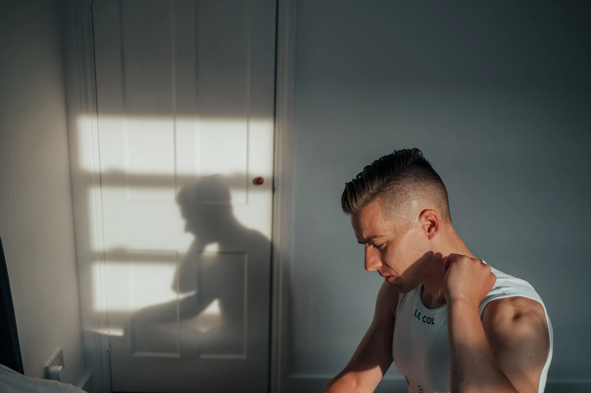
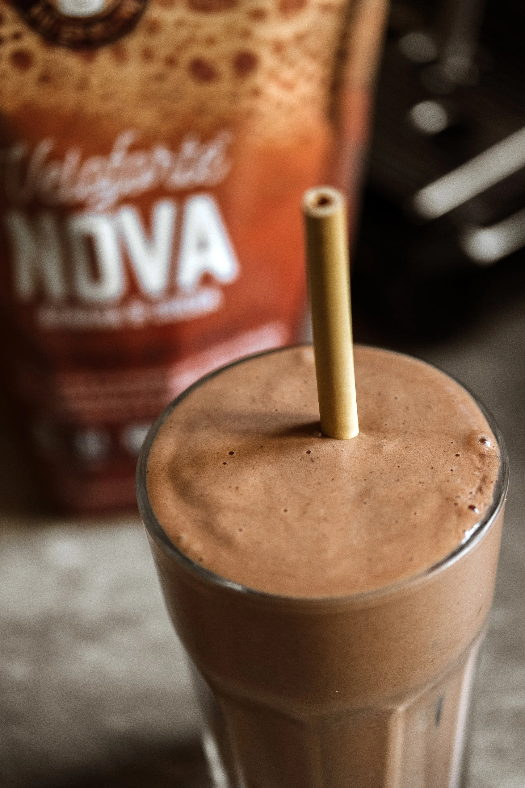
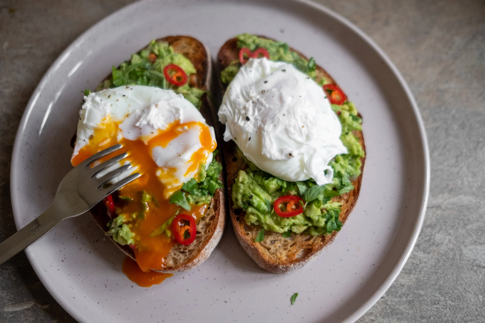
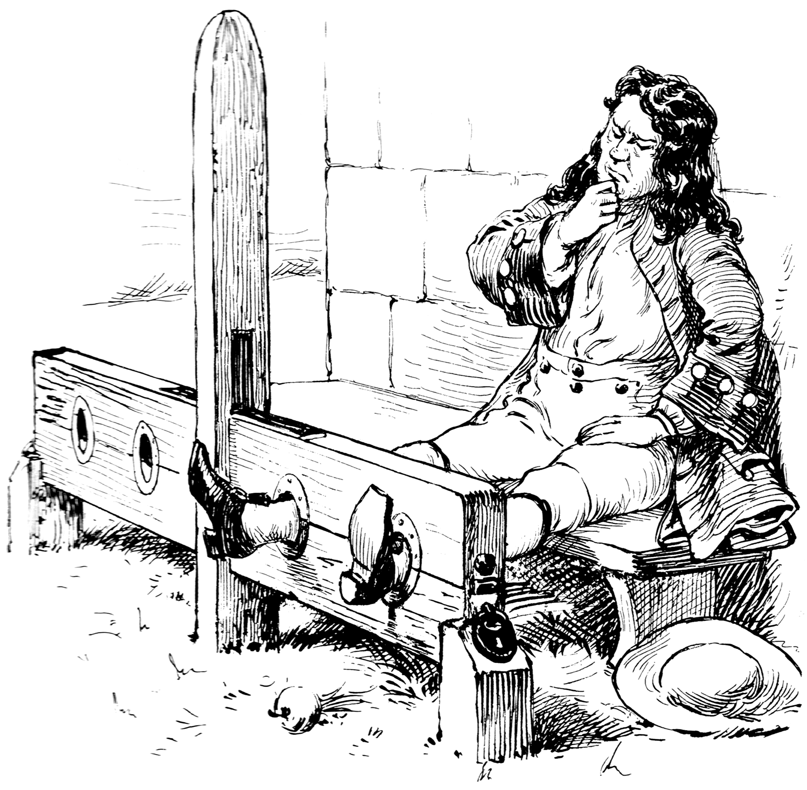
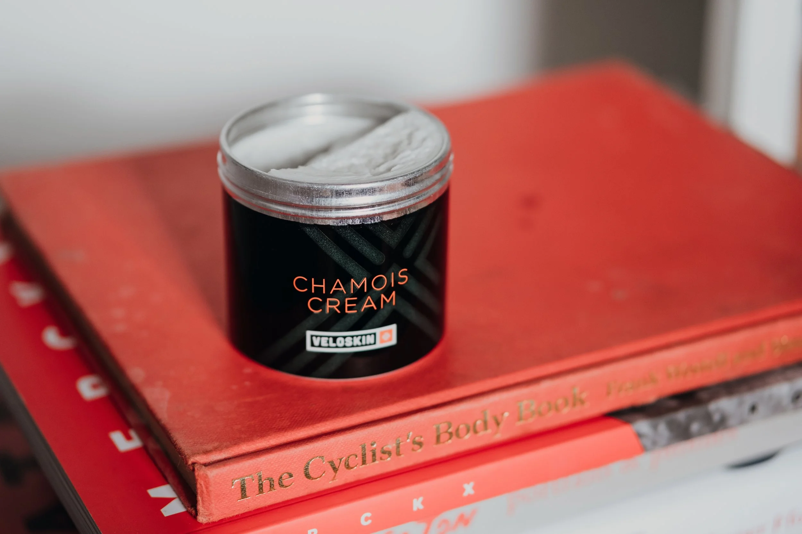
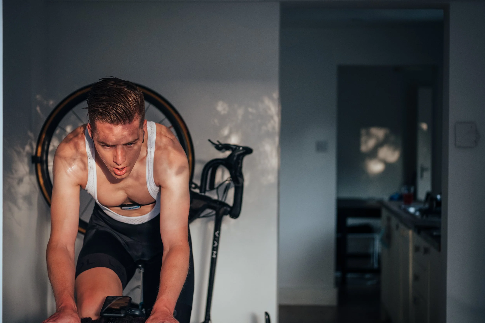
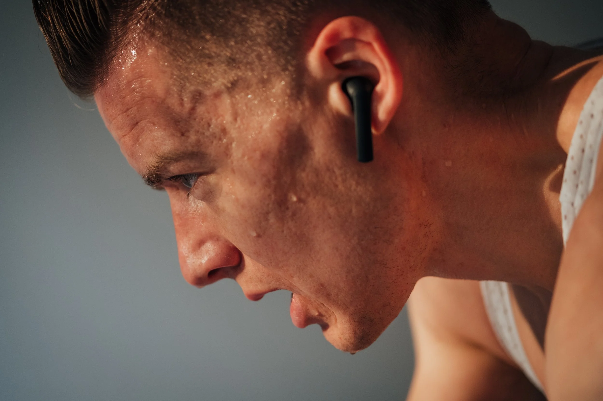
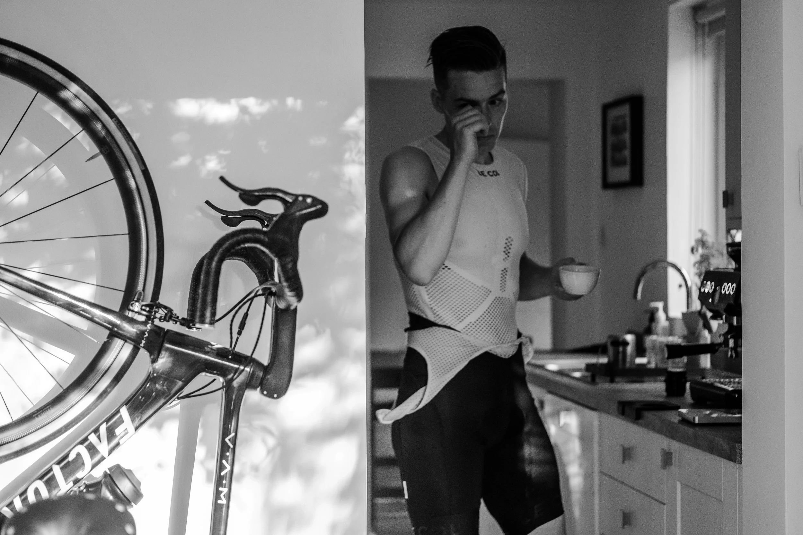
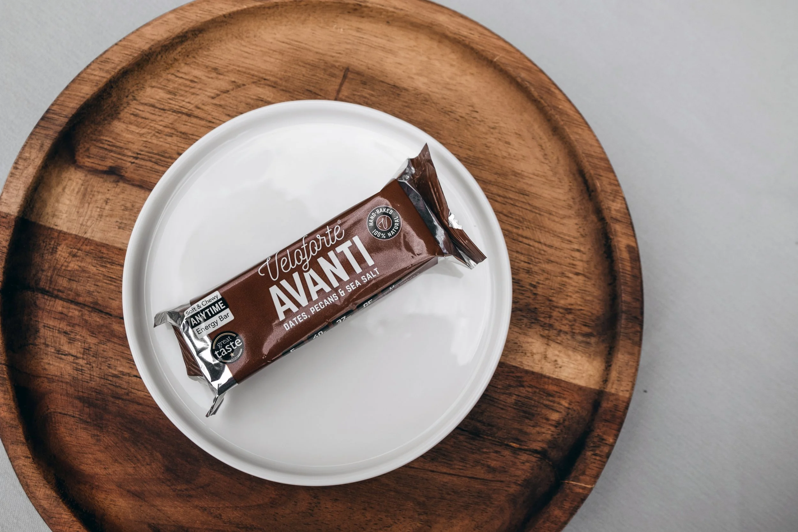

I thought training indoors was for fairweather cyclists who like to avoid the cold, dark, wet winter months. However, my opinion has transformed completely. Indoor training is mentally and physically challenging, making it incredibly rewarding, and has become an essential part of my routine as it maximises my limited time.

At the moment of writing this, I have clocked over 524hrs on Zwift (since March 2020). As you can imagine, I have learned a thing or two along the way. So, whether you're a veteran turbo-trooper or have just enrolled, hopefully, you can pick up a trick or two.

## 1. Come Prepared

Having a plan will ensure you see it through. If you plan to go hard, go to war with yourself. If you plan to recover, have the self-discipline to 'sit up and beg' and keep it steady. I recommend giving one of Zwift's training programmes a try, or following one of their many workouts, rather than opting for an agenda-less 'free ride'. The structured sessions will do the planning for you, give you a focus and ensure you "don't stop when you're tired. Stop when you're done."

Yesterday informs today, today informs tomorrow. So prioritise good sleep and plan your week. I keep a training calendar so that I can prepare ahead of time. Failing to prepare is preparing to fail. Find reasons why you can achieve your training objectives, rather than excuses not to.

Prep your pain cave with a fresh towel, calibrate your power device, fill your bottles, put on your headphones, position your fan, etc. Create boundaries and give precedence to your training time. The result of prioritising yourself will pay dividends to all other aspects of your life and your mental and physical wellbeing.

## 2. Nutrition

To maximise performance and recruit all of your training gains, you need to fuel and refuel. Consider the training demands for the session ahead. For example, a high-intensity session will require at least 40g of carbohydrates per hour.

### Pre-session

Before a high-intensity session, I like to eat a Veloforte Avanti natural energy bar for breakfast. They are perfectly balanced to provide enough fuel for the first hour of power: 40g of carbs, 5g protein, 8g fat, 252Kcal. Being made of natural ingredients, they are easy to digest, gluten-free and plant-based.

Alternatively, I'll reach for a slice of sourdough toast with nut butter and chopped banana on top. Either way, I advocate eating real food rather than synthetic 'nutrition-isms' that are full of initials and acronyms, rather than ingredients.

### Post-session

Refuelling is vital to the recovery process. Your glycogen starved muscles are desperate to absorb nutrients. Therefore, I like to prepare my post-ride meal before I clip in.

I wake up an hour before my training begins, make a coffee, eat my pre-ride snack, then prepare my post-ride meal. It's an excellent way to save time and ensure that you are refuelling immediately afterwards. My favourite post-ride macronutrient-packed breakfast is poached eggs and avocado on sourdough toast. This portion holds 28g of protein, 69g of carbs, 30g of fat, 648kcal.

#### Ingredients

- Sourdough Bread
- Medium-sized ripe avocado
- Large eggs x 2
- Coriander
- Thai Basil
- Red Chilli
- Lemon juice
- Shallot
- Ground coriander seeds
- Salt
- Pepper

#### Method

Before my training session, I mash the avocado with salt, pepper and ground coriander seeds (I use a pepper grinder, you can also use a pestle & mortar). Next, I dice the shallot and red chilli, scatter into the avocado, squeeze over some lemon juice, throw in some chopped coriander and Thai basil and store it in an airtight container to spread over toast later.

After my turbo session, I jump in the shower, get dressed and then plate up. Cook your eggs however you like them, poached, fried, soft boiled. If you have a plant-based diet, replace the eggs with spicy vegan sausages.

When short for time, I reach for a Veloforte recovery shake. They have a 3:1 carbohydrate to protein ratio and essential nutrients to kick start the recovery process. The point is, refuel and reward yourself with a flavourful balanced meal, created from good quality ingredients.

## 3. Bib Shorts

Don't use old worn out bib shorts on the turbo. I know you don't have to look your best while training indoors, but this is about functionality.

Kicking out power while riding in a fixed position without respite takes a real toll on your saddle area. Good quality bib shorts will keep you comfortable, so your mind is free to focus on the pain and sensation of your effort — not your sensitive spots.

If you are doing indoor sessions over 2hrs, you may want to consider a halftime change. I regularly do 3hr sessions, and my bibs become saturated with sweat. Changing halfway into clean/dry bibs will help to avoid chaffing and discomfort. It's also a great little morale boost.

I recommend wearing lightweight summer bib shorts with better breathability and moisture-wicking properties to help avoid overheating. In addition, a pro-level chamois pad is necessary to deal with extended periods of power delivery in the saddle.

Bib shorts are personal. We all come in different shapes and sizes, so find a brand and style that works for you.

## 4. Hygiene

Have you ever had a saddle sore so painful that you've considered buying medieval stocks from a bondage website to 'air it out' and stop you from being able to close your legs? No, me neither…

Salty sweat is an efficient cutting compound, which leads to skin breaks if you're not careful. Removing potential setbacks, such as saddle sores, will keep you consistent.

### Preventative Measures

- Wear bib shorts with a quality chamois.
- Ensure your bike fit is optimised. For example, excessive saddle height and reach will overload saddle pressure points.
- Use chamois cream to reduce friction — it has natural anti-bacterial and soothing properties.
- As soon as you unclip, get those sweaty bibs off immediately, sling them in the washing machine and head straight for the shower. Do this before refuelling. Otherwise, you'll be sitting in sweat and bacteria.

## 5. Mindset

You will learn more from failure than you will from success. If you don't fail regularly, that's a good sign that you are not pushing yourself hard enough. Quitting, however, is not healthy for your mind. If you quit today, you permit yourself to quit tomorrow and the next day — which will leave you with negative feelings and unfulfillment.

Set yourself a goal and a purpose, and you have a measure of success to work towards. This can be anything from increasing your FTP by 5%, riding your first 100km, etc. Now you can 'prepare to succeed' by removing excuses and variables.

For example, did your boss just put an early meeting in the diary? Set boundaries and ask them to reschedule. Not an option? Set your alarm an hour earlier and go to bed on time, or move your training session to later in the day. That is just one of many examples of removing excuses to not turn up.

"It takes relentless self-discipline to schedule suffering into your day, every day. But if you do, you'll find at the end of that suffering there is a whole other life just waiting for you." — David Goggins

Ever wonder why it feels so good to chase or be chased by cyclists? A daily dose of suffering synthesises the behaviour of the hunter-gather. Modern life has phased out 'the chase'. However, recreating challenging physical tasks reconnects us to this evolutionary instinct, even on Zwift.

I have far more than 5 learnings inside my head. If you have any questions, just ask.

Gareth.
