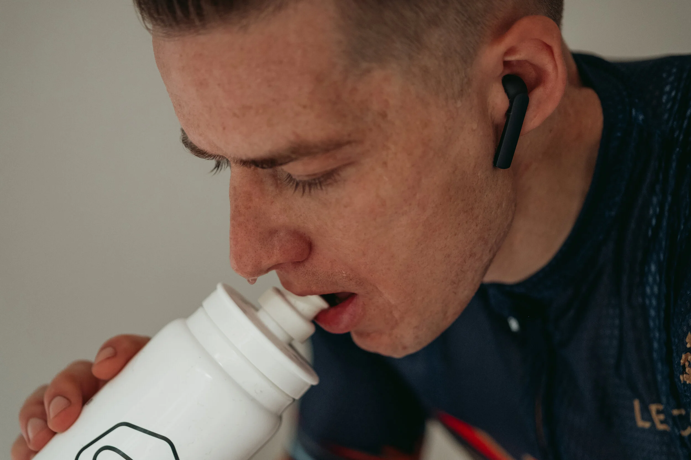
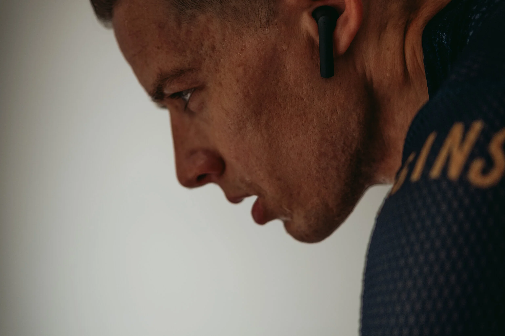
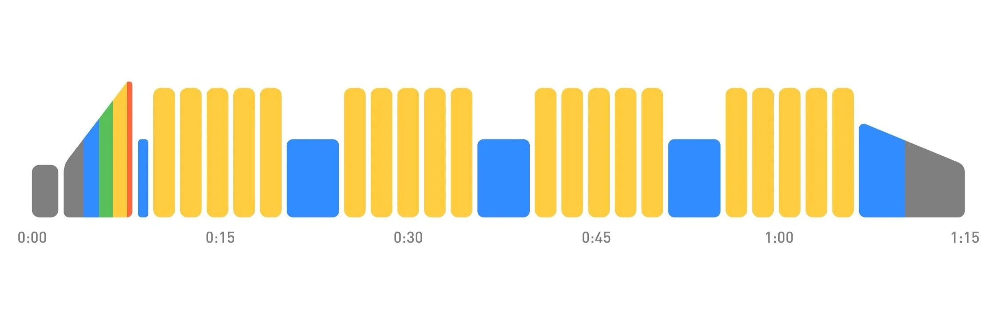
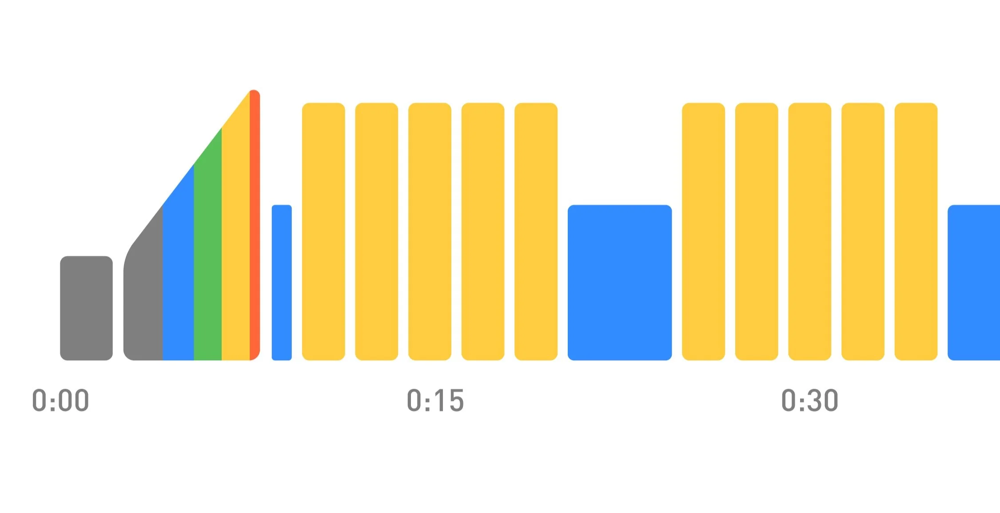
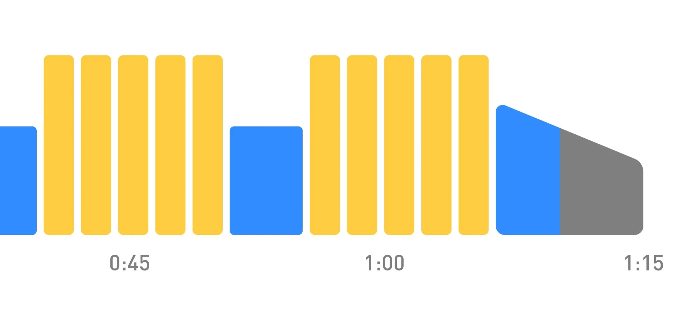

The imposing sight of a mountain looming on the horizon can defeat you before you've even started. It's the same when you load up a training session on Zwift and think: "Fuck me. This is going to hurt."

The mind is far sharper than the sword. So use it to cut through any self-doubt by breaking down the challenge into manageable chunks (apply to all aspects of life).

Here goes my process and inner dialogue. I load up today's session. It's only 75mins but with 40mins at FTP. "Ah fuck. Here we go again."

### Warm-Up

"This is free." So I piss about on my phone and load up a playlist.

### First 10min Interval

"This is still basically the warm-up." My body is riding on autopilot. So, my mind starts to wander and process everything on my to-do list.

### Second 10min Interval

"This is comfortable. No stress." My subconscious keeps ticking.

### Third 10min Interval

"This is getting uncomfortable, but nothing I can't handle." I slowly become conscious of my effort. So I turn up the music and tap away to the rhythm.

### Fourth 10min Interval

"This is starting to hurt. The first 2mins are going to be fine, the second 2mins could start to burn, the third should be pretty toasty, fourth I might have to grimace, but the fifth, I have nothing to lose. I can empty the tank, and it's done."

I crank up the music and let it distract me from the sensation of time and effort. Then I get to the end of the final interval and go, "That wasn't so bad. I could go for another."

Once broken down, only 10mins of this 75min session are uncomfortable, and only 2/4mins hurt. Seems a lot easier now, eh?

My point is: "Don't let a challenge beat you before you've even started."

Secondly, if you don't fail frequently, then you probably aren't pushing yourself hard enough. Take confidence in your abilities.

A sweaty biohazard 💦.

G
