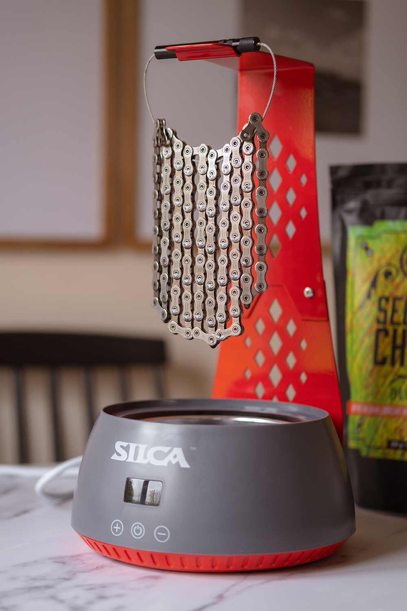
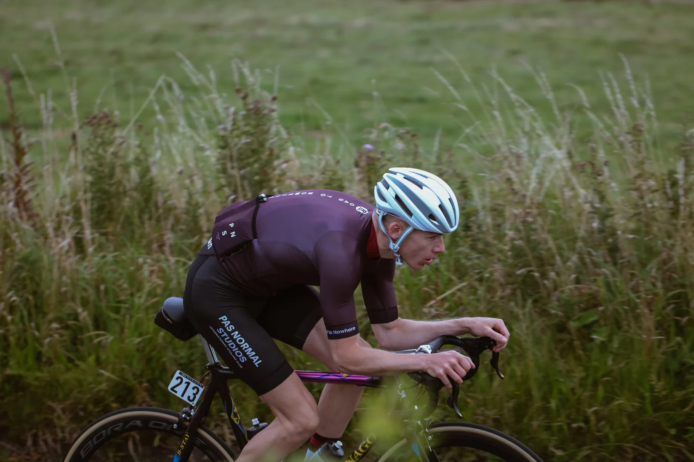
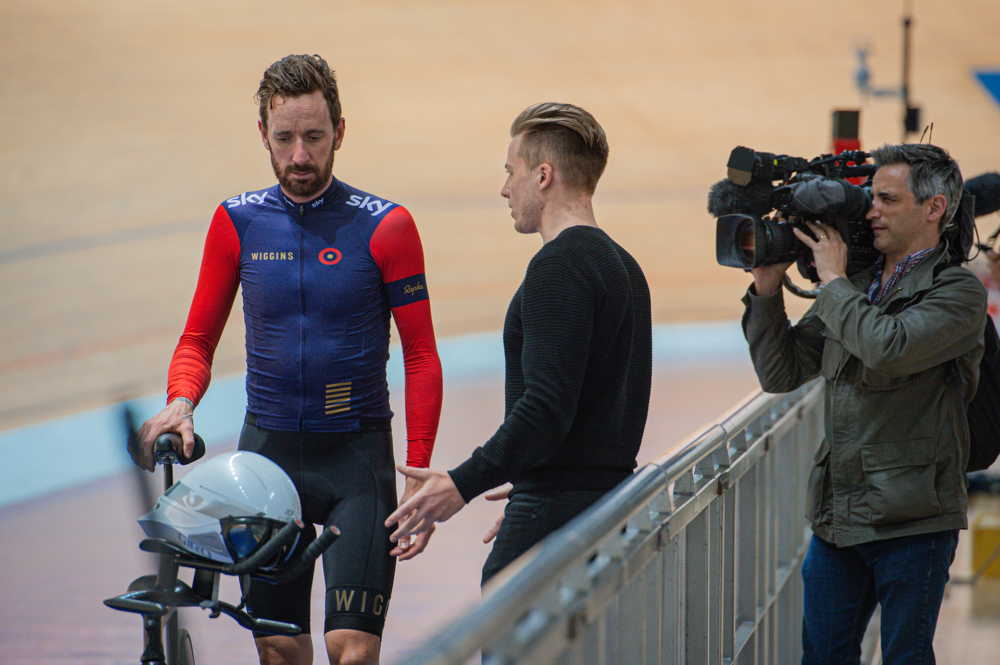
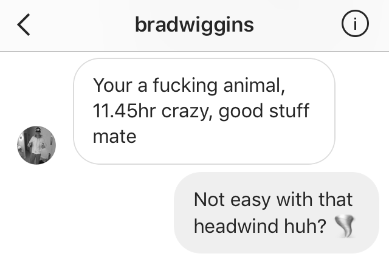
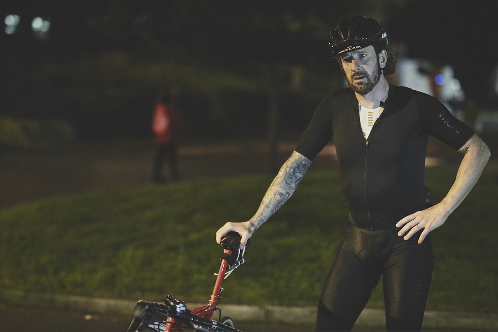
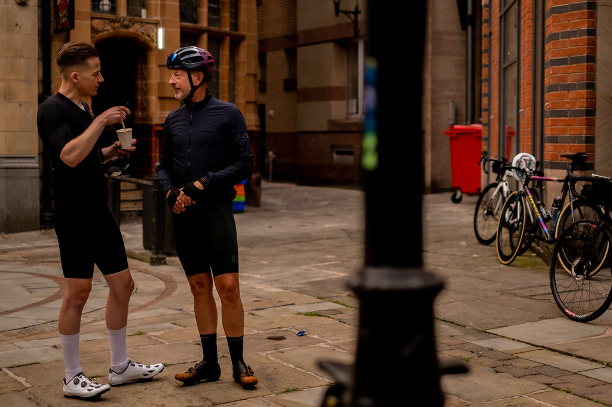
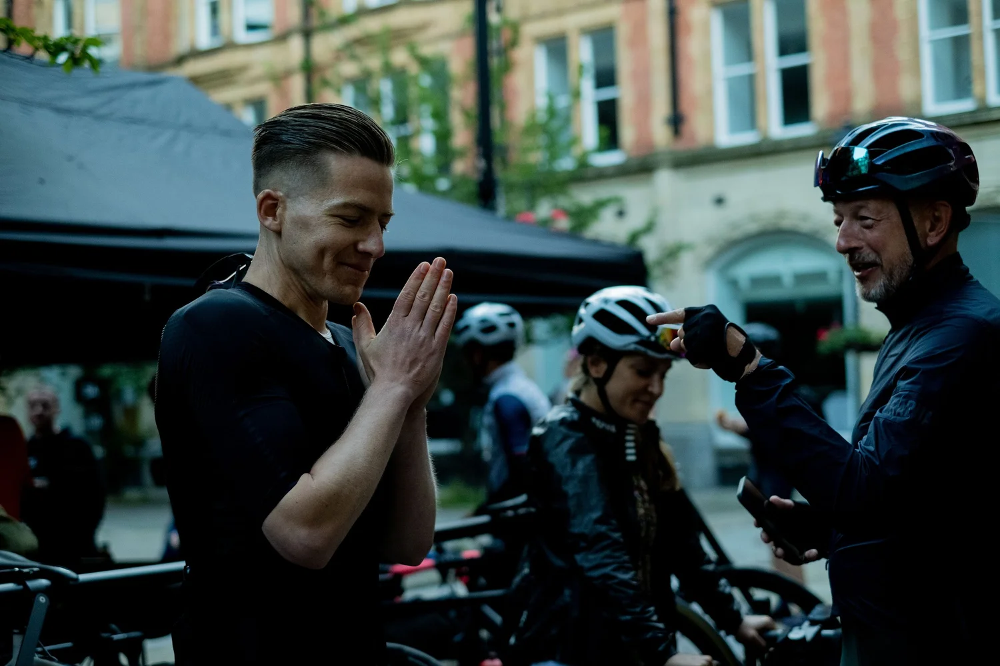
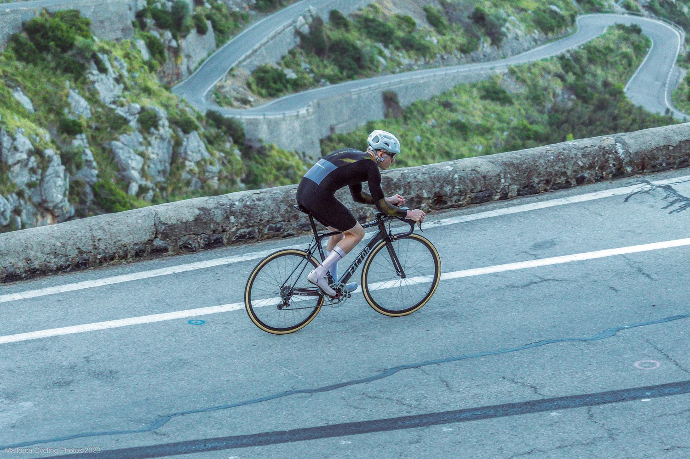
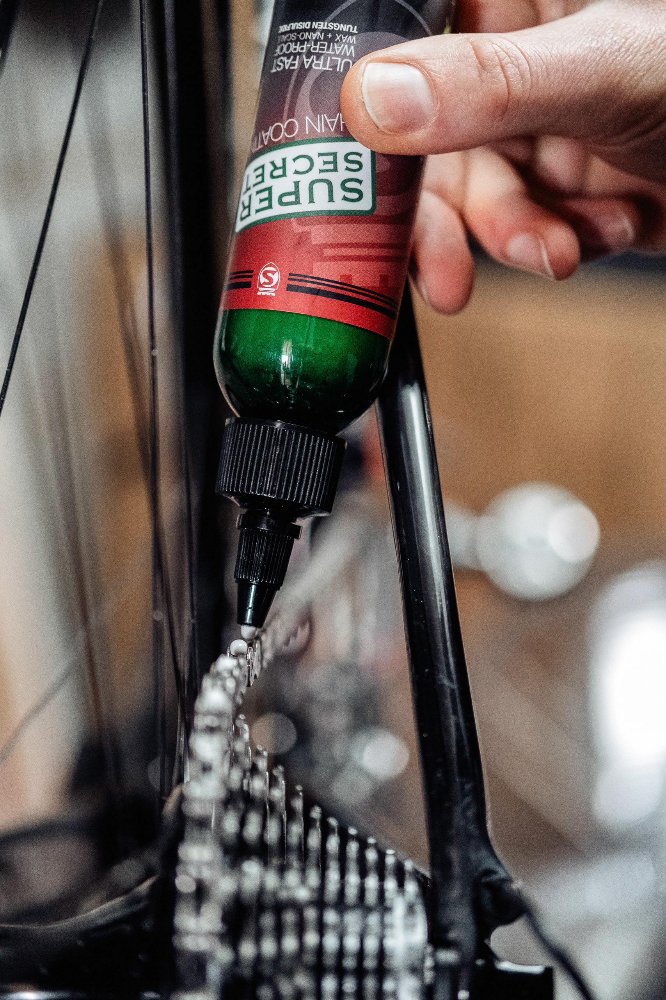
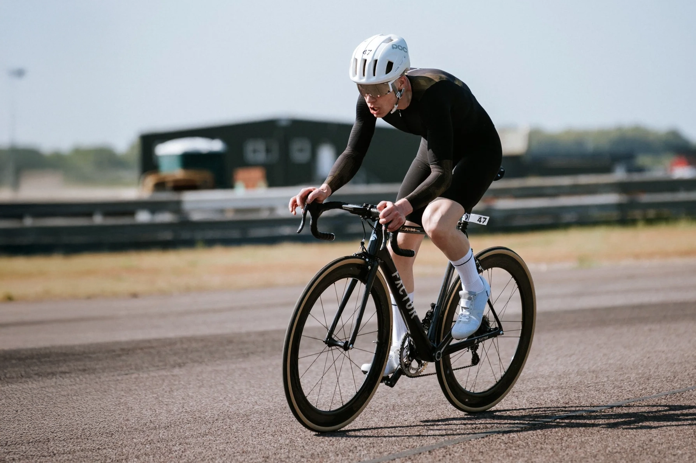

*Updated February 2026 | 12 min read | Gareth Winter*

- - -

## I Stopped Cleaning My Chain 10 Years Ago. My Drivetrain Has Never Been Better.

This is not a maintenance tip.

It is a confession, a provocation, and if you give me twelve minutes, a complete reframe of something you thought you already understood.

The cycling world has a cleaning ritual. We all know it. Degrease. Re-lube. Repeat. It feels productive. It feels like the responsible thing. It feels, in a very specific way, like the thing a serious cyclist does.

But what if the ritual itself is the problem?

What if cleaning your chain after every ride is the clearest possible sign that your lubricant is already failing you?

That is the question that changed how I think about my drivetrain. And the answer, found across ten years, three Manchester to London editions, and one very personal appointment with a clock reading 29:53 on a Mallorcan mountainside, is what this post is about.

- - -

## The Degreaser Is Not Maintenance. It's a Symptom.

Here is something most cyclists never stop to consider.

Oil attracts contamination. That is not a design flaw. That is simply what oil does. It is wet, it is tacky, and every particle of grit the road throws at your drivetrain has somewhere warm and welcoming to land. The degreasing session after a long wet ride is not upkeep. It is damage control. You are cleaning up after a lubricant that spent four hours working against you.

Before I made the switch, I knew this cycle intimately. Finish a long ride. Chain like a cement mixer. Cassette that looked like a plasterer's radio. Leave it overnight, wake up to rust. Then came the full degreasing session, the hazmat-suit variety, the kind that wilts nearby plant life and prompts genuine reflection on your decisions. And underneath all of it, the quiet suspicion that the ride had just cost me £50 in component life I couldn't account for.

The problem was never the weather. It was never the distance.

It was the lubricant. Doing exactly what oil does: collecting every particle on the road and grinding it methodically into the most expensive parts of my drivetrain.

I switched to <a href="https://silca.cc/en-gb/collections/chain-waxing-system/products/secret-chain-wax-blend" target="_blank" rel="noopener noreferrer">SILCA Secret Chain Blend, Hot Melt Wax.</a> And the first thing I noticed was not speed.

It was silence.

A properly waxed chain does not sound lubricated. It sounds absent. Standard drip lube versus hot melt wax is like comparing a chain smoker with lungs like raisins against Wim Hof's windpipes, the ones that could seat a tubeless tyre with a single exhale.

That silence is not magic. It's friction reduction. Not witchcraft. Watt-craft.

- - -

## What Is Actually Happening Inside a Wax Bath

Before we go further, let's clear up the misconception that costs most people the first conversation.

Chain wax is not candle wax. When most cyclists hear the word, they picture birthday cake or a church at Christmas. That is not what is happening inside a SILCA wax pot.

<a href="https://silca.cc/en-gb/collections/chain-waxing-system/products/secret-chain-wax-blend" target="_blank" rel="noopener noreferrer">SILCA's Secret Chain Blend</a> contains nano-scale tungsten disulfide, WS2, the same class of solid lubricant used in aerospace engineering. It does not sit between metal surfaces the way oil does. It plates into the microscopic imperfections of the chain itself, modifying the surface. The metal interface becomes the lubricant.

Zero Friction Cycling, the most exhaustive independent drivetrain testing authority in the sport, places SILCA Hot Melt at approximately 3.8 watts friction loss at 250 watts. Their 6,000km block testing across clean, wet, and contaminated conditions consistently shows wet lubricants degrading to losses of 5 to 8 watts under real-world conditions.

That gap is not theoretical. At 250 watts on a climb that already has you at the limit, the difference between 3.8 and 8 watts is the difference between holding the wheel and watching it go.

Adam Kerin of ZFC has put the cost of a poor lubricant choice at upwards of 5 watts at race power, a number that increases as output increases. Friction Facts testing, reported through VeloNews, showed wax-based systems running nearly 6 watts faster than standard oil after one hour in real contamination. Six watts is not a rounding error. At 50 kilometres per hour, that is a bike length. Over 360 kilometres, it compounds into something you can feel in your legs at hour ten.

- - -

## The Numbers, Side by Side

For those of you who want it straight, here it is.

|                                 | Standard Oil                                      | SILCA Hot Melt Wax                                   |
| ------------------------------- | ------------------------------------------------- | ---------------------------------------------------- |
| Contamination behaviour         | Attracts and holds grit                           | Sheds contamination                                  |
| Friction loss, clean conditions | 4 to 6W                                           | 3.8W @ 250W (ZFC)                                    |
| Friction loss, contaminated     | 5 to 8W+                                          | Minimal degradation                                  |
| Post-ride maintenance           | 20 to 30 min degreasing session                   | Wipe chain, back in the pot                          |
| Cassette and ring wear          | Accelerated                                       | Significantly lower (ZFC 6,000km data)               |
| Real-world cost per service     | Effectively free, until the cassette bill arrives | £1 to £2 per interval                                |
| Re-application                  | Every ride or every few rides                     | Every 300 to 500km, topped up with Super Secret Drip |

*Source: Zero Friction Cycling independent testing, Friction Facts via VeloNews*

The cassette column is the one most people overlook until it is too late. You are not just buying friction reduction. You are buying drivetrain longevity. On a high-end groupset, that matters far more than the cost of the wax pot.

- - -

## Three Races. Three Chains. One Conclusion That Never Changed.

I have used Manchester to London as my long-form testing ground across three different setups. What follows is not a review. It is a record.

### Manchester to London, 2016: The Experiment

Immersive waxing in 2016 was fringe territory. The kind of thing a certain type of obsessive did in their kitchen and tried to explain at club runs while everyone edged quietly away.

My friend Liam Maybank, founder of Aerevolution, a serious UK time trial engine, and someone whose technical judgement I do not question, offered to prep my chain before M2L for £20. He promised durability and a few free watts. I wasn't convinced, but I trusted him, so I agreed.

The process looked like a scene from Breaking Bad. Solvents. Home oven. Kitchen chemistry of a kind that makes you wonder if you should notify someone. But I showed up on start day with a freshly waxed chain.

Then the forecast arrived. The 2016 edition became a full washout. I panic-bought a Rapha Shadow jersey the day before. If my drivetrain was going weatherproof, the rest of me needed to follow.

The moment I clipped in, something felt different. Not faster. Quieter. More deliberate.

I rode off the front with two others early on, Jake and Tom. After a few hours in the rain, their drivetrains sounded like they were chewing gravel. Mine stayed silent. That silence became its own kind of fuel. Every pedal stroke was confirmation that the preparation had been right, and that confirmation pushed me harder than I had any rational basis to go.

I rode them off my wheel. Spent the next six hours alone. Low position. Rhythm. The particular mental clarity you get when there is nothing left to decide.

When I reached London, my legs were finished.

**My drivetrain was not.**

### Manchester to London, 2017: The Record

In 2017, I returned with Muc-Off's Nanochain, developed for Sir Brad Wiggins' Hour Record attempt, a project I worked on directly, leading the creative and advertising for the Sky Sports broadcast and global YouTube coverage. Tickets sold out in under five minutes. Being that close to marginal gains applied at the absolute ceiling of the sport changes how you think about preparation at every level below it.

The Nanochain worked. Course record: 11:43:10, into a headwind for most of the route.

Sir Bradley rode M2L that year too. His acknowledgment at the finish is the kind of thing you carry quietly for a long time.

But the Nanochain had one fundamental problem. Single-use. You could not replicate the treatment at home. Expensive, inaccessible, impractical for anyone who wasn't attached to a Sky Sports production.

A hot melt system at home solves all three of those problems simultaneously. You do it yourself. At home. For 30 to 50 pence per immersion. And the independent data places it above specialist drip formulations across extended contamination testing. The best technology for this job is now also the most accessible. That does not happen often. When it does, it tends to be worth paying attention to.

### Manchester to London, 2022: Nothing Left to Debate

By 2022, I was running the full SILCA Hot Melt system. No hedging. No contingency.

Fastest time again. Same British weather lottery.

Silent from the first pedal stroke to the last. The morning after, the chain went back into the wax pot and came out as good as new. The drivetrain required nothing from me except the twenty minutes I had already spent before the ride.

Unlike my legs, which required considerably more.

- - -

## Sa Calobra: When 18 Seconds Stops Being Abstract

Manchester to London proved what wax does over distance in the worst conditions British roads can provide.

Sa Calobra, 9.4 kilometres, 7% average gradient, the kind of climb that ends conversations and starts obsessions, proved what it does to the actual margin.

Climbing it in under 30 minutes became a number I could not put down. 30:47. Then 30:21. Then 30:12. Each attempt close enough to believe in. Each result far enough to hurt in a specific and lasting way. There is a quality to missing a target by 12 seconds that is different from missing by two minutes. It does not feel like failure. It feels like unfinished business. Which is harder to live with.

The maths is clean. At roughly 300 watts sustained on a climb, a 3-watt saving is approximately 1% of total output. One percent over 30 minutes is around 18 seconds. Eighteen seconds is the difference between 30:12 and 29:54, the number on the other side of a door I had been standing in front of for years.

But here is what the watts calculation misses entirely.

When you have done everything within your control, when there is no variable you have left unaddressed, no preparation you have skipped, something shifts in how you ride. The doubt that arrives on schedule at minute 18 has less to attach itself to. You have already answered every question it knows how to ask.

For the sub-30 attempt, everything was controlled. Weight. Tyre pressure. Pacing strategy. Sleep. Nutrition timing. Position. And friction. Fresh immersion in Secret Chain Blend the week before, optimised for outright efficiency. Super Secret Drip applied the night before. No contamination variable. No boundary friction penalty. Nothing unaccounted for.

On previous attempts, somewhere around minute 18, the resistance arrived. Cadence dropped. Torque increased. At threshold, drivetrain losses stop being numbers on a spreadsheet. You feel them as physical resistance, and the mind interprets physical resistance as the limit of your ability rather than the cost of your equipment. That distinction matters enormously.

That day, everything felt direct. Clean. Mechanically silent.

When I crossed the line and saw 29:53, it wasn't relief.

**It was validation.**

Wax didn't give me lungs. It didn't give me legs. But it removed resistance at the metal interface and it removed uncertainty from the preparation. Both of those things matter on a climb like Sa Calobra. The second one, in my experience, matters more.

- - -

## The System That Makes This Actually Practical

The old reputation of chain waxing was earned. Multiple solvent baths. A slow cooker you would never cook in again. A level of mechanical commitment that most people tried once, abandoned, and used as evidence that the whole thing was too much trouble.

SILCA rebuilt the process entirely. Here is how it actually works now.

### StripChip: The Part Nobody Mentions

Factory grease is the enemy of wax adhesion. It is the reason immersive waxing used to require half a day and a ventilated outdoor space. <a href="https://silca.cc/en-gb/collections/chain-waxing-system/products/strip-chip" target="_blank" rel="noopener noreferrer">StripChip</a> chemically converts factory grease inside the wax bath at 125°C. No pre-solvent stripping, no mason jars, no garden chemistry, no explaining to your partner what that smell is. One chip per new chain. That is the entire process.

### Secret Chain Blend: What You're Actually Buying

Four refined waxes carrying nano-scale WS2. Hot immersion ensures full penetration into the rollers, the friction interface that actually determines your drivetrain's efficiency. Approximately 3.8 watts loss at 250 watts in official ZFC testing. The wax that goes in costs less than a coffee. What it replaces, accelerated cassette wear, chainring wear, the compounding cost of a drivetrain that is always fighting contamination, is considerably more expensive over any meaningful distance.

### SpeedChip vs EnduranceChip: Not One-Size-Fits-All

<a href="https://silca.cc/en-gb/collections/chain-waxing-system/products/performance-chips" target="_blank" rel="noopener noreferrer">SpeedChip</a> is tuned for outright friction reduction. Time trials, short-course events, any day where peak efficiency on a clean road is the only variable that matters. <a href="https://silca.cc/en-gb/collections/chain-waxing-system/products/performance-chips" target="_blank" rel="noopener noreferrer">EnduranceChip</a> extends contamination resistance and pushes re-wax intervals further. Correct for Manchester to London, for winter riding, for anyone whose roads are not closed circuits. The same base system, tuned for completely different demands. Marginal gains that account for what you are actually marginal gaining for.

### Super Secret Drip: Between Immersions

You do not re-hot-wax every week. <a href="https://silca.cc/en-gb/collections/chain-waxing-system/products/silca-super-secret-chain-lube" target="_blank" rel="noopener noreferrer">Super Secret Drip</a> uses the same WS2 nano-platelet technology in a drip format. Applied the night before a ride, left to dry, and the wax matrix stays intact without stripping. Performance does not degrade. The ecosystem stays whole.

- - -

## What It Actually Costs, Run Properly

The upfront number stops most people before they get far enough to understand it. So let's run it properly.

Initial setup: Secret Chain Blend 500g (£40) + Super Secret Drip (£25) + StripChip for 6 chains (£24) + Chain Waxing System (£100) = approximately £189 total.

Now the real numbers.

A 500g bag of Secret Chain Blend costs £40. The wax bath is reused indefinitely. Actual wax lost per immersion is a few grams, working out at 30 to 50 pence per dip. Super Secret top-ups run around 60p to £1 per application. StripChip is a one-off £4 per new chain. Amortise the waxing system over five years of bi-weekly use and the machine itself costs approximately 70p per session.

**Total real-world cost per service interval: £1 to £2. Less than a coffee.**

ZFC's long-range modelling shows drivetrain savings over 10,000 kilometres can reach four figures on high-end groupsets when low-wear lubrication is used consistently. I ride Campagnolo Super Record. This arithmetic is not abstract. The cassette I am not replacing early is a cassette I am riding instead.

- - -

## Who This Is For

**The watt-conscious racer.** You have stared at power files looking for the place you lost time. Drivetrain friction is one of the few performance variables that is completely within your control before the start gun fires. Take it.

**The long-distance endurance rider.** Cost per kilometre matters to you. So does the cleanup that used to take thirty minutes and now takes two. Multiply that across a season and the case makes itself.

**Anyone running premium components.** Dura-Ace. Super Record. Red AXS. The lubricant you use determines how long that investment performs. Oil accelerates the wear you paid to minimise. Wax does the opposite.

**The rider who is tired of the mess.** Oil is reactive. You clean because it failed. Wax is proactive. You prevent contamination from ever taking hold. The drivetrain stops being something you maintain and starts being something that simply works. That shift in relationship with your equipment is underrated.

- - -

## How to Start

1. <a href="https://silca.cc/en-gb/collections/chain-waxing-system" target="_blank" rel="noopener noreferrer">Buy the SILCA Hot Melt system</a>
2. <a href="https://silca.cc/en-gb/collections/chain-waxing-system/products/strip-chip" target="_blank" rel="noopener noreferrer">Use StripChip on your first chain</a>, no solvents, no faff
3. <a href="https://silca.cc/en-gb/collections/chain-waxing-system/products/performance-chips" target="_blank" rel="noopener noreferrer">Add EnduranceChip for UK conditions</a>, <a href="https://silca.cc/en-gb/collections/chain-waxing-system/products/performance-chips" target="_blank" rel="noopener noreferrer">SpeedChip when time is the only variable</a>
4. <a href="https://silca.cc/en-gb/collections/chain-waxing-system/products/silca-super-secret-chain-lube" target="_blank" rel="noopener noreferrer">Top up with Super Secret Drip</a> between rewaxes
5. Ride. Come home. Wipe the chain. Back in the pot. Done.

- - -

Ready to make the switch? Use code **ROADBOOKOFCYCLING15** for 15% off at <a href="https://silca.cc/" target="_blank" rel="noopener noreferrer">silca.cc</a>. The only thing I cannot control is whether this code is still active when you read this. It was live when I wrote it. Use it now, while it works. On a £189 starter kit that is approximately £28 back, enough to cover your first two months of Super Secret Drip, with change left over.

- - -

## Final Thought

There is a version of this post that gives you the data and stops there. The watts. The wear rates. The cost breakdown. All of it true. All of it useful. All of it incomplete.

Because the real reason riders who switch to wax stay with wax is not the 3.8 watts. It is the silence. The particular quality of a pedal stroke through a clean drivetrain at the start of something long and hard. It is the absence of doubt at minute 18 on a climb that has beaten you before, because you have already answered every question the climb knows how to ask.

Manchester to London proved the durability. Sa Calobra proved the margin. Zero Friction Cycling proved the wear data. Friction Facts proved the efficiency. Tungsten disulfide explains the science.

The silence explains everything else.

If you are still running oil, you are not wrong.

You are just leaving seconds and component life on the table.

And sometimes, seconds change everything.

*— Gareth*
