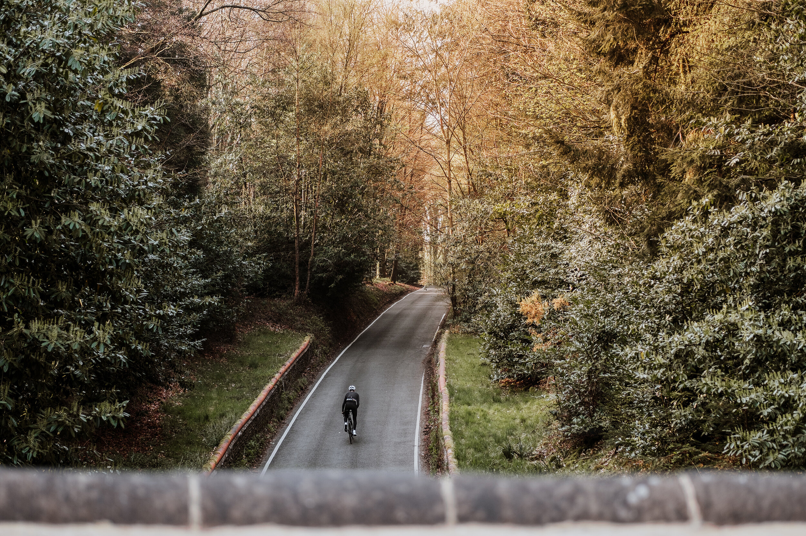
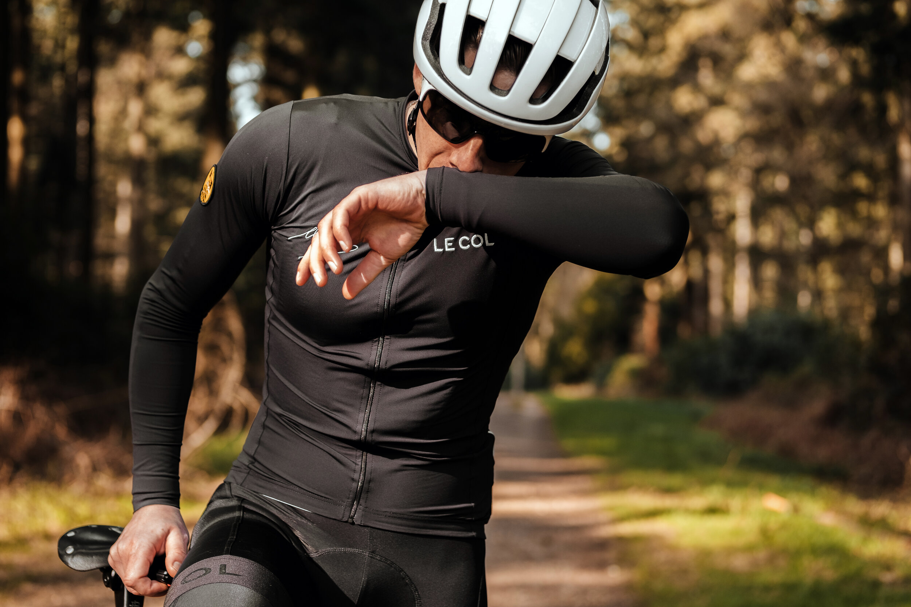
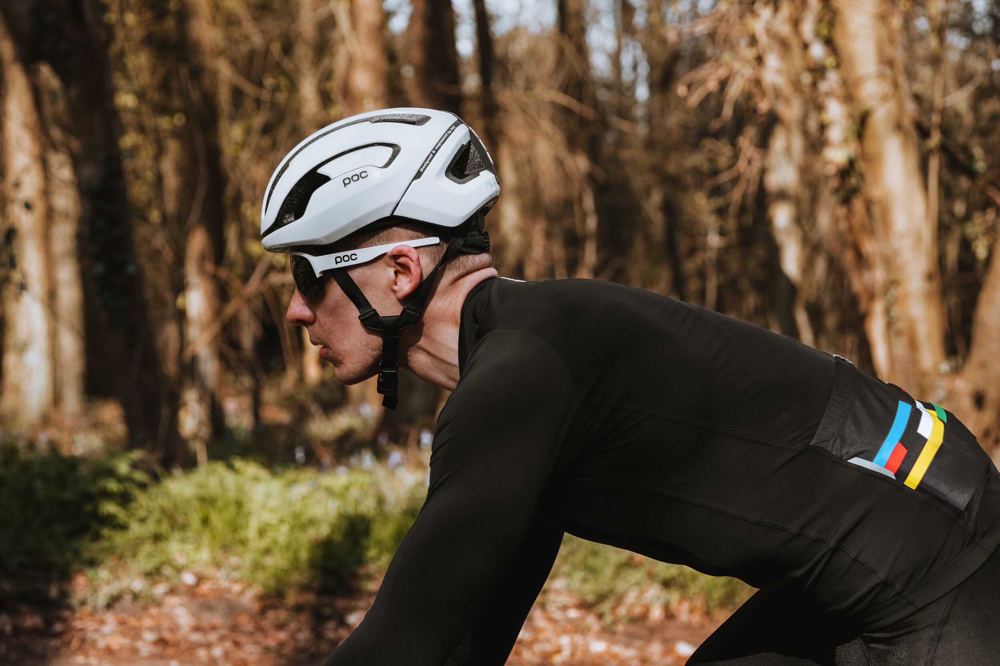
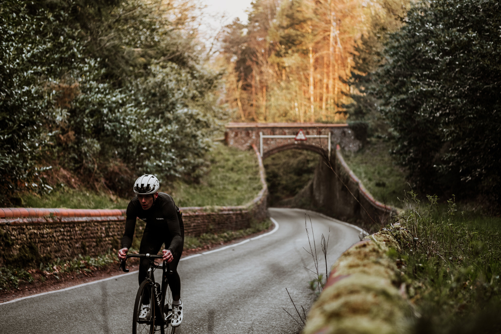
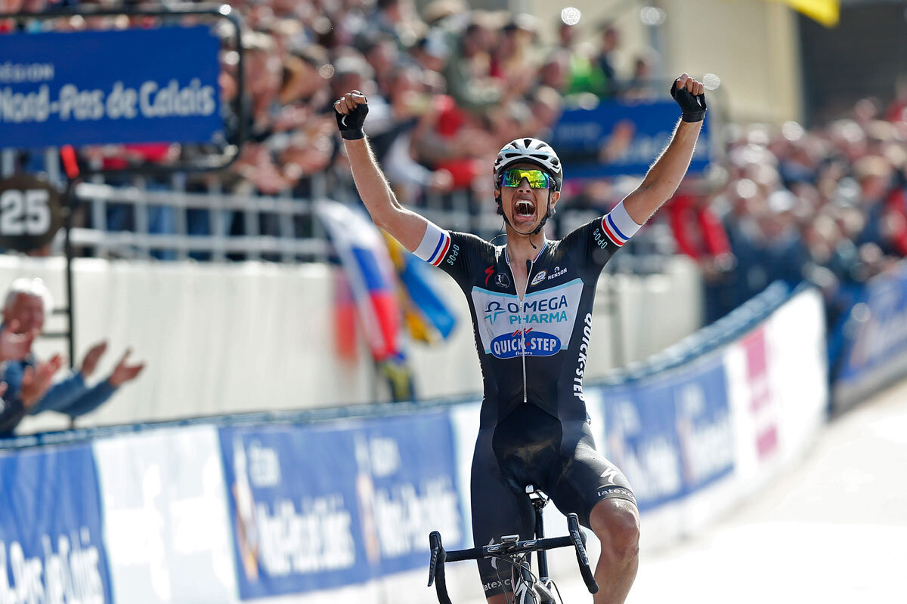
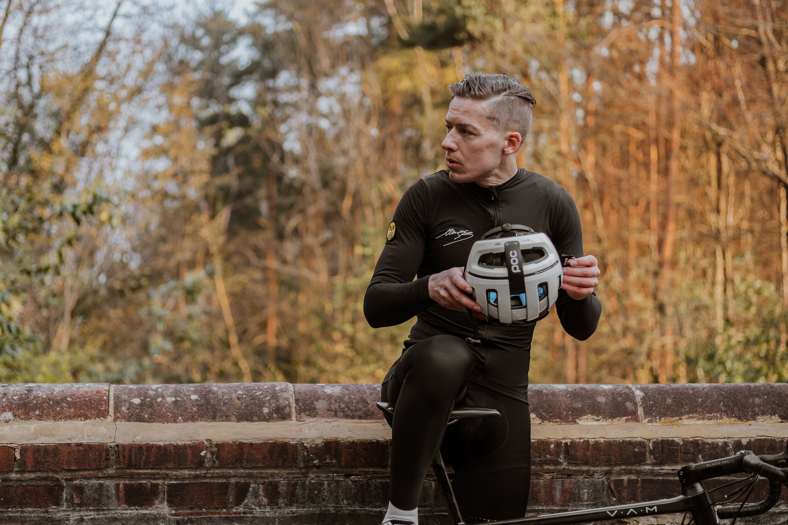
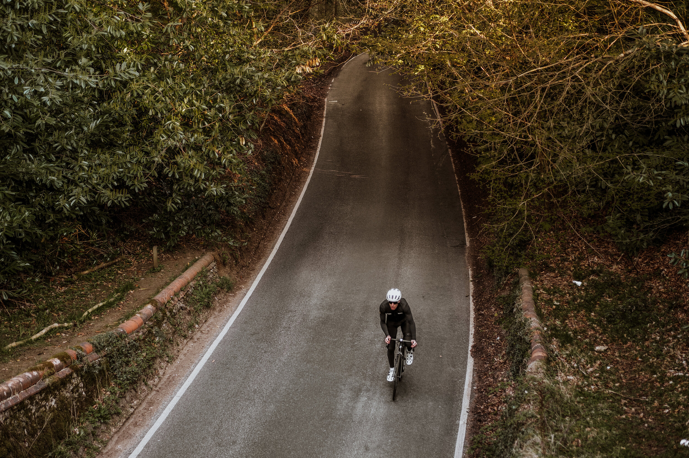
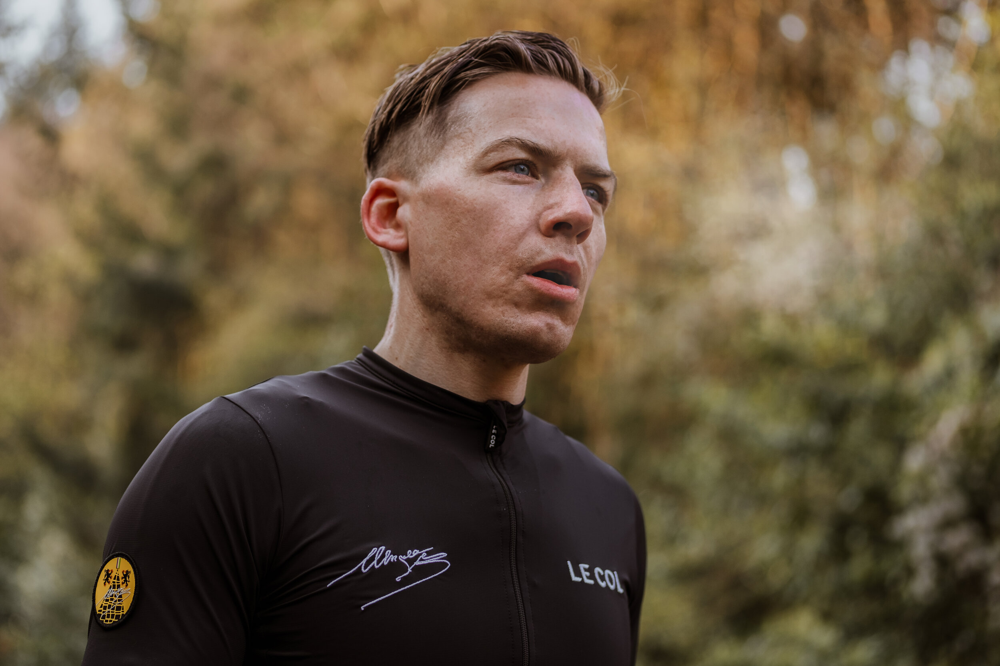
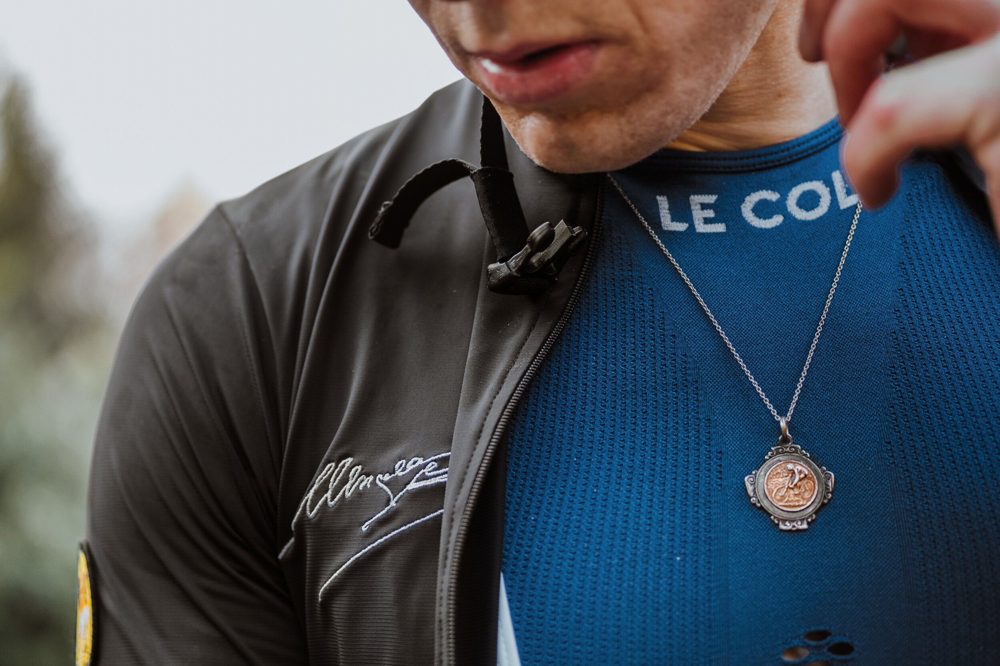

Hill reps are the purest form of interval training: warm-up, full gas, recover, repeat, cool down.

*"The slower you roll on the flats, the faster you'll go up the climbs."*

Made even better with a few friends — hill reps are an oddly social way to ride, as you can warm up together, attack the hills at your own pace, regroup at the end, and cool down as you spin to the cafe (to refill your empty legs and bore non-cycling bystanders with stories about your heart rate and power output).

I try to build routes that don't incorporate the same climb twice, but repping one climb does have benefits, such as lap times and splits to compare, or if you are training for a specific hill climb, Strava KOM/QOM, etc.

If you're feeling strong, you can initiate a bit of friendly competition — or do an extra interval if no one wants to race. If you're having a bad day, need to recover, or can't keep up with the grimpeurs — you can take it steady or maybe skip a climb. No one gets left behind, whatever your ability.

Spring is my favourite time of year. The cold morning air forces you to ride hard to keep warm. The pro-racing calendar is usually full of my favourite races — Tour of Flanders, Paris Roubaix, Strade Bianche, Liège-Bastogne-Liège, Gent Wevelgem — urging me to go out and ride.

You know you've gone deep when your lungs burn, and you can taste metal. This is your red blood cells releasing iron, which forms thick spittle known as 'Belgian toothpaste' — the taste of a job well done, soon to be washed down with coffee.

Just look at that string of 'toothpaste' inside Niki Terpstra's mouth as he won Paris Roubaix in 2014 — a clear indication of how hard he attacked the final sector of pavé with six kilometres to go.

We're not all 'climbers', but we all love climbing. Nothing gives you that same sense of satisfaction as reaching the top. To me, heaven is a summit-less climb. You can just leave me there, half-wheeling my grandad for eternity.

*"See you at the top."*

My dad once told me, "Get the best pair of bib shorts and wheels you can afford." This is the best piece of cycling advice I have ever received. Good bibs will keep you comfortable all day, and good wheels will keep you rolling smoothly.

Gareth.
