Something happened when I arrived at the L'Eroica Britannia press event and slid my leather shoes into toe clips and fastened the straps (rather than twisting the ratchet on my carbon shoes and clipping into my Speedplay pedals). I was transported back to my teenage years, standing in my dad's garage — unhooking his old Peugeot-Campagnolo race bike from the ceiling, where it hung from the saddle via a toe strap.

*📷 Moloko Cycling*

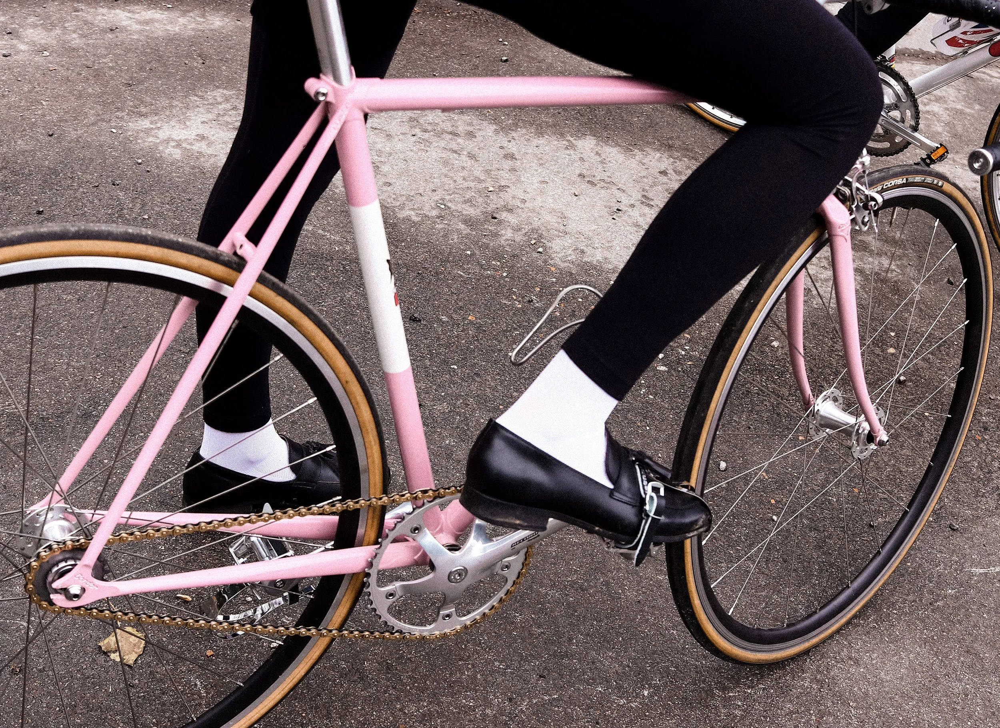

I could almost smell the cured rubber, cold steel and various greases and oils that linger in the air of his garage (which is more like a cycling museum). L'Eroica Britannia is a celebration of this nostalgia — helping us re-live the golden era of cycling. But unfortunately, it also presents another N+1 excuse. Oh, well.

There is only one fundamental rule: you must ride a pre-1987 bike (reproductions, such as mine, are also permitted). Goodwood Motor Circuit is the new home of L'Eroica Britannia and has a cycling legacy. In 1982, Goodwood hosted the World Road Championships, where Giuseppe Saronni and Mandy Bishop (Jones) took the titles, and they are attending the main event this August 6-7th.

I haven't been to Goodwood Motor Circuit in decades. I'm not a petrol head at all. However, even I got goosebumps when I pulled up alongside the race control tower and pulled my pink Condor Classico Pista fixed wheel bike out of the boot.

Goodwood Motor Circuit is unlike any other circuit I have ridden, such as Silverstone, Brands Hatch, etc. It has classic style and heritage, a fitting venue for L'Eroica. Daffodils and white picket fences line the circuit. Tim Bulley, International Director of the Goodwood Estate & keen cyclist, explained that they have six different varieties of daffodil that all stagger in bloom, so Goodwood is painted yellow for most of the year.

*📷 James Clarke*

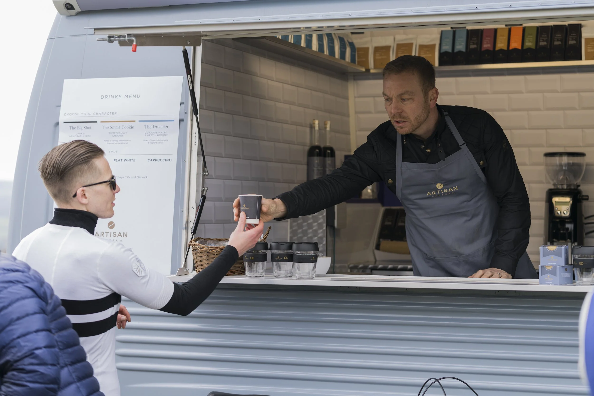

After the ride briefing in the control tower, we rolled out on our classic steeds and straight up the road of The Goodwood Festival of Speed hill climb — which was a baptism of fire for all my road companions who hadn't ridden with downtube shifters for many years, if ever at all, as they waggled them to 'find the gear'. I still love downtube shifters. Nothing symbolises that a rise in pace is coming when someone drops their shoulder to throw it in the big dog.

However, I was riding my fixed wheel (48x17), which only has two gears: in the saddle and out the saddle.

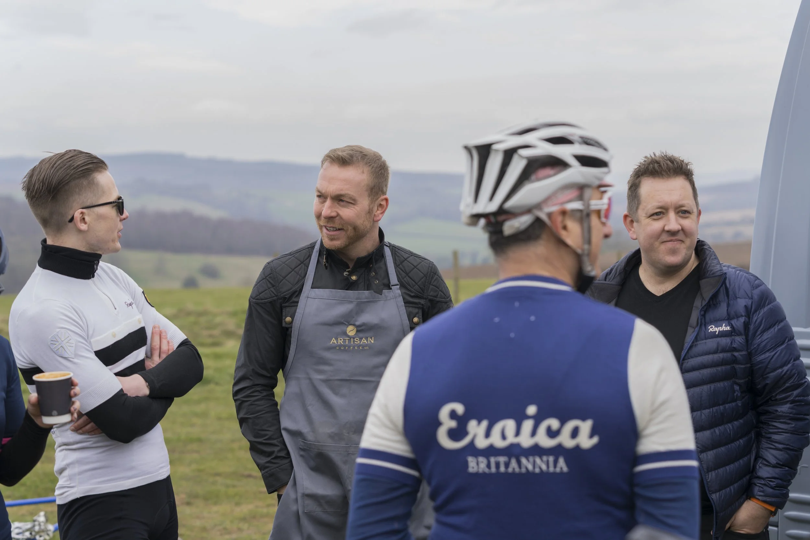

The ride was like a treasure hunt. And the first golden surprise was parked on top of the second climb - the Artisan Coffee Van. I have a nose for coffee and could smell it a mile off. But I didn't catch the scent of Sir Chris Hoy, who popped out of the serving hatch as we huddled around the van like preying vultures. It was a brilliant surprise.

*📷 Moloko Cycling*

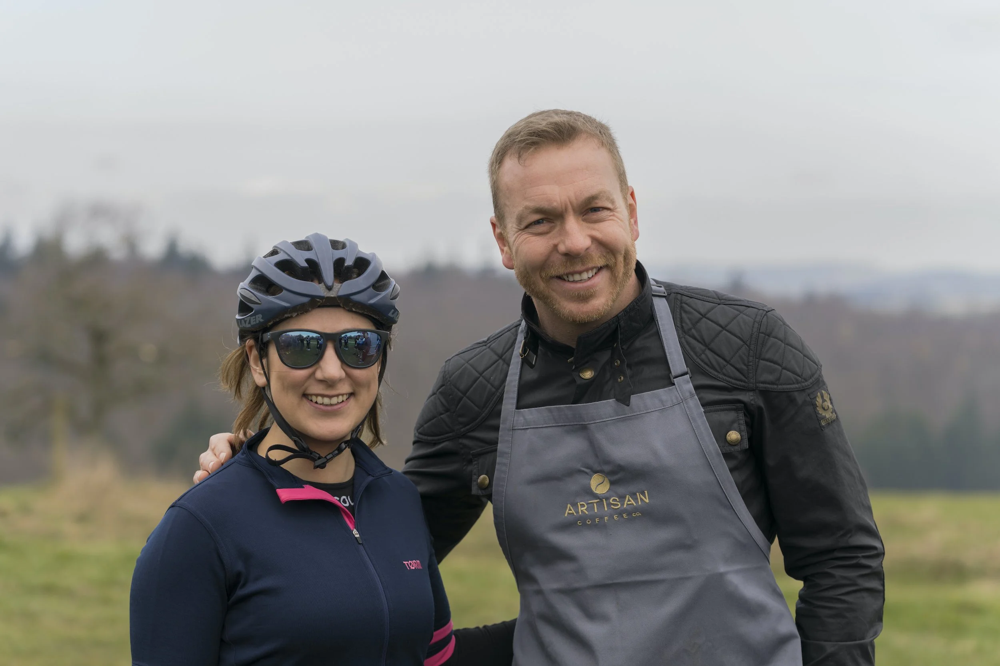

I have heard many tales about Sir Chris Hoy carrying his espresso machine to training camps, Olympic holding camps, events, etc. As a confessed coffee snob, I can relate. Life is too short to drink shit coffee. Chris was pulling golden shots as fast as we could drink them — with Artisan's chocolate pairings to make the experience even sweeter.

*📷 James Clarke*

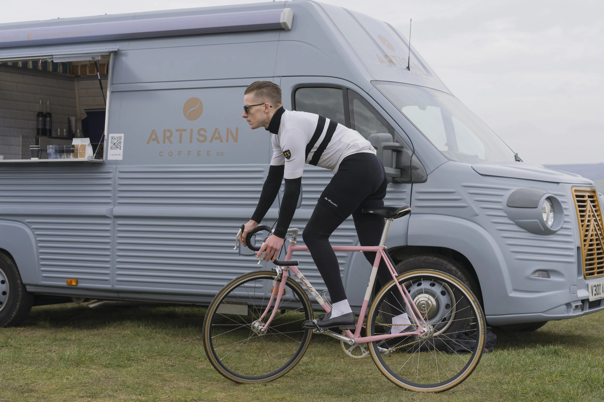

Artisan Coffee was co-created by my friend Ash Palmer-Watts, a gastronomic genius and the most significant coffee connoisseur I have come to know. Ash is a keen road cyclist, and our paths first crossed at LeBlanq, where his passions and professions intertwine.

*📷 James Clarke*

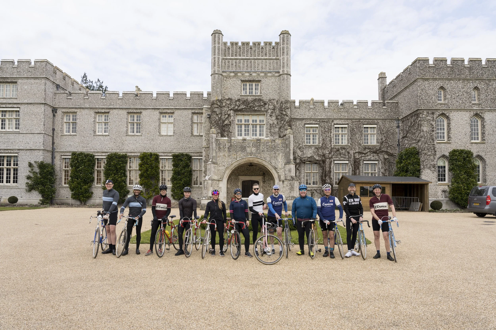

If you are a home coffee enthusiast like me — give Artisan a try. Their purpose is to simplify the process of creating artisanal coffee at home. For example, if you only have a kettle, they have created coffee 'tea bags' — so you don't need a french press or any pour-over gadgets. If you are like me and like to grind your own coffee and have an espresso machine, then Artisan has a great range of delicious whole beans. They have a solution for everyone.

*📷 James Clarke*

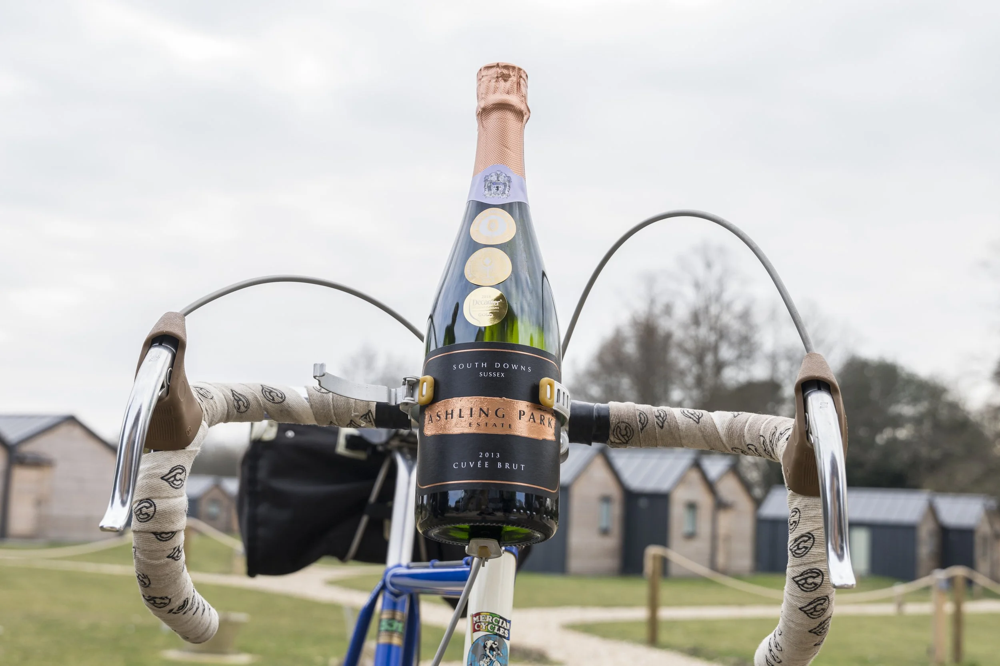

Anyway, back to the ride. After waving goodbye to the Artisan team (I was five coffees deep by this point), we rolled onto a gravel section and through the West Dean Estate, which was beautiful.

We stopped for lunch at the Ashling Park Estate, an award-winning wine producer and vineyard. Now, I stay away from the naughty water, but the lunch was delicious, and they have a healthy population of bees — so while everyone was enjoying sparkling wine, I looked more like Winnie-the-Pooh.

*📷 James Clarke*

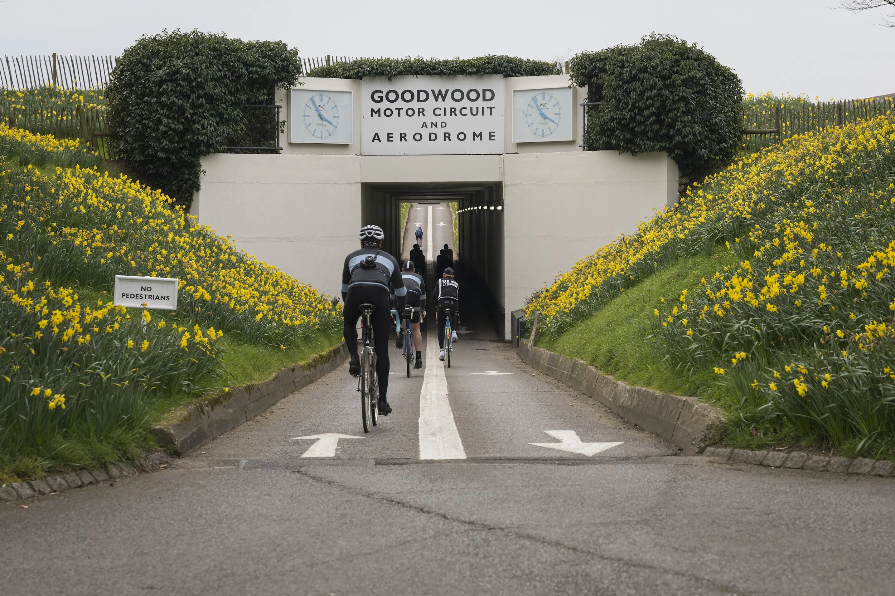

The race track was empty when we arrived back at Goodwood Motor Circuit, so Tim let us loose. Having ridden at a social pace, and having eaten enough honey to put a yellow bear in a carb-coma, I thought I'd go à bloc for a lap with Simon Smythe, Cycling Weekly's senior tech writer — both on our fixies.

*📷 James Clarke*

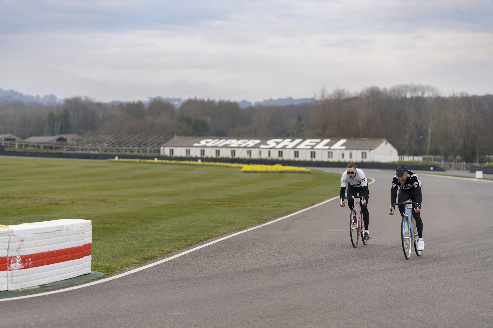

Artisan Coffee Co greeted us at the finish line. I couldn't resist another. Six coffees is fine, right? We enjoyed local delicacies from the Goodwood Estate before saying our goodbyes.

It was a fantastic day out, and I am sitting here smiling as I recall these memories. I have made some friends for life, we all bonded over an appreciation for steel bikes, great produce, beautiful scenery and road camaraderie.

*📷 Moloko Cycling*

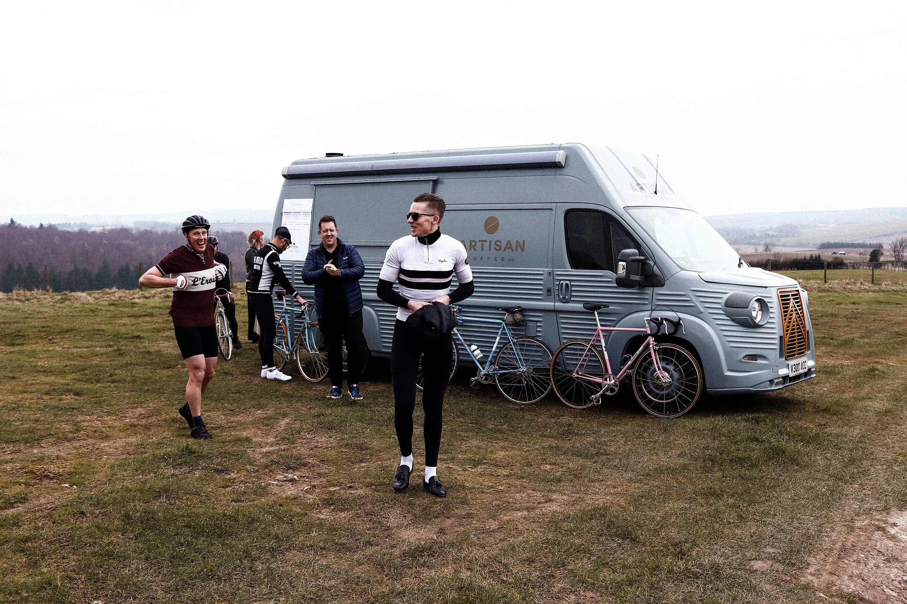

I cannot wait for the actual event in August, and I hope to see some of you there. The routes have just been launched. I can testament, the West Sussex countryside is stunning.

Thanks for reading. G

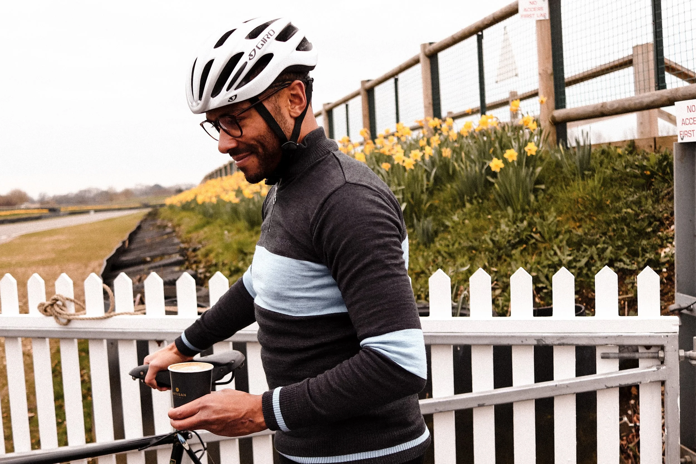

*📷 James Clarke*

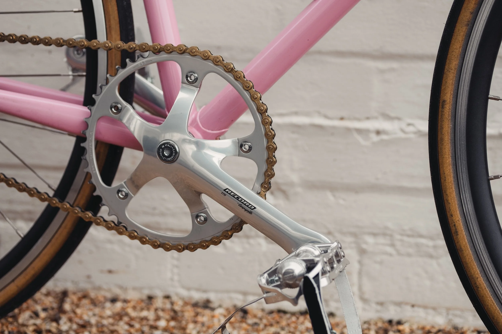
