This was not a training camp.

Becky is six months pregnant. We needed to get out of the country before everything changed permanently. A last trip as two. The climbing and the roads were a bonus. Mallorca was the venue. I nicknamed it "the Milk Race."

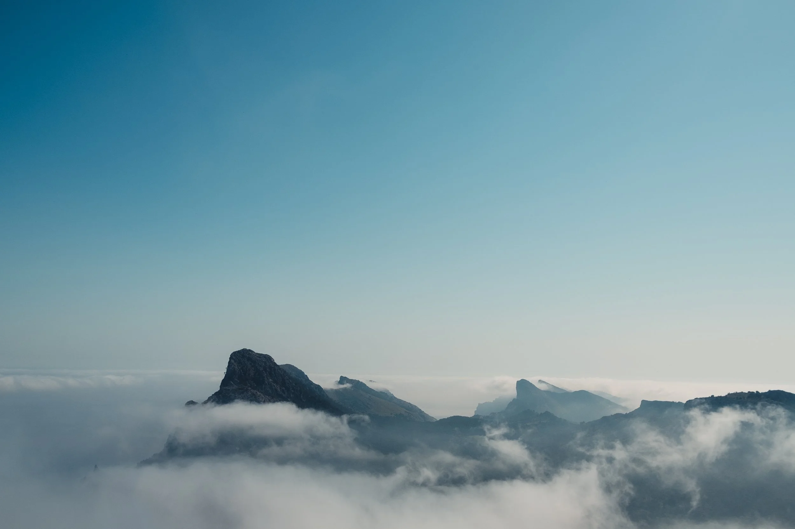

*View from the Albercutx Watchtower*

I keep coming back to Mallorca for the same reasons: roads like smooth tarmac, enough elevation to satisfy any obsession, Pollenca as a base. Two to four hours in the colls at dawn, back for breakfast, then spend the rest of the day together not talking about cycling. Roughly in that order.

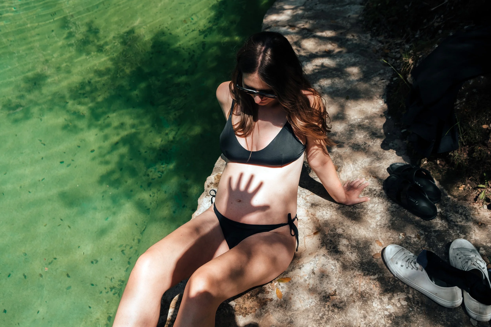

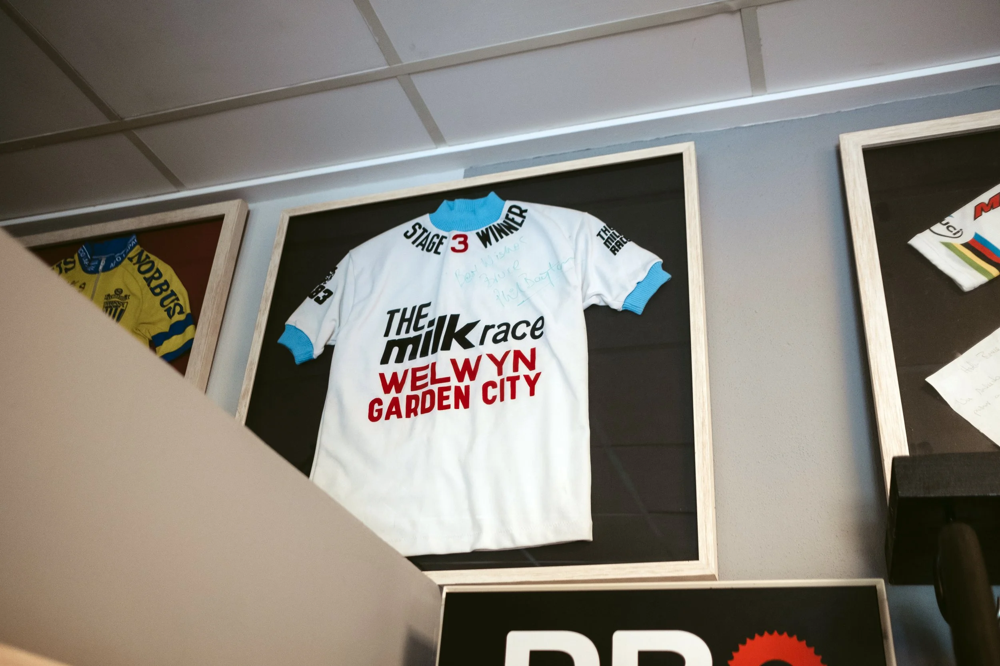

*(Jersey found at Pro Cycle Hire Mallorca. Felt appropriate.)*

I give too much of myself to work and cycling. Becky absorbs the shortfall with considerable grace. This trip was about finding balance before balance becomes legally required by a small human.

My lighthouse for this year: "Is this authentically me?" That question has already led to one significant change. I became creative director of Veloforte. The career at Sky shaped me. But Veloforte runs deeper. Helping athletes at every level get more from their sport through real food and real nutrition has become a purpose, not just a job.

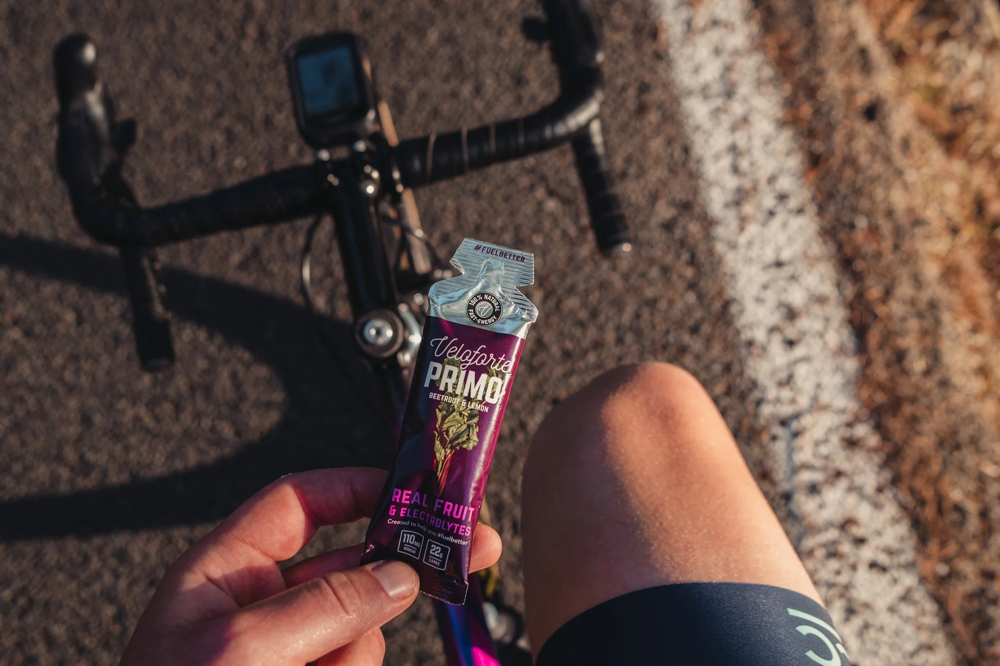

*Veloforte PRIMO Gel*

I train for the feeling, not for a result. Cycling channels my obsessive nature. The hunt, not the kill. The climb, not the summit. When fatherhood arrives, that does not change. Babies love white noise. My turbo trainer should work perfectly.

My parents found their own solution in the 1980s.

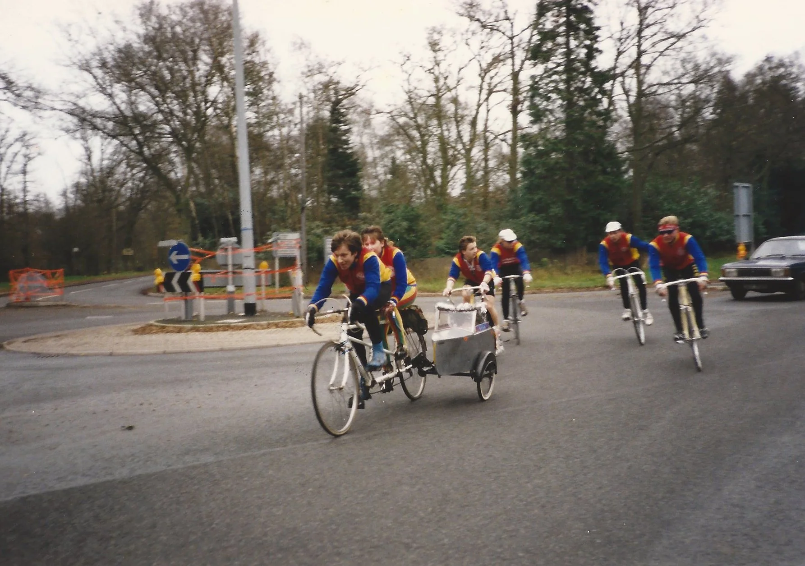

That is my parents charging down an A road on a tandem with a sidecar attached. I will stick to Zwift and a baby bouncer.

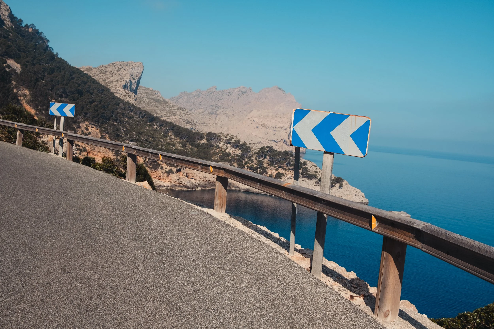

*Mirador Formentor*

## Mallorca Day 1

The standard arrival ritual: a leg stretcher to Cap de Formentor. We always stay in Pollenca. The ride to the lighthouse shakes out the travel, wakes up the legs and reminds you why you came.

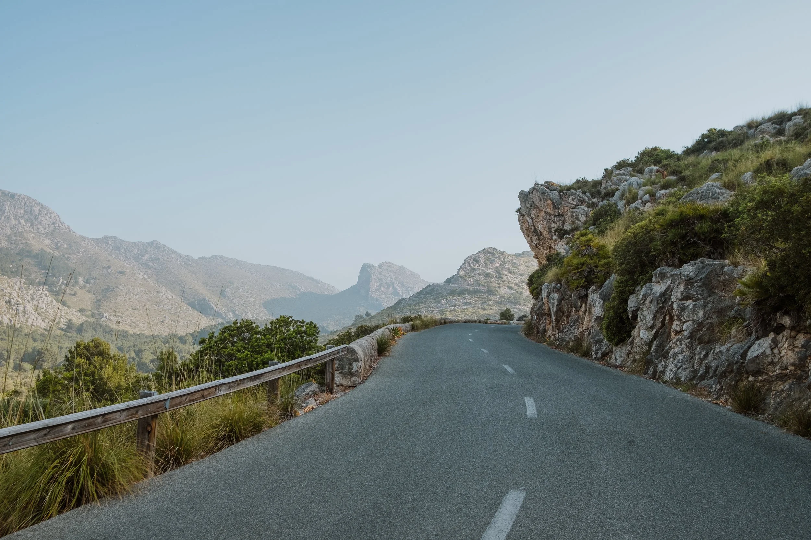

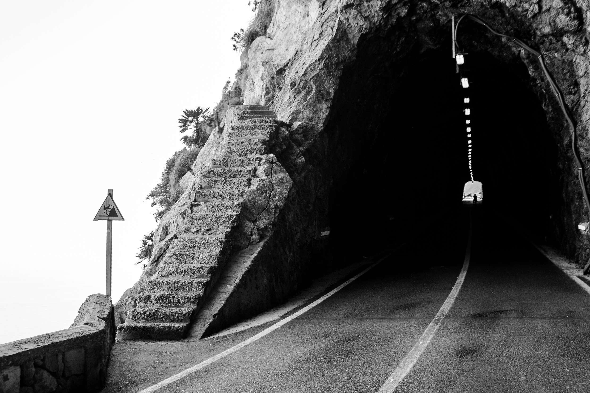

The final segment to the lighthouse was closed, guarded by a rather hostile gatekeeper who did not make the photographs. I redirected to the Albercutx Watchtower instead.

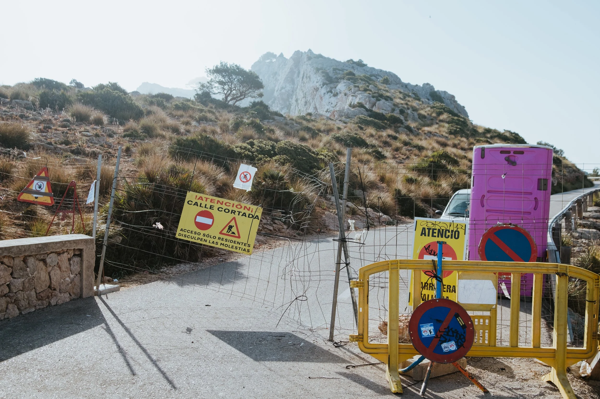

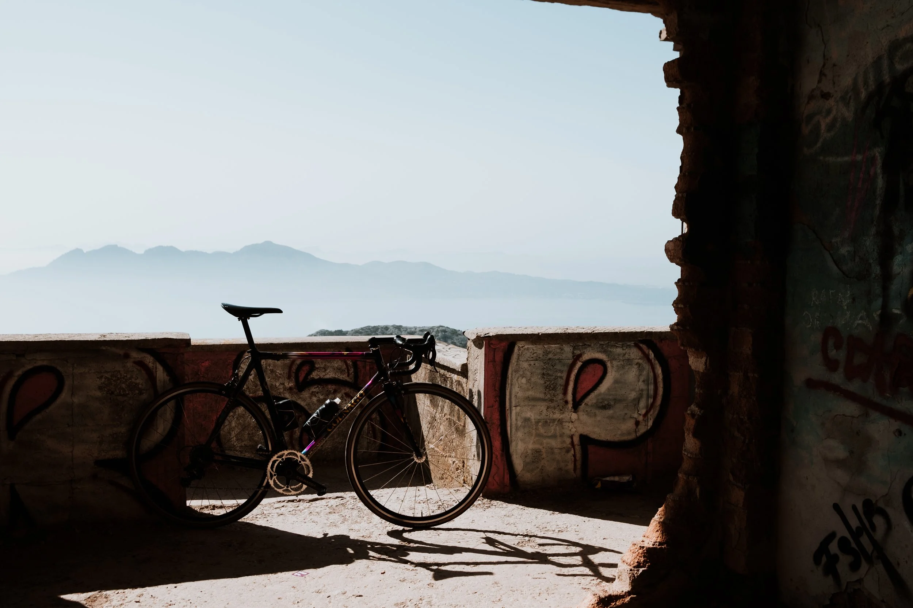

Back at the villa, I mixed a NOVA recovery shake and uploaded to Strava. I had PRed every segment of that ride.

Context matters here. In 2019 and 2020, I did serious damage to my cycling chasing a world tour power-to-weight ratio. I set the wrong goal. I tried to lose more weight instead of building more power. The result was that I became light and powerless simultaneously. I have spent the last year undoing that.

The PRs suggest it is working.

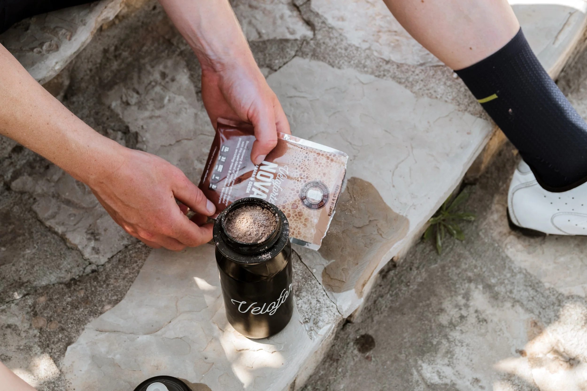

I am a rouleur. A diesel engine. A jack-of-all-trades. I will not win the first climb, and I will not win the sprint. But I will be the last one standing at the end of a long day. Training to that strength instead of against it has made cycling feel right again.

## Day 2

Sa Calobra. My favourite climb on the island.

Not the biggest. Not the most celebrated. But the snaking hairpins, the dead-end port at the bottom, the views at every switchback: it has the most character of any climb I know. Out and back is the only route. There are no shortcuts.

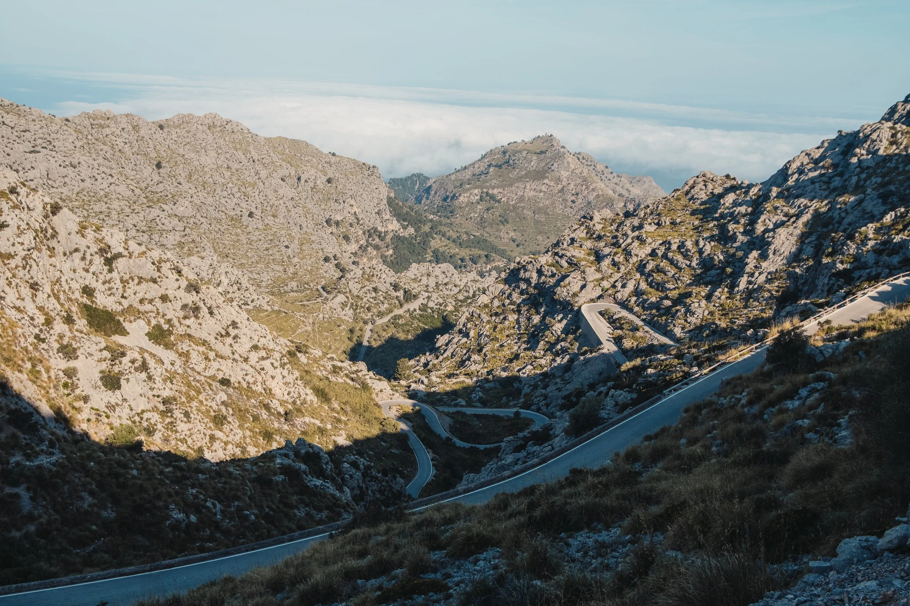

I needed this descent. Two years mostly on a turbo trainer had done damage to my cornering and descending. Going to shit is the accurate phrase.

Sa Calobra holds a particular memory. In 2019, my dad climbed it with me. His doctors had told him he would struggle to walk without assistance. Leukaemia, DVT, a lung tumour. He defied all of it. We rode Sa Calobra together.

Having set a sub-30 minute PB on that day, I expected to go faster this year with my improved training. I was six minutes slower.

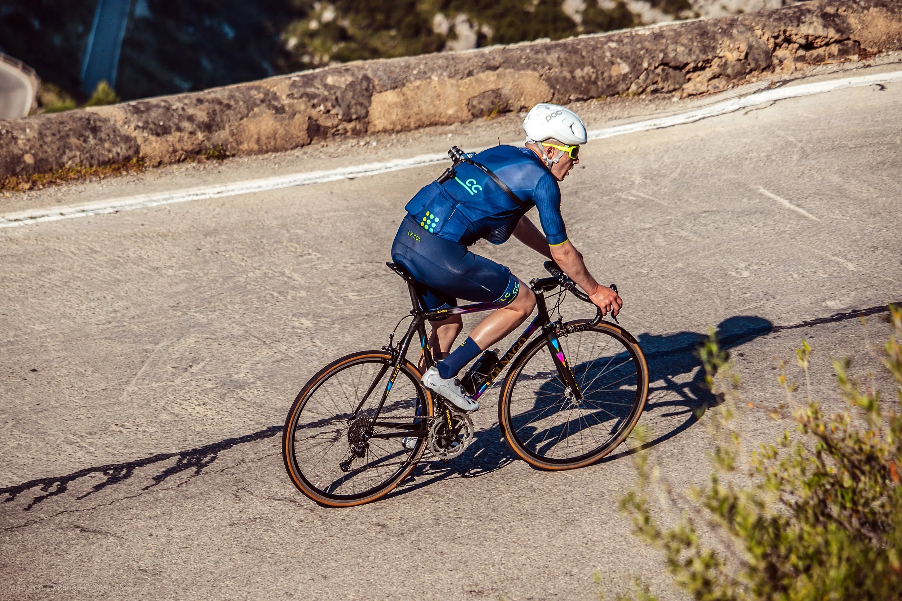

It would be easy to be disheartened. The reality is that in 2019 I was good uphill for 30 to 60 minutes and useless at everything else. Now I am far more complete. The numbers are against me for this specific climb at this specific duration. They are in my favour for everything else.

The additional context: this year I had a camera on my back, full tools and spares, food, water, a heavy Colnago C40 from the 1990s with a Flemish compact (53x39) and alloy wheels. Setting my PB, I emptied my pockets at the top of the descent and hid everything in a bush, rode a lightweight hire bike with a compact chainset, and eliminated every unnecessary gram. The variables are significant.

Average power was higher than my PB. That is the only metric I am looking at.

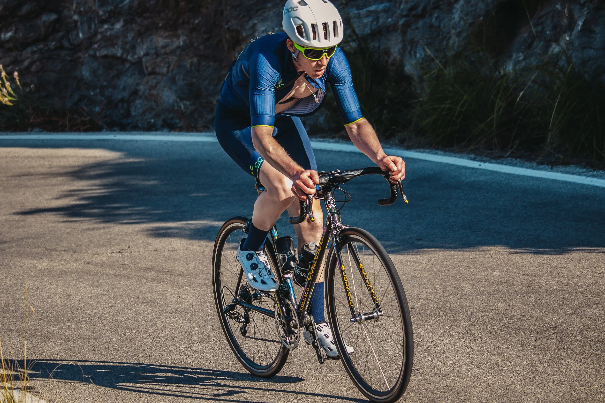

---

## My essential travel items

Condoms are not essential this year. We have already established that.

## 1. Veloforte

Controlling the controllables means travelling with nutrition you know and trust. I brought a range. Here is what earned its place in my pockets:

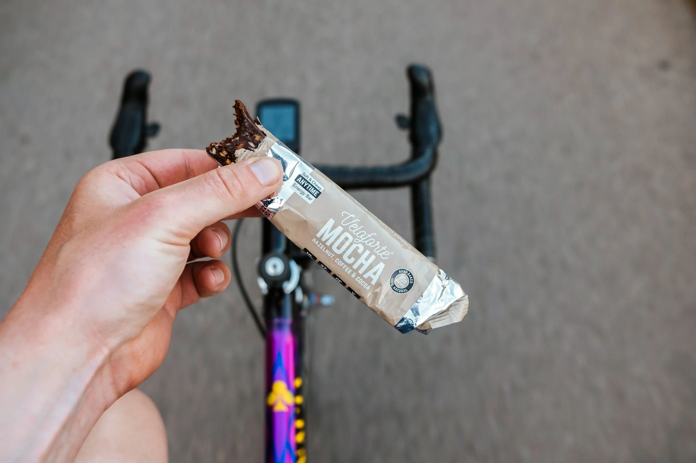

**MOCHA Protein Bar:** 10g plant-based protein, 40g carbs. I start early (4 to 5am) and often do not want a full meal. MOCHA solves this. Small, fortifying, easy to digest. I eat one before the ride and another after the first hour. I could live on these.

**FORZA Protein Bar:** The reward for when the efforts are done. 12g protein from egg whites. Fennel and apricot. My favourite Veloforte product. It tastes like the ride was worth it.

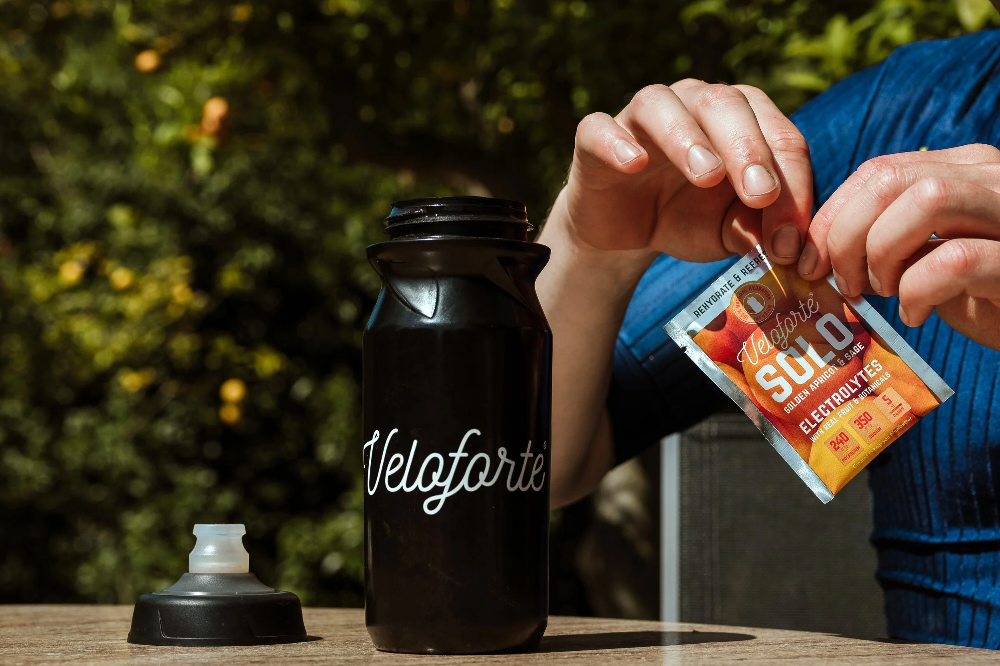

**SOLO Electrolyte Powder:** Hot conditions and consecutive riding days drain sodium and potassium fast. SOLO replenishes them: powdered coconut water, pink Himalayan salt, 240mg potassium, 350mg sodium, 5g carbs. The flavour is refreshing enough that you actually want to drink more, which is the point.

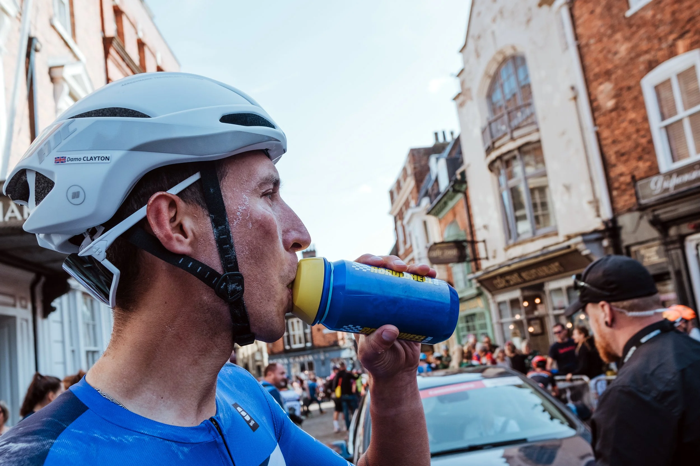

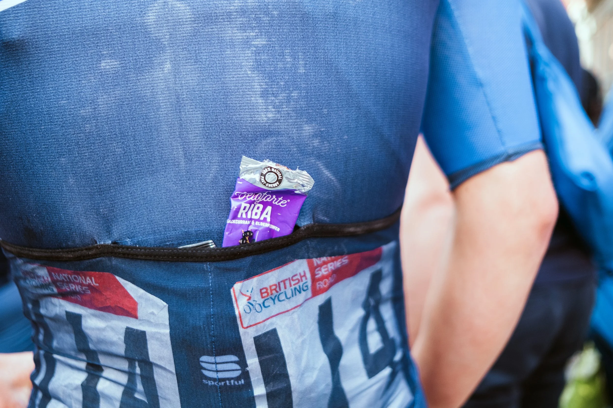

**Primo Natural Energy Gel:** Made from real ingredients. No synthetic fillers. Balanced fructose and glucose for absorption. Easy on the stomach for back-to-back riding days. I have been known to pour the TEMPO gel on pancakes.

**NOVA Recovery Shake:** Protein and carbohydrates within 30 minutes of finishing. When you have gone deep, appetite disappears. A shake bypasses that problem. Chocolate, banana, plant protein. It makes recovery feel like a reward.

## 2. Veloskin Chamois Cream

Shea butter, orange oil and aloe vera. Natural anti-bacterial properties. In Mallorcan heat, sweat volume multiplies and bacteria accumulates quickly. Veloskin stops saddle sores before they start.

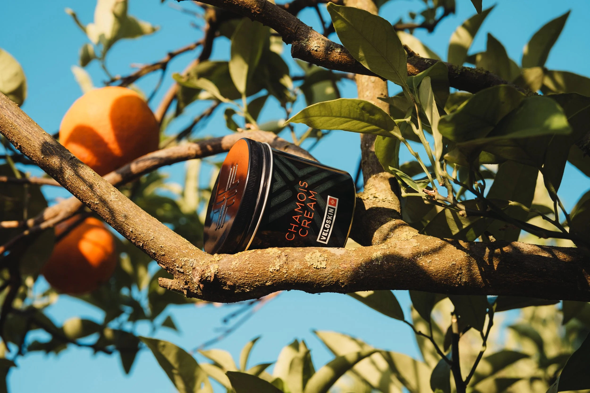

Travel sachets work for shorter trips. For a week of riding I bring a tin. Their shave cream is equally good. The guns stay gleaming.

(10% off with code GARETHWINTER10)

## 3. Pelotan Suntan Lotion

"Stick it on and forget about it." That is the brief. Pelotan SPF 30 delivers all-day protection without needing to reapply constantly. It smells good, goes on easily, and the roll-on version fits in a jersey pocket for top-ups mid-ride.

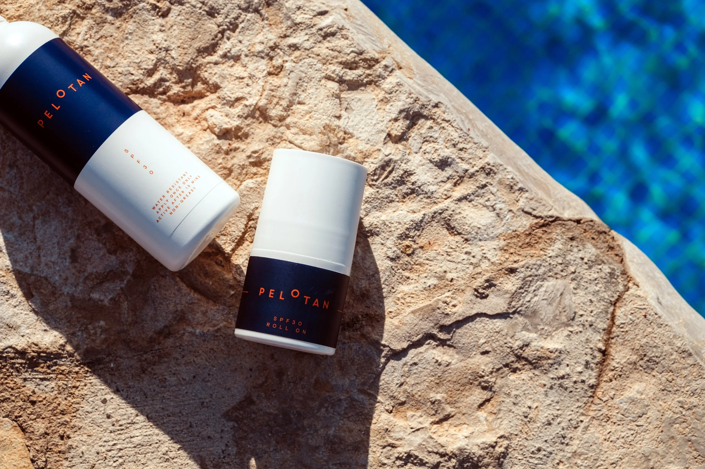

## 4. Aeropress

Mallorca's coffee is mostly disappointing. I take an Aeropress and freshly ground beans stored in a freezer bag to keep them fresh. Full-bodied, clean, done in two minutes. The perfect compromise between espresso and filter. Life is too short for bad coffee, especially when the first sip of the day comes before a dawn climb.

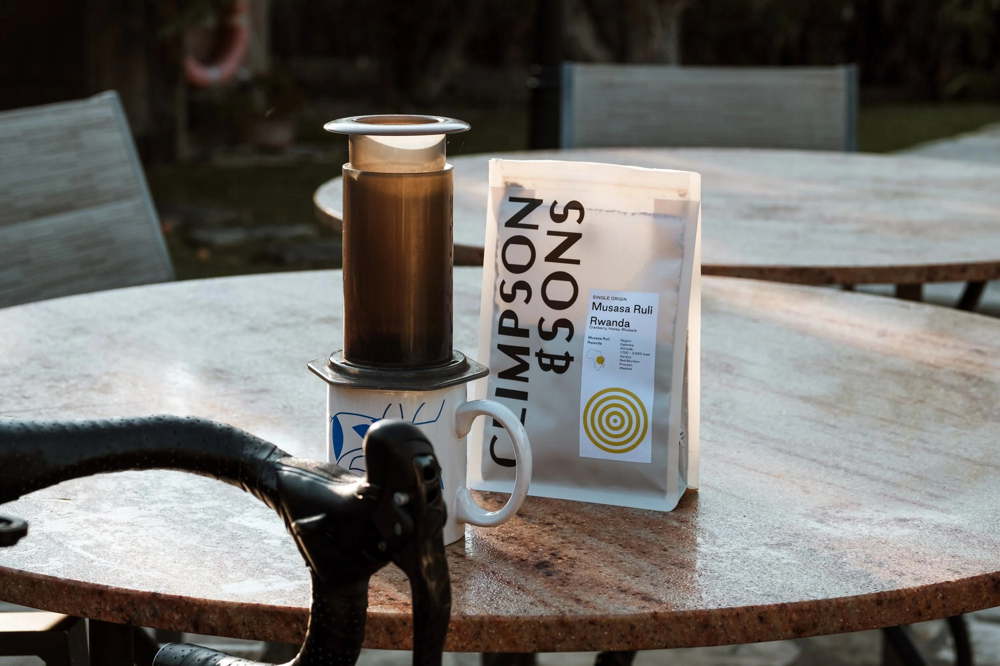

## 5. Aloe Vera

Organic aloe vera gel: after-sun, insect bites, daily moisturiser. It does more jobs than anything else in the bag, weighs almost nothing, and costs almost nothing. Nature got there before the lab.

## 6. Le Col Wallet

Passport, payment cards, driving licence, key clip, extra room for tools or tyre levers. The whole thing goes in a jersey back pocket. Elegant and practical.

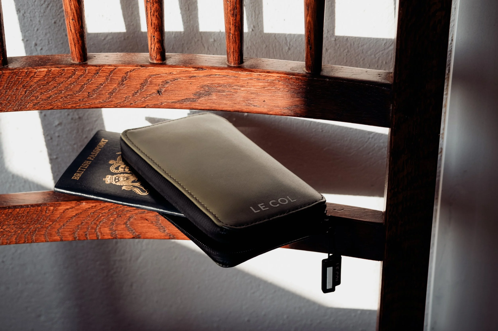

(20% off at Le Col with code GARETHWINTER20)

## What I wish I had brought

**Cable ties:** For closing the hardshell bike box. Finding a shop that sold them was harder than it should have been.

**CO2 cartridges:** I borrowed Bruce's track pump at Pro Cycle Hire Mallorca. Next time, CO2 to inflate after the rebuild, pump for the rest of the week.

**POC Ventral Air:** I brought my standard Ventral out of habit. The Air has far more ventilation. By 8am, Mallorca was already a sweat fest. Also, more vents means more escape routes for mosquitoes.

**Orthopaedic pillow:** The villa pillows felt stuffed with damp rags. Once you have slept on a proper orthopaedic pillow, everything else is a punishment.

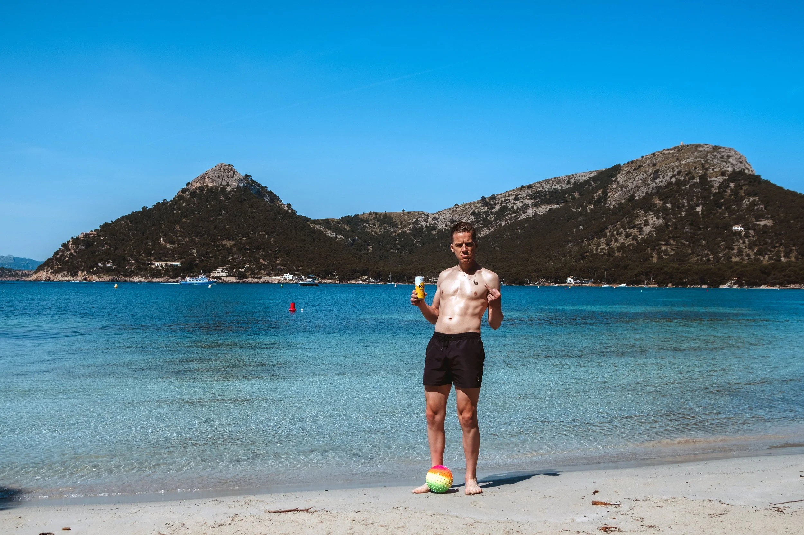

*A Brit abroad.*

Stay tuned for Part 2: more cycling, less introspection. Plus restaurants, coffee, and the best ice cream on the island.

G
