I called it heaven in Part 1. An endless climb, an infinite loop, a summit that never arrives.

Here is why.

Climbing at threshold is the closest thing I have found to meditation. Jersey unzipped. Jaw down. Sweat rolling. My pendant ticking in sync with my cadence. The effort demands all of my consciousness. There is no room for anything else: no to-do list, no unresolved arguments, no half-formed ideas. Just the gradient and the breath and the cadence.

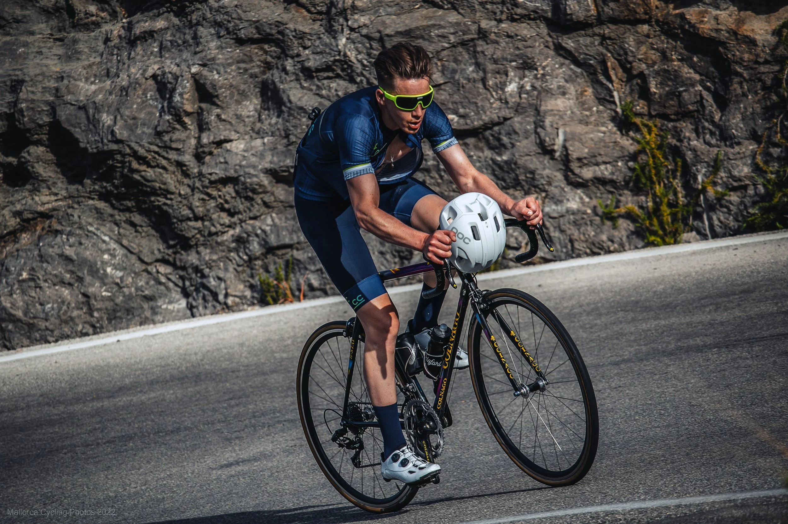

You know that feeling when you are deep in a climb, hurting, wanting it to be over, and then you crest it and immediately think: "That was brilliant. I want to go again." Inner peace lives in that middle. It hurts. It is a good hurt.

Add other riders and it turns into a race. Which is a different kind of enjoyment entirely.

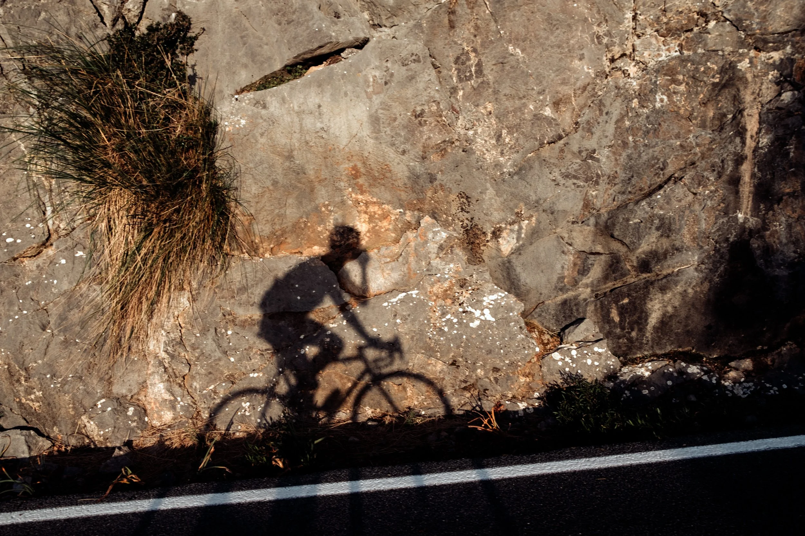

## Day 4

The Puig Major. 14km, 830m elevation, steady 6% gradient from Soller to the Tunel de Monnaberthe. The longest climb on the island. The descent felt as endless as the climb.

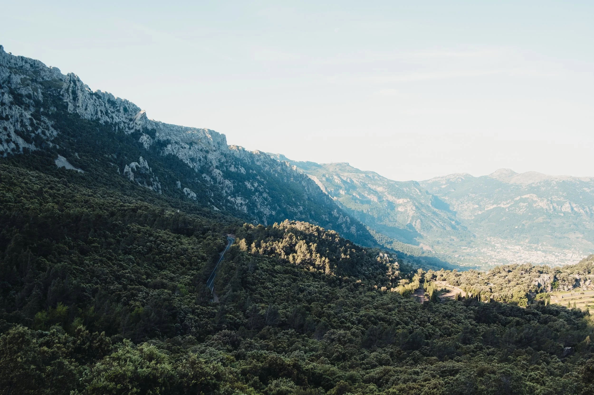

I still prefer Sa Calobra. The Puig has the stats, but Sa Calobra has the hairpins and the views. Sa Calobra is a Scalextric track laid by an imaginative, sugar-fuelled child. The Puig is a motorway by comparison. But you cannot come to Mallorca and skip it. You pay your respects and move on.

Volume in the legs from the previous days and nights. I laid down what I could.

Left the villa at sunrise with pockets loaded: bars, gels, chews, a 500ml bottle of VIVO electrolytes, a carton of coconut water, freshly squeezed orange juice from the villa trees. Dawn patrol means everything is closed. I drink the cartons first, throw them in a recycling bin, then the bottles carry me home.

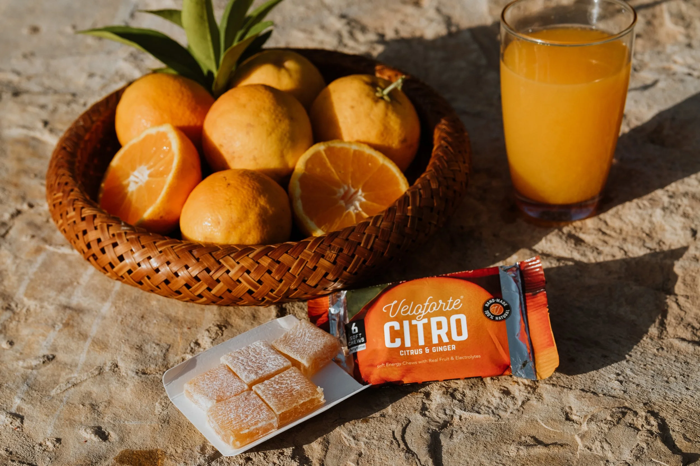

*Veloforte CITRO all-natural energy chews*

By the morning shadows I was already riding full Schleck (jersey open) to cool down. Hot conditions drain you faster than you expect. Fuelling rule for back-to-back riding days: before, during, after. Every ride. No exceptions.

Fitness is your ability to recover. Under-fuelling is the fastest way to destroy training. You cannot out-suffer a calorie deficit when you are doing this volume.

The final descent of the Coll de Femenia slung me back into Pollenca. I collapsed poolside with a recovery shake, then got in the pool to cool down.

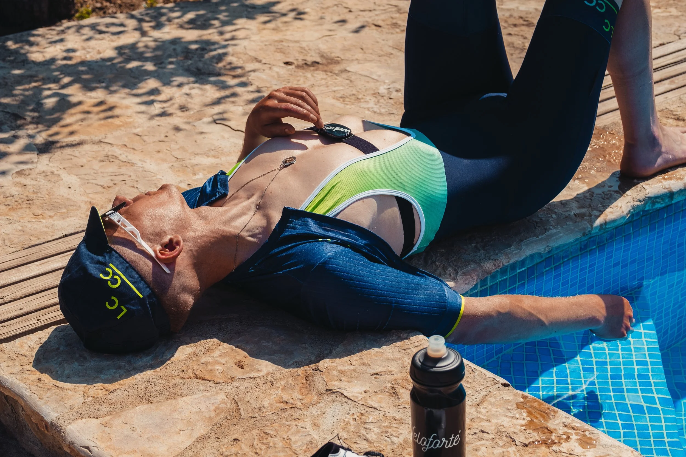

Four hours in the bank. The day was just starting.

Lunch: Restaurant Es Guix. Hidden in the woods below the Sierra de Tramuntana, between the Coll de Femenia and Sa Calobra, with a blue lagoon fed by the mountain water table. The water is freezing.

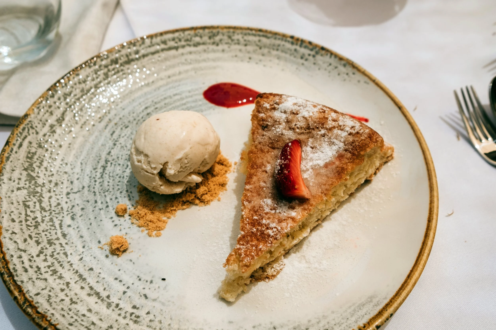

We ate Mallorcan almond cake and then got in. Legs first. The cold contracted the vessels. When you stand up, they dilate, blood flow improves, and the dull ache from the morning disappears. I dived in properly. Emerged completely reset.

This pool does what ice baths do, in a far more pleasant setting.

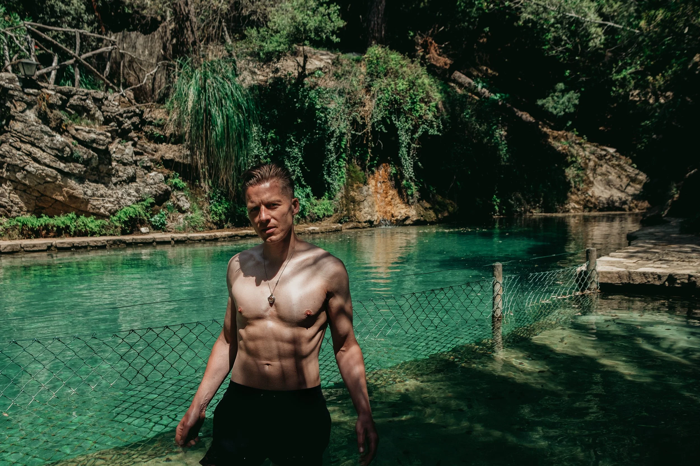

## Day 5

Recovery day. "Roll for the soul." Back to Formentor, easy pace, sunrise light.

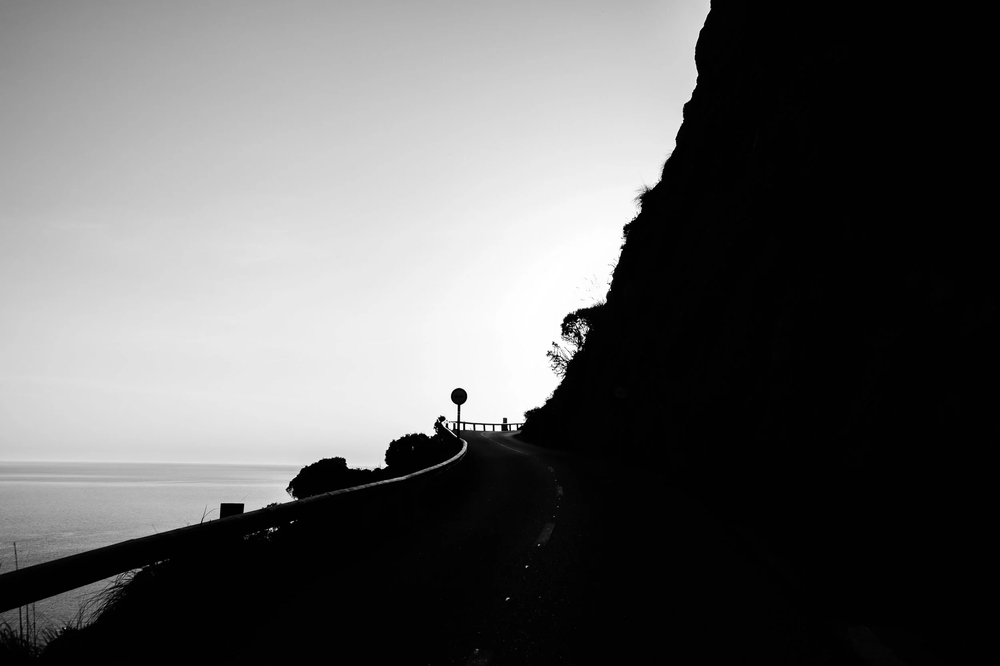

Formentor is not just a cycling route. There is a beach. As soon as I was back from the morning ride, we made a picnic and drove straight back.

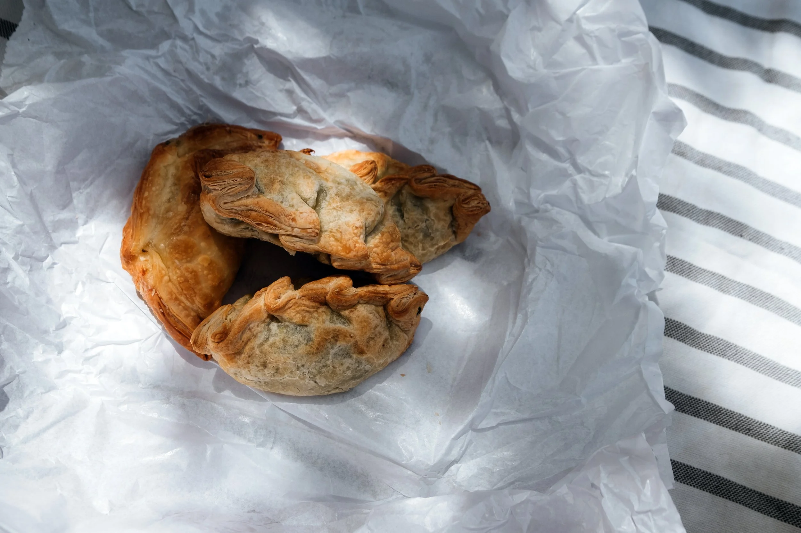

Stop at La Mar Dolça on the way: the best coffee shop in Pollenca, possibly the island. The only place with Oatly Barista if you are an oat milk person. Best empanadas. Iced coffee. Picnic loaded.

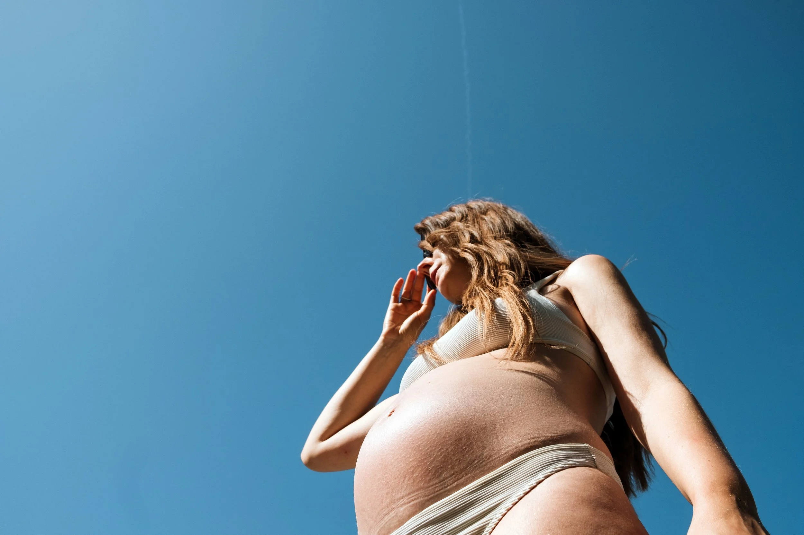

The water at Formentor is gin clear and exactly the right temperature. Baby wriggled enthusiastically the moment Becky began floating. The beach is quiet on the left. Turn right for European techno at 10am and people day-drinking in the sun. Both options have their advocates.

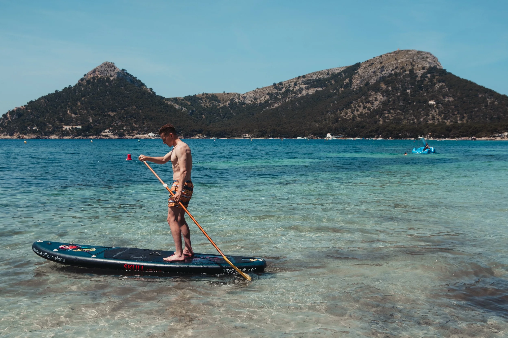

Evening: Tolo's, Port de Pollenca. The canonical roadie restaurant. I eat early by default (early riser), so I am usually surrounded by toddlers and pensioners. This suits me perfectly.

There is a reason cyclists flock here. Enormous portions, serious calories, cycling memorabilia covering the walls. The room understands the audience.

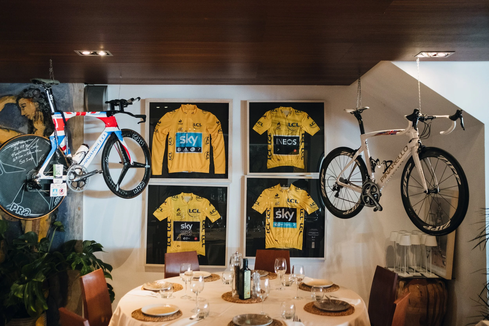

Order the Wiggins Pappardelle: sautéed mushrooms, pecorino, fresh vegetables, truffle oil. It is excellent. The best dish on the menu is the crab and lobster ravioli. Both are worth the trip.

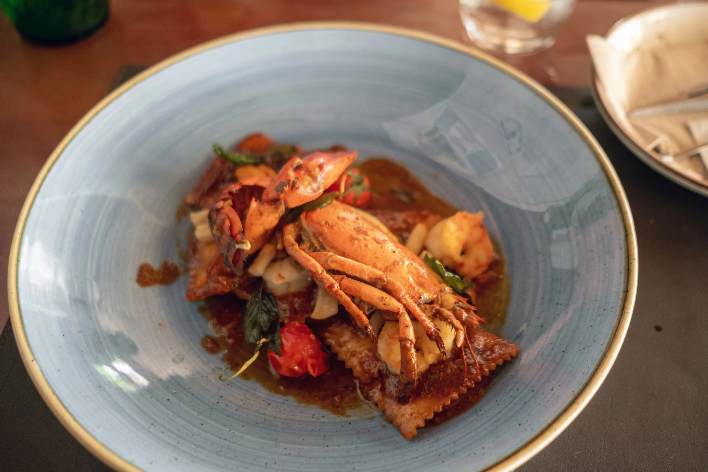

Part 3 has the best ice cream on the island. Stay tuned.

G
