I picked up the prototypes at Rouleur Live. Damien Phillips from POC handed them to me. I held them. My first words were: "Fuck. These are light."

23 grams. The lightest high-performance cycling sunglasses on the market. Outside POC HQ and the pro teams, I was the first person to get my hands on them. So step aside, Mitch Docker. I've got this.

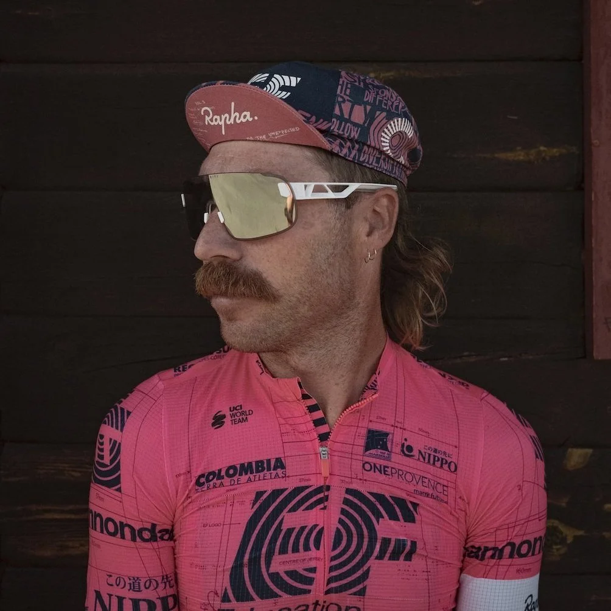

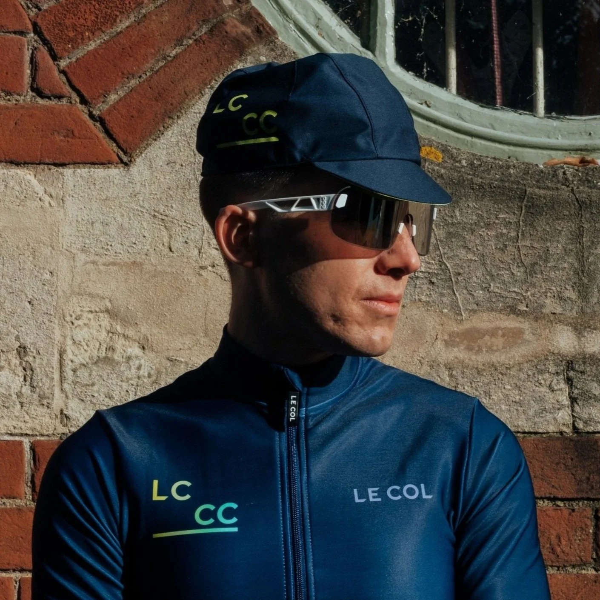

Mitch Docker wore the Elicits in their racing debut: Paris-Roubaix, ironically his final professional race. The most brutal one-day race in the calendar. The Elicits survived. So did Mitch.

> "The Elicit's are special, and their weight is extraordinary! The lightness means I hardly notice them and they are beautifully balanced. I am a fan of bigger lenses and I have ridden the Elicit's in almost every weather condition, including my last race, Paris-Roubaix, which was very messy, but they handled it all."

That is the brief this product was designed to meet. Lightest possible. No compromise on protection. Proven across the worst conditions in the sport.

## Weight Obsession: A Brief History

I grew up borrowing my dad's old 6-speed steel bike with downtube shifters. I took perverse pleasure in working harder than everyone else on modern equipment. His bike weighed a ton. I loved it.

Then in 2013, I upgraded to an 11-speed carbon bike. My first ride, I thought: "Is this what I've been missing?" Speed I couldn't explain arrived from nowhere. I became a weight weenie immediately.

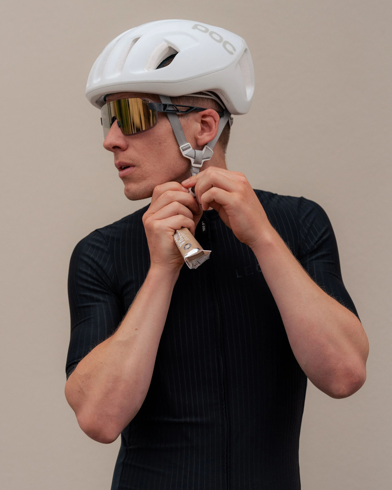

Now I ride a Factor O2 VAM with Campagnolo Super Record. One of the lightest bike and groupset combinations on the market. When you go back to a heavier winter bike, the contrast is physical. You feel the difference in your legs.

But weight savings have limits. I once swapped my Black Inc seatpost (184g) for a WR Compositi (131g). 53g saved. The post slipped and clicked constantly. The saddle would not hold position. I changed straight back and immediately understood why 53g can be worth keeping.

The POC Elicit Clarity is a 7g saving over my previous POC Crave Clarity. That is 23.3%. Which sounds modest. Which is not modest.

## The Product

POC could have saved weight by reducing lens size. That would have been the easy route. They did not take it.

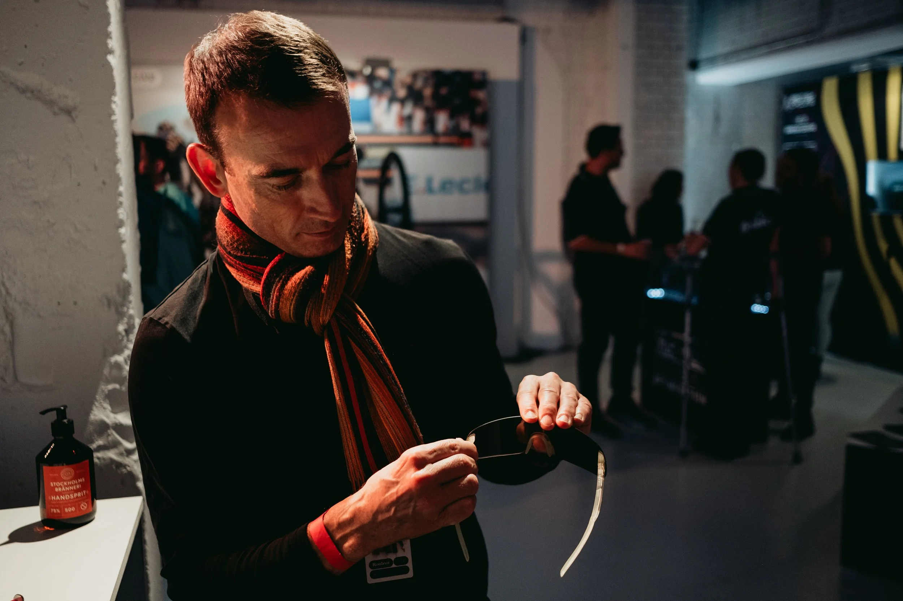

Instead: frameless construction using Bio-Grilamid snap-fit hinges made predominantly from renewable sources. The result is a maximised lens surface with an uninterrupted field of vision. The lens is large. The coverage is wide. The weight is 23 grams.

The construction is clever. The hinges snap in. They flex without breaking. If you crash, the temples break away from the lens cleanly to limit damage. The rubberised nose bridge comes in two sizes, both included. The arms grip at the temples. When you stow them in your helmet vents, they stay put.

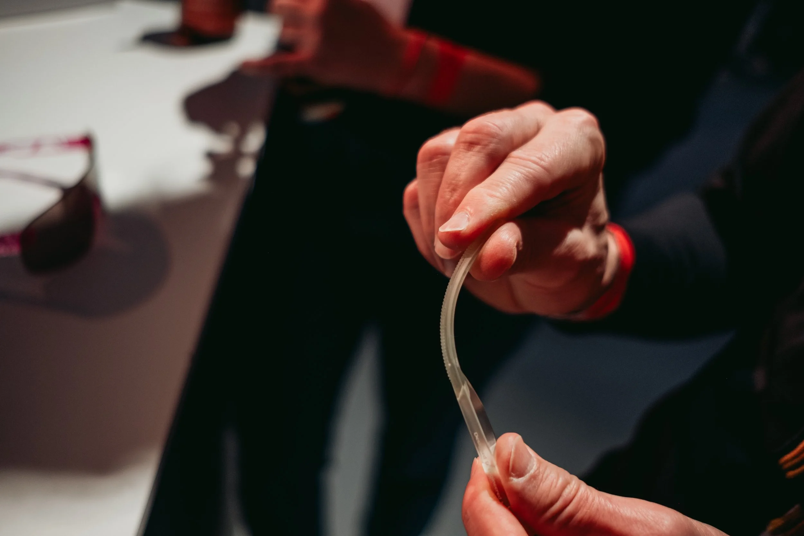

The Clarity lenses are made in collaboration with Carl Zeiss Vision. Enhanced contrast. Better hazard identification. Potholes, road debris, surface changes: you see them faster, which gives you more time to react. On a fast descent, that margin is real.

Ri-Pel coating: repels water, sweat, dirt and oil. Makes them easy to clean. Anti-fog treatment on the inside. The lenses do what they should do without requiring constant maintenance.

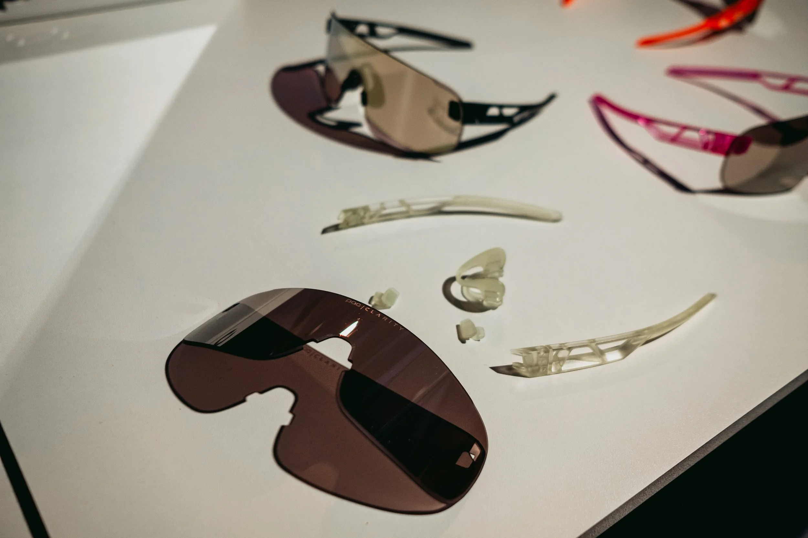

I have ridden these in full sun, crosswinds, rain and headwinds. They do not move. The balance of the frame and the flexible arms that hug the temple keep them in place regardless of speed or conditions. My one concern before testing was that 23 grams might mean they blow off at pace. They do not.

## Personal Summary

The first few rides, I kept removing my helmet before my sunglasses because I forgot I was wearing them. That took some adjustment. In a good way.

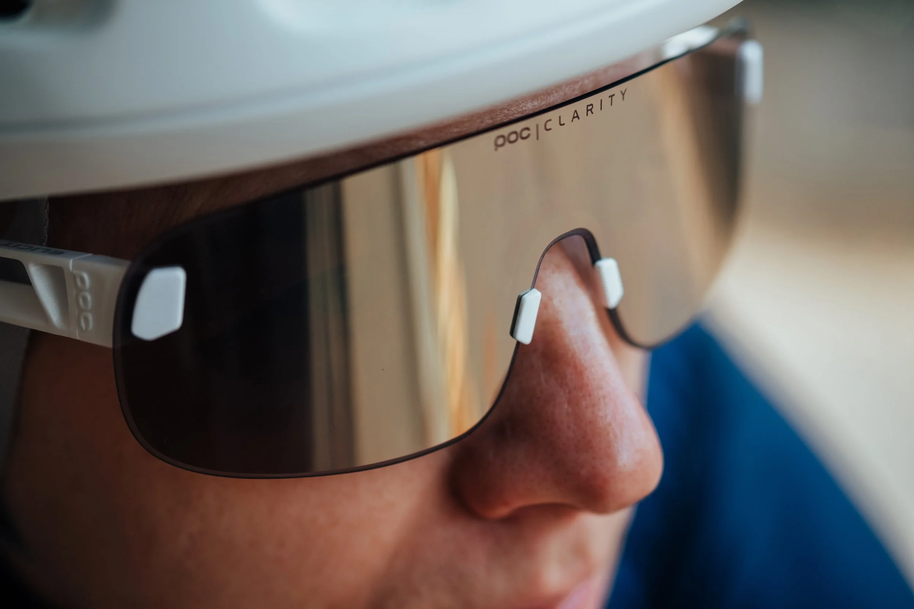

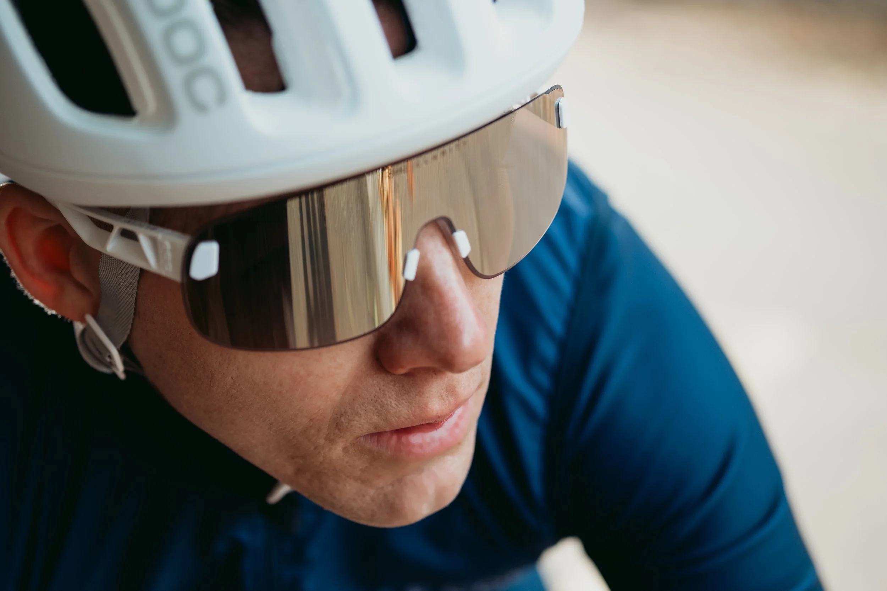

## Pros

- Incredibly lightweight
- All-day comfort: you forget they are there
- Uninterrupted field of vision
- Wide protection area
- Clarity lenses with enhanced contrast
- The style is clean

## Cons

- So light you might remove your helmet and drop them (see above)
- The arms have an industrial look to save weight. I prefer the slimmer arms on the Crave or Aspire aesthetically

The cons list is short. The Elicits are the best sunglasses I have owned.

If weight matters to you: pair them with the POC Ventral Lite helmet. Combined weight is 223 grams (size medium). That is a serious number for any event where every gram counts.

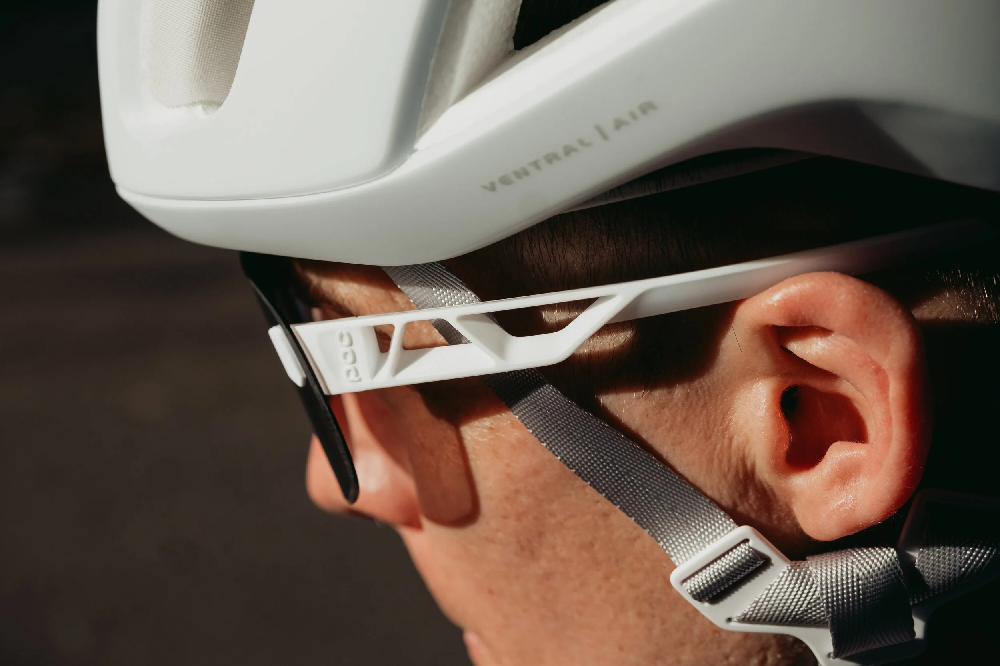

## Elicit Clarity Specifications

- **Weight:** 23g
- **Frame:** Frameless Bio-Grilamid construction with snap-fit hinges
- **Hinges:** Snap-in; temples break away on impact to protect the lens
- **Nose bridge:** Two rubberised sizes included
- **Lens:** POC Clarity technology with Carl Zeiss Vision collaboration for enhanced contrast
- **Coverage:** Curved continuous lens with chamfers for exceptional peripheral coverage
- **UV protection:** UV400 (full UVA and UVB)
- **Ri-Pel coating:** Protects against water, sweat, dirt, salt, oil and dust
- **Anti-scratch treatment:** Applied to lens surface
- **Spare clear lens:** Included for low-light conditions
- **Case:** Hard case and soft pouch included

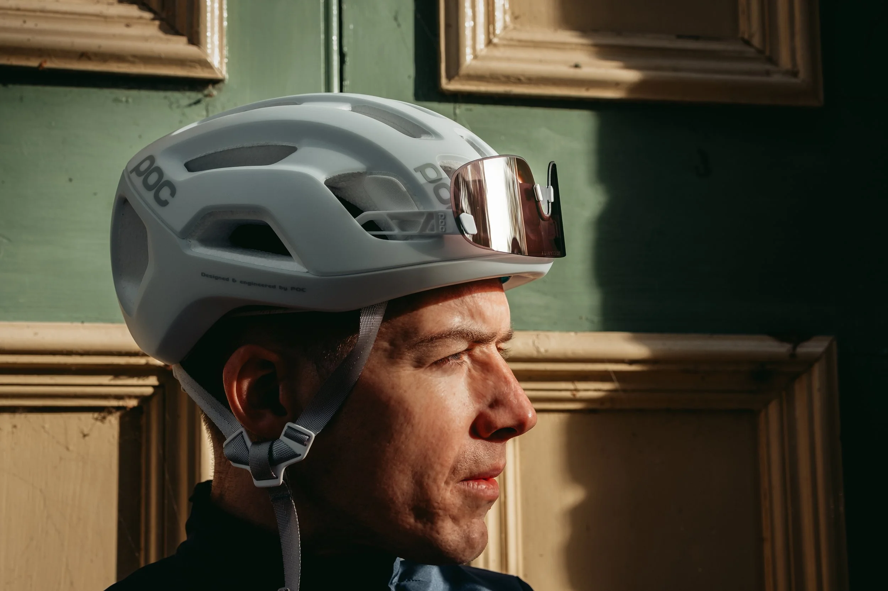

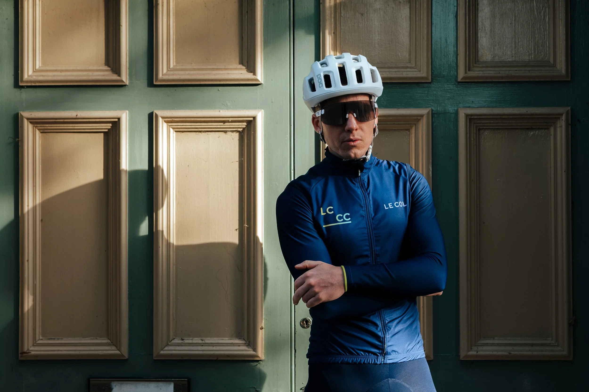

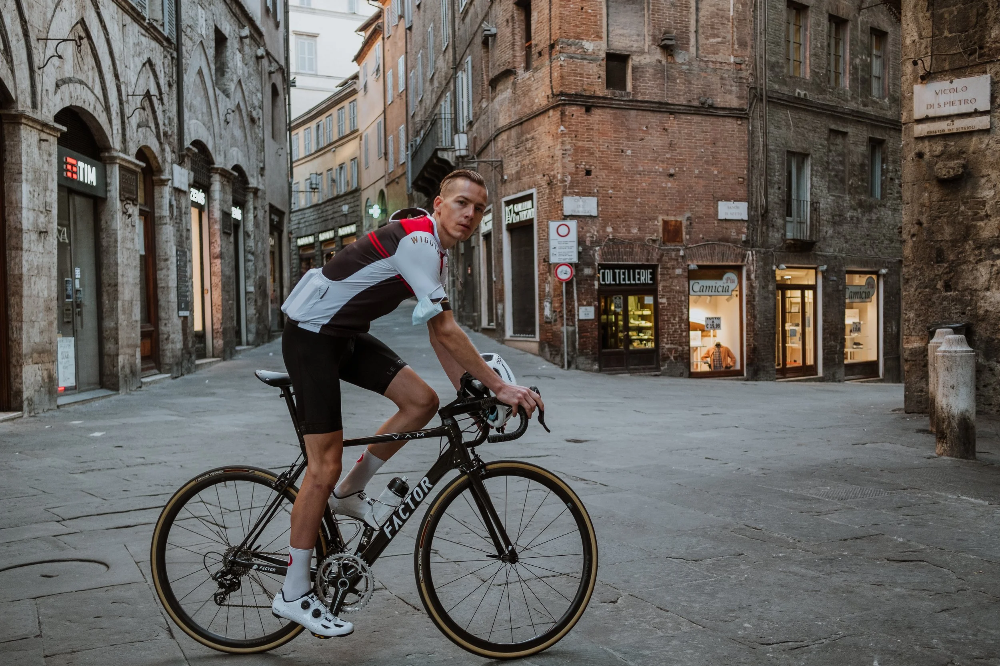

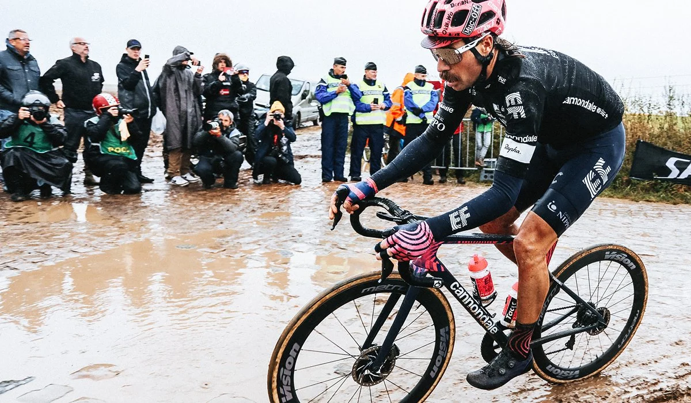

# 1 Year On

### November 2022

Over a year of riding the Elicits. They are still the first pair I reach for.

In June, I rode from Manchester to London. Approximately 12 hours in the saddle. A few hours more to get home. 14 hours total.

At the finish, I had barely a dent on my nose. Other finishers had angry red marks from their frames. The Elicits sit on your face differently. The contact is minimal and distributed. Not concentrated on the bridge.

After 14 hours, that difference is not marginal.

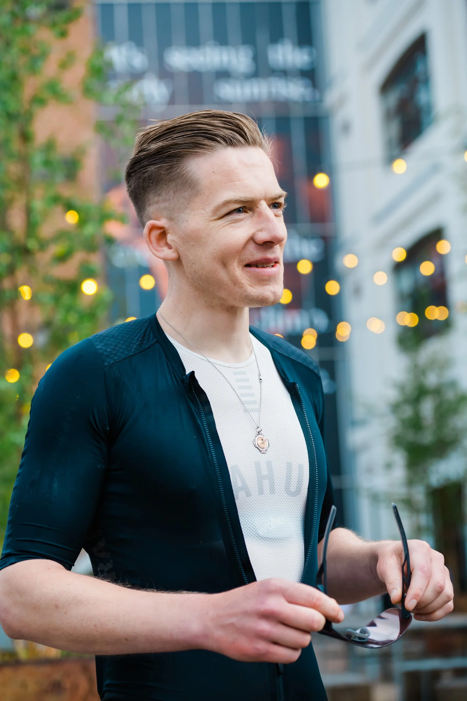

Still the most comfortable, high-performance sunnies in my collection.

Gareth
