We climbed through the vineyards of Champagne side by side, neither of us speaking.

Eddy Merckx doesn't fill silence with small talk. Neither do I. There was nothing to say. We just rode.

His head cocked slightly to one side. Sweat ran down his face, caught on his nose. He was 76 years old and he was suffering in exactly the way he suffered in 1969. The mechanism is unchanged. Only the speed has softened.

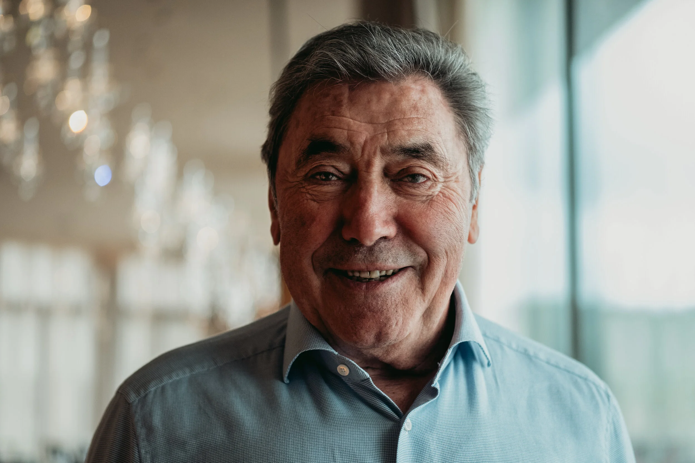

David Millar once told me: "Cycling is a team sport for loners." Those words sat with me that morning on the vineyard road. Eddy and I were both somewhere else entirely. The hill had taken us there.

Everything I had worked toward in 30-odd years of cycling had led to this: climbing alongside the greatest rider who ever lived. It happened in slow motion, the way important things sometimes do.

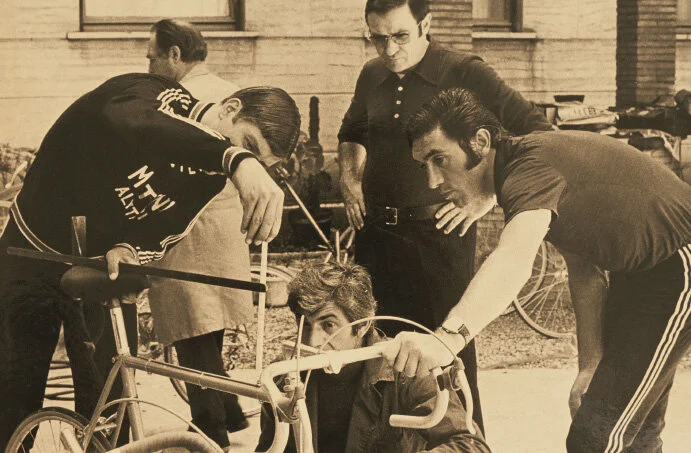

Greg LeMond said "it never gets easier, you just go faster." He could have stopped at "it never gets easier." Age will catch us all. But Eddy's ability to suffer has not diminished. Watching him climb that hill in Champillon was not less inspiring than any archival footage I have seen. It was more inspiring. Because I was there.

If I make it to 76, I want to still be on my bike. Eddy confirmed that this is possible.

Sir Brad Wiggins once said of Merckx: "He is cycling. He is the epitome of the sport. Everyone's got a story about him. He is the greatest, most stylish, the benchmark for the Hour record, how to conduct yourself."

Yes. All of that.

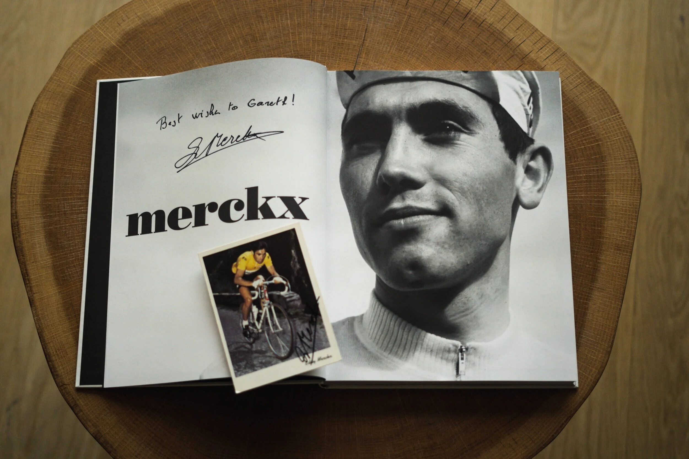

Then Johan Museeuw pulled up behind us with the group and shouted: "Coach!"

I was suddenly riding with the Cannibal and the Lion of Flanders on a Champagne vineyard road, and it felt entirely normal and completely surreal at the same time.

The word "Coach" is specific. Johan calls Eddy that because Eddy coached him to win the 1996 World Championships in Lugano. His advice: lift your saddle 2mm. Johan lifted it. He won.

When Eddy gives you advice, you take it.

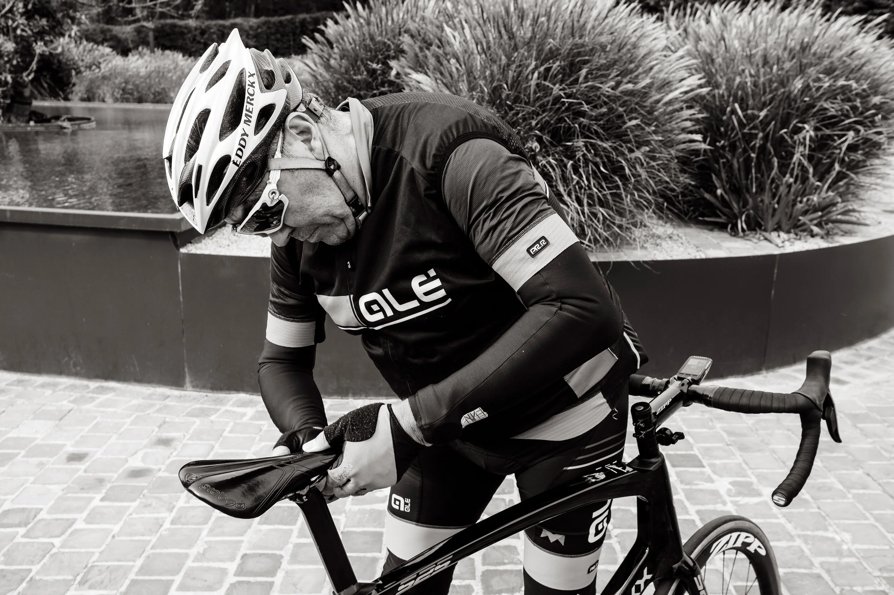

Sean Yates told a similar story. Eddy told him he needed 180mm cranks. "So I switched. I'm still using them."

Before we set off that morning, Eddy was at his bike, fettling with the saddle. It is one of his defining characteristics, the tinkering. Merckx famously adjusted his position mid-race. The pursuit of perfect is permanent for him. There is no arrival.

He once looked at my position and said: "Maybe you are a few millimetres too high."

He is right about these things.

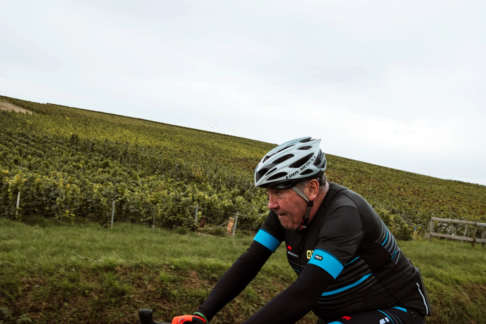

Post-ride debrief at the Royal Champagne Hotel and Spa. Everybody does the same thing after a hard ride regardless of how grand the venue: they talk about the ride. Watts, gradients, who nearly got dropped on which corner, the coffee stop.

At the table: Adam Blythe, Chris Lillywhite, Monica Dew, Liam Yates, our guests, Johan, and Eddy. All cyclists. All doing the same thing.

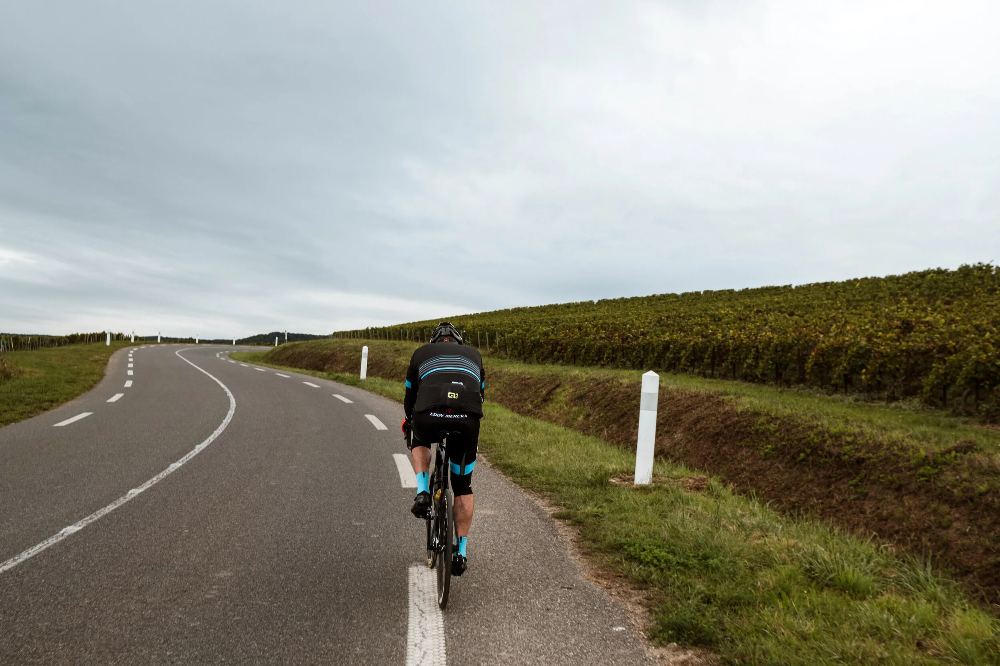

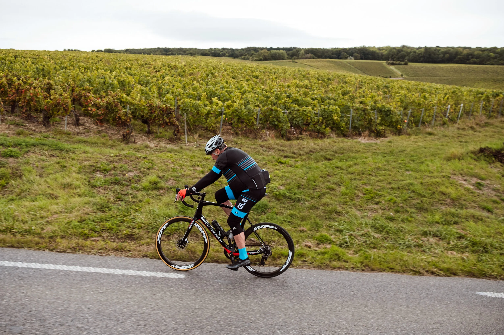

I brought my dad.

I could not have lived with myself had I been in Champagne with Eddy Merckx while my father sat at home. He came with us on the whole weekend, and that was the right decision.

In 1981, Eddy signed a postcard for my dad at the Eastway Circuit in Lee Valley. My dad was a young club rider. Eddy was already a legend. My dad thought that was the greatest moment of his cycling life.

He had no idea that 40 years later he would spend an entire weekend with him.

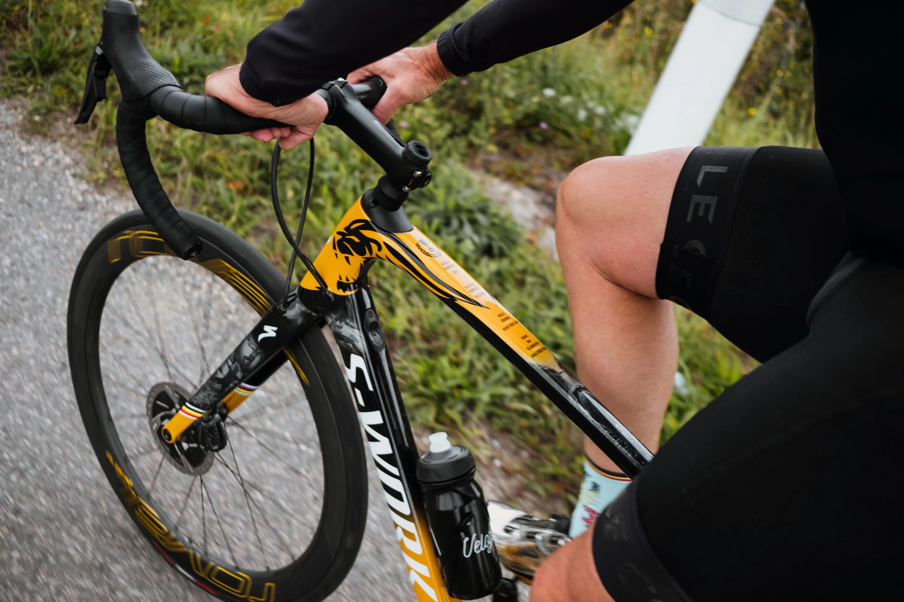

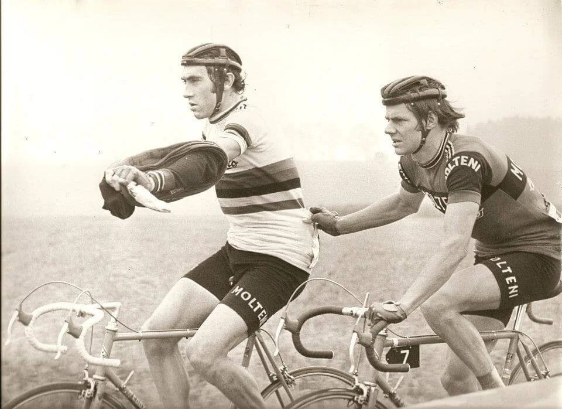

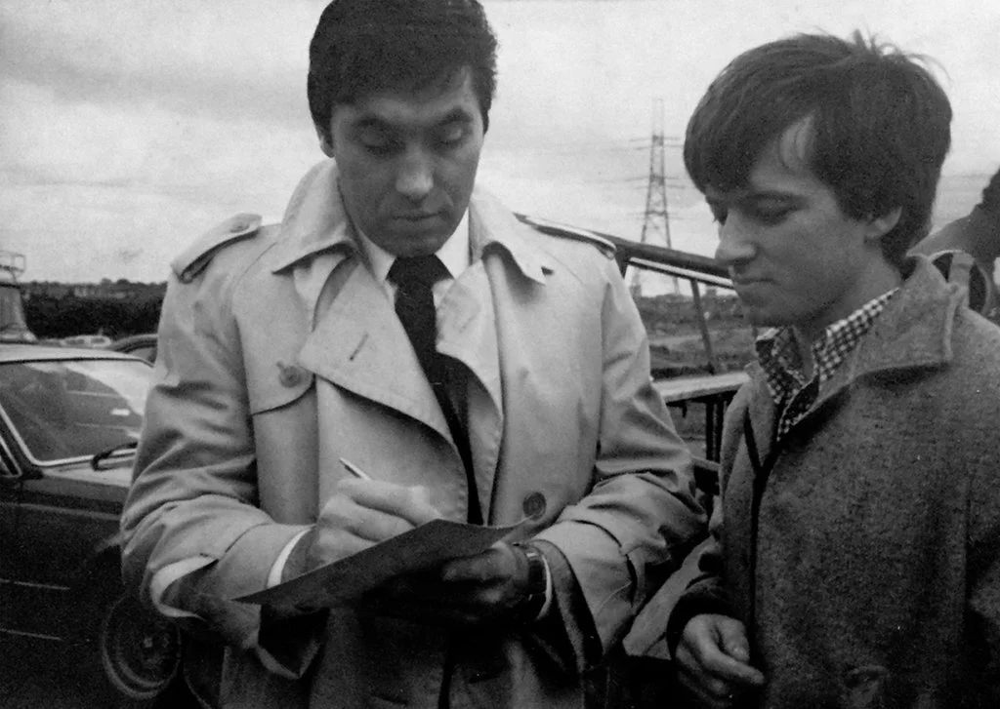

Watching my dad with Eddy was like watching a child who cannot believe what is happening. His face said everything. Some moments are too large to process in real time. That was one of them.

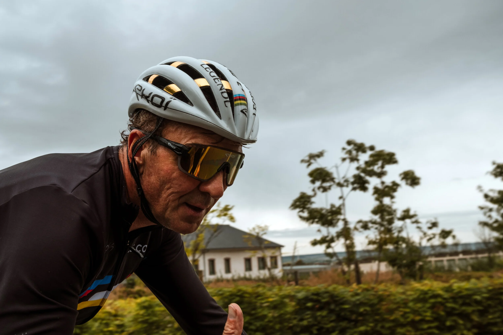

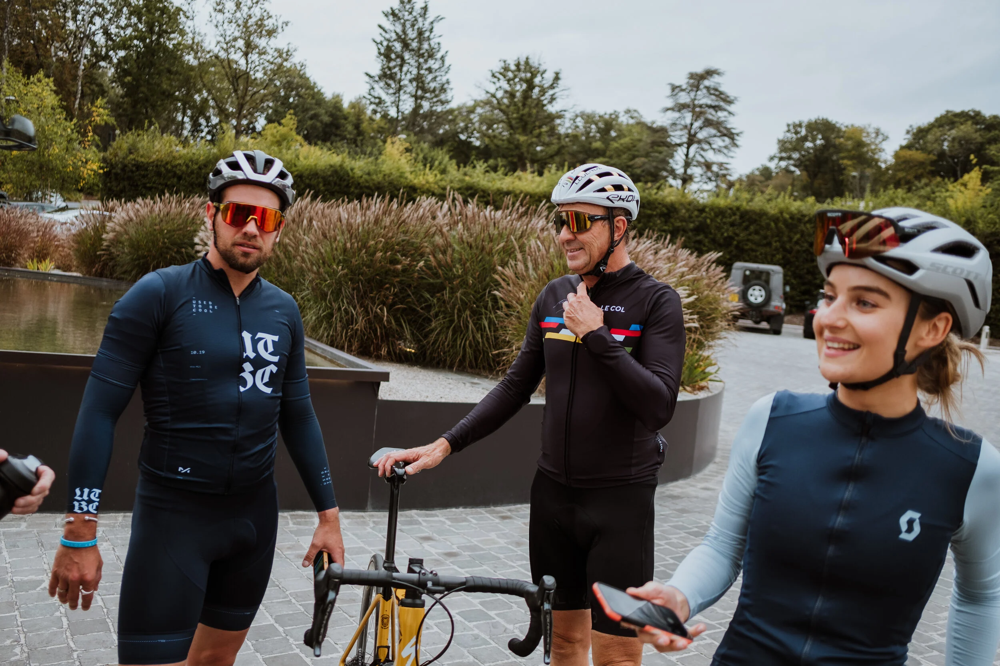

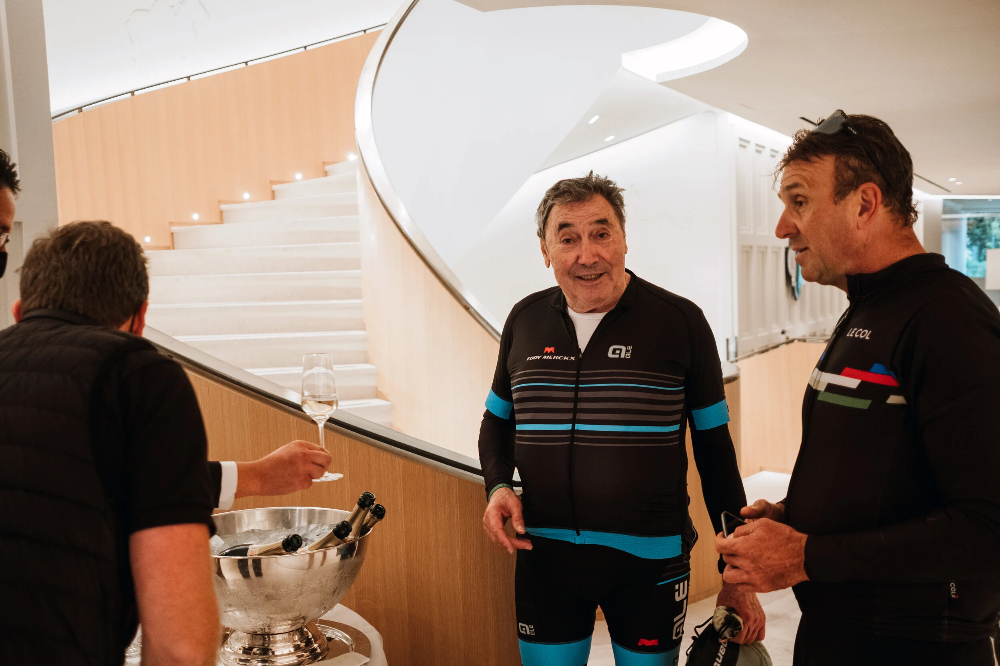

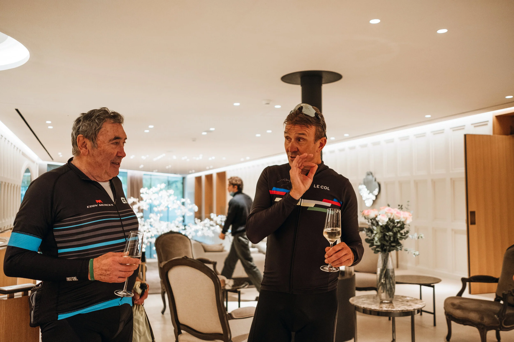

Thanks to my new friend Frederik Backelandt for this beautiful edition of Grinta! Titanen.

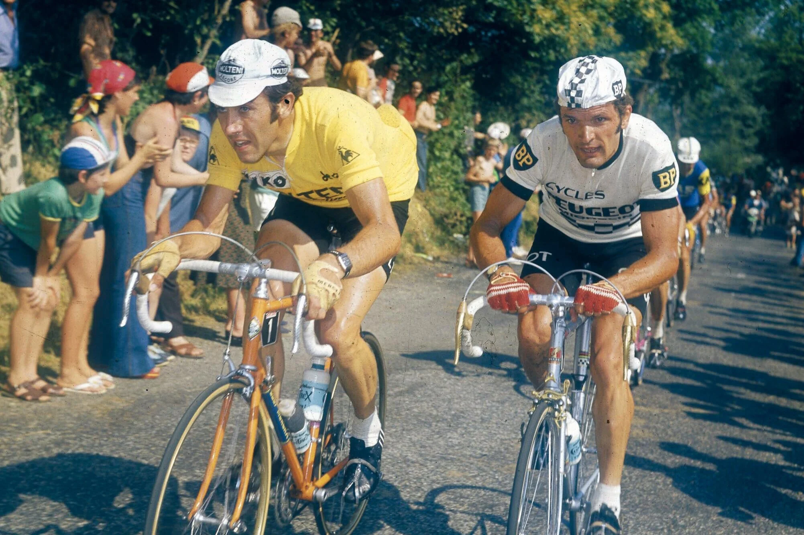

Another legendary LeBlanq weekend.

See you next time, Eddy.
