Three attempts.
Two failures.
Seven seconds to spare.

Monday: **DNF**
Tuesday: **30:47**
Friday: **29:53**

I've ridden Sa Calobra more times than I can count. I know every hairpin, every false flat, every section where the gradient lies to you before it tries to break you. And for a long time, I'd been circling 30 minutes like a kite that wouldn't land.

Close enough to taste it. Not close enough to claim it.

So I came to Mallorca with a plan. Get it done on Tuesday morning. Clean roads, fresh legs, family holiday intact. Simple.

What I didn't account for was a seatpost that had opinions of its own, a teething eight-month-old who refused to let me sleep, and the particular humiliation of riding your absolute limit and still seeing "30:47" on the screen.

This is the story of how I found 54 seconds. And what it actually took to get there.

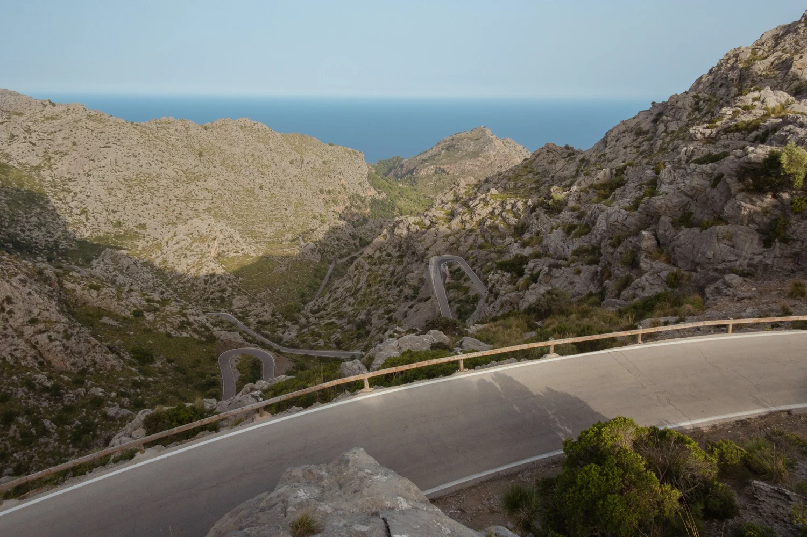

---

## Why Sub-30 Matters (and Why I Needed It)

Sa Calobra's stats don't lie. 9.44km. 659m of elevation. 7.0% average. The road corkscrews up through the Tramuntana mountains in a series of tight hairpins that compress your lungs and your patience in equal measure. Tom Pidcock's KOM sits at 22:46 -- a number so far into another dimension that it's more useful as inspiration than comparison.

Sub-30 is the benchmark for serious amateur climbers. Not elite. Not professional. But serious. The kind of number that tells you something real about what you've built.

I worked with Team Sky. I sat across the table from Sir Dave Brailsford and watched what happens when you apply marginal gains thinking with total commitment. Every stone turned. Every variable controlled. No apologies for the obsession.

That mentality doesn't leave you. And for a dad with a full-time leadership role whose training window is 6 to 8 a.m. on a turbo in his kitchen, you learn very quickly that everything has to count. I don't have junk miles. I don't have spare time. I have quality, or I have nothing.

Six to eight hours a week. Three VO2 max intervals on the Zwift that feel like being slowly turned inside out. Three Z2 sessions so monotonous they make you question your entire relationship with the sport. And somewhere in those sessions, the thought of this climb: the serpent, 9.44km, 30:00 on the clock.

I once read that a champion is someone who can endure the boredom, the routine, the repetition.

It resonated.

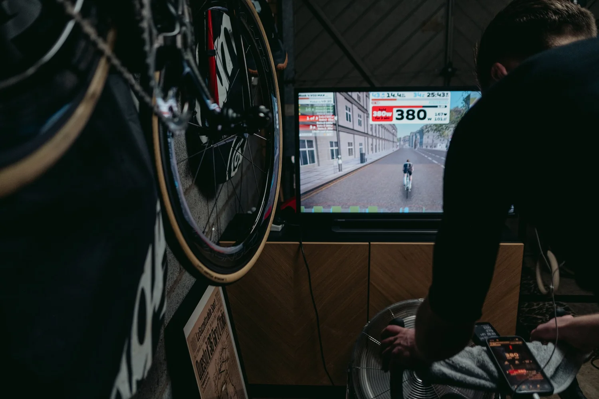

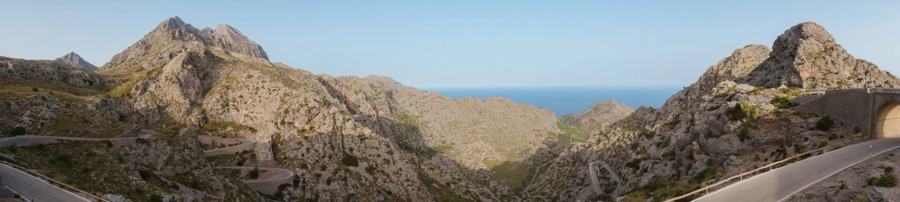

---

## The Setup: Getting the Bike to 7kg

I gave this everything Brailsford taught me.

- **Frame:** [Factor O2 VAM](https://viresvelo.com) (rim brake). My go-to climbing machine.
- **Groupset:** Campagnolo Super Record 11-Speed.
- **Wheels:** White Industry T11 Hubs, Sapim CX-RAY spokes, Light Bicycle Falcon R25 rims: 20h front, 24h rear. Custom built and stupid light.
- **Tyres and tubes:** Michelin Power Cup with [Silca Latex Inner Tubes](https://silcavelo.eu/collections/tubes). Ultra-low rolling resistance. Not a detail worth skipping.
- **Drivetrain:** 52x36 chainset, 12x29, [Silca Waxed Dura-Ace Chain](https://silcavelo.eu/collections/chain-lube-wax). The fastest wax on the fastest chain.
- **Computer:** [Hammerhead Karoo 2](https://www.hammerhead.io/products/hammerhead-karoo-2) with Strava Live Segments enabled. This would prove to be more important than I knew.
- **Pedals:** [Wahoo Powerlink](https://uk.wahoofitness.com/devices/pedals/powrlink/powrlink-zero-dual-power-pedal-buy) dual-sided, accurate to the watt, transfers to any bike in seconds.
- **Everything else:** all nuts, bolts and screws swapped for titanium. Bottle cages removed. Bar end plugs gone. HR monitor left at the villa -- I was riding to power and every gram was a decision.

I kept the vintage perforated leather bar tape. And the matching leather saddle cover. They weigh a ton in weight-weenie terms. I kept them anyway. I am a human, not a robot. Sometimes sentiment and style get a vote.

On the aero side: [POC Ventral Air](https://www.pocsports.com/collections/road-cycling-helmets-1/products/ventral-air-mips) helmet at 245g, [POC Elicit](https://www.roadbookofcycling.com/blog/2021/11/6/poc-elicit-clarity-review) sunglasses at 23g (so light you forget they're there, which I cannot say about most sunglasses I've worn for 14 hours), [Le Col McLaren skinsuit](https://lecol.cc/products/le-col-x-mclaren-racing-long-sleeve-skinsuit?variant=39711220957247), Le Col Aero socks. And [UDOG Cima climbing shoes](https://udog.cc/products/cima-salt-white) with laces, because laces tension across a longer surface area than dials. Nobody tells you that.

And my grandad's medal. Won in a 25-mile TT in 1949. I wear it for every hillclimb. I countered its minimal weight by removing my HR monitor.

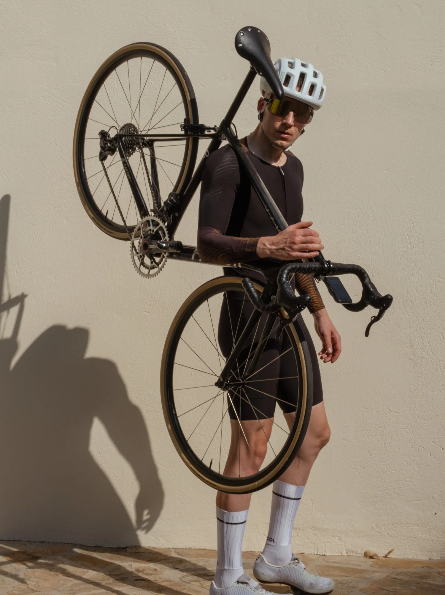

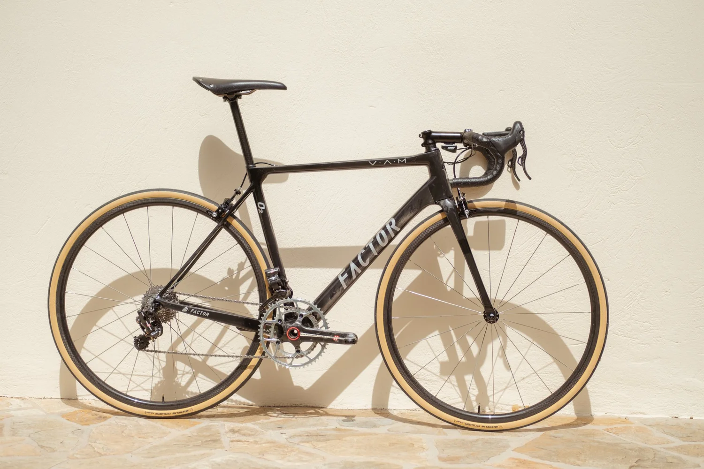

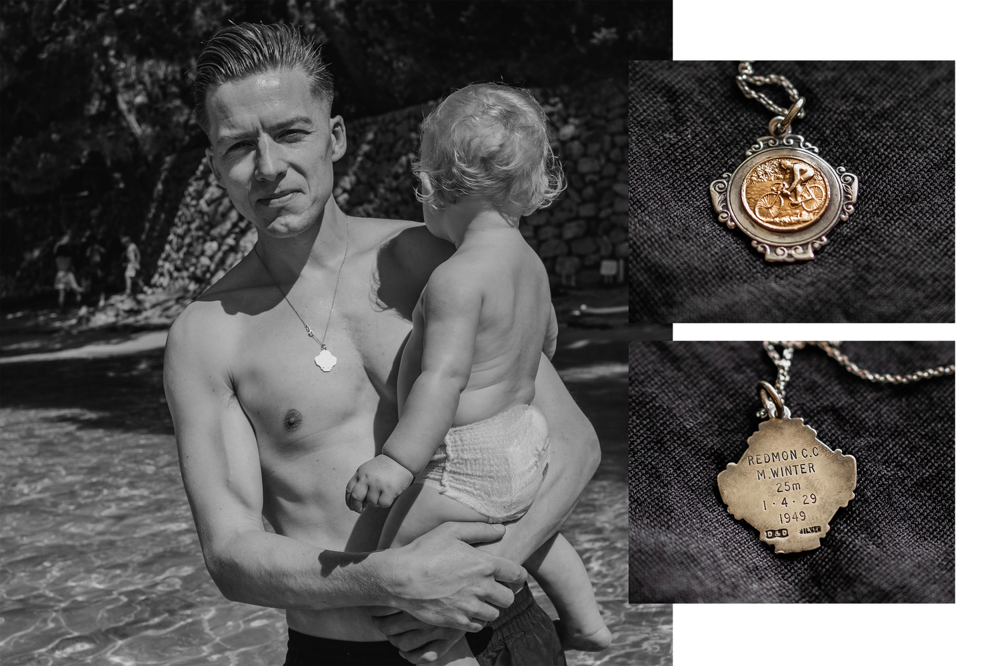

---

## First Attempt: DNF

Roads empty. Nutrition dialled. Bike smooth and light. Confidence high.

Zepp had been teething all night. I'd had barely two hours' sleep. I told myself I could survive that. I've survived worse.

The first steep hairpin comes at about 6km. I kicked out of the saddle to power through it. FUCK. My seatpost twisted to the right.

I'd torqued it to the recommended 6nm when I reassembled after the flight. I'd used a torque wrench. I'd used carbon grip paste. It twisted anyway.

I knocked the saddle back to centre. Kept going. It dropped a few millimetres. Then a few more. Then centimetres. At that point you're not riding a bike, you're hovering above one, trying to produce power with no platform to push against. I had two choices: destroy my legs trying to hold the gap or save them for tomorrow.

Eddy Merckx once told me my saddle looked a touch too high. I should have listened.

I reached the top, found the musette bag I'd hidden in a bush, multi-tooled the seatpost back into position, and drank a recovery shake while my legs tried to forgive me.

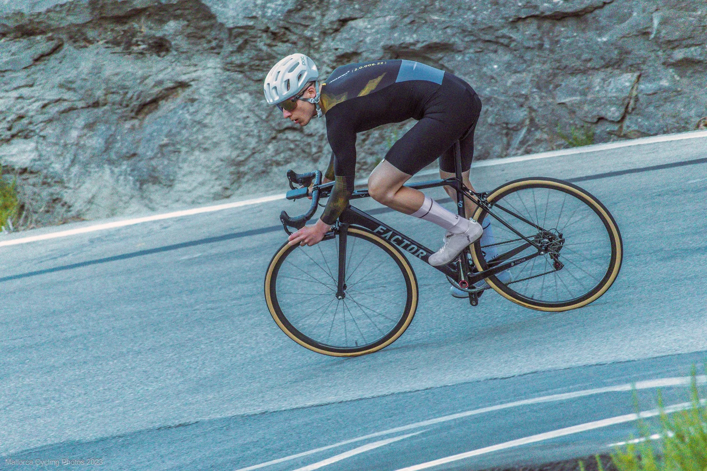

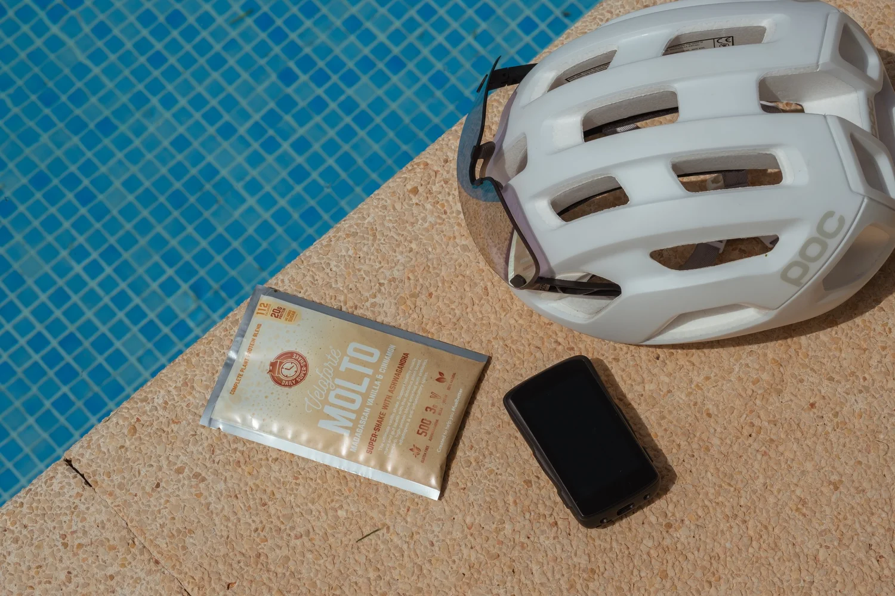

---

## Second Attempt: 30:47

Seatpost torqued to 6.2nm. Carbon paste reapplied. Chain topped with [Silca Super Secret Chain Lube](https://silcavelo.eu/products/silca-super-secret-chain-lube). Tyres set to the correct pressure using the [Silca Pro Tyre Pressure Calculator](https://silcavelo.eu/pages/sppc-form) (a free app).

Zepp had another rough night. I followed the same pre-ride routine and went slightly harder on the caffeine.

The climb went well. The hairpins felt controlled. I was riding 95rpm average, targeting 340w, pushing to 380w on the steeper sections and chasing back up to target as the gradient softened.

The clock ticked past 30:00 before I reached the summit.

My Hammerhead chirped: "New PB: 30:47."

I could taste metal. Sweat dripping. Lungs burning.

Forty-seven seconds short.

I uploaded to Strava and stared at the data. Here's what I found:

I'd averaged 325w. Not 340. The power dropouts were happening every time I changed gear. By targeting 95rpm on a 52x36 I'd set myself up to shift constantly -- and every shift was a brief pause in applied power. Individually: negligible. Thirty minutes of them, compounded? That's where the seconds went.

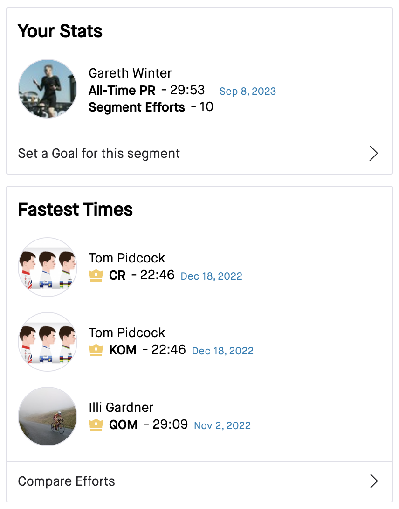

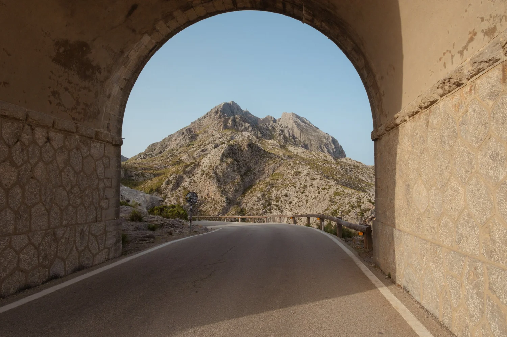

I ran the calculation in my head. Less gear changing. Heavier gear on the steep sections, grind at 75-85rpm instead of chasing cadence with shifting. Then spin the legs back up to 95-105rpm as the gradient softens, rather than throwing the chain down the cassette.

And the first 6km: shallower gradient, faster speeds, more aerodynamic demand. I'd given away watts to wind I could have been slicing through.

The question that kept me awake that night wasn't "can I find 47 seconds."

It was simpler than that.

> Can I give an extra three per cent?

Definitely.

I had to try.

Thursday: recovery ride, easy pace, keep the legs ticking over.

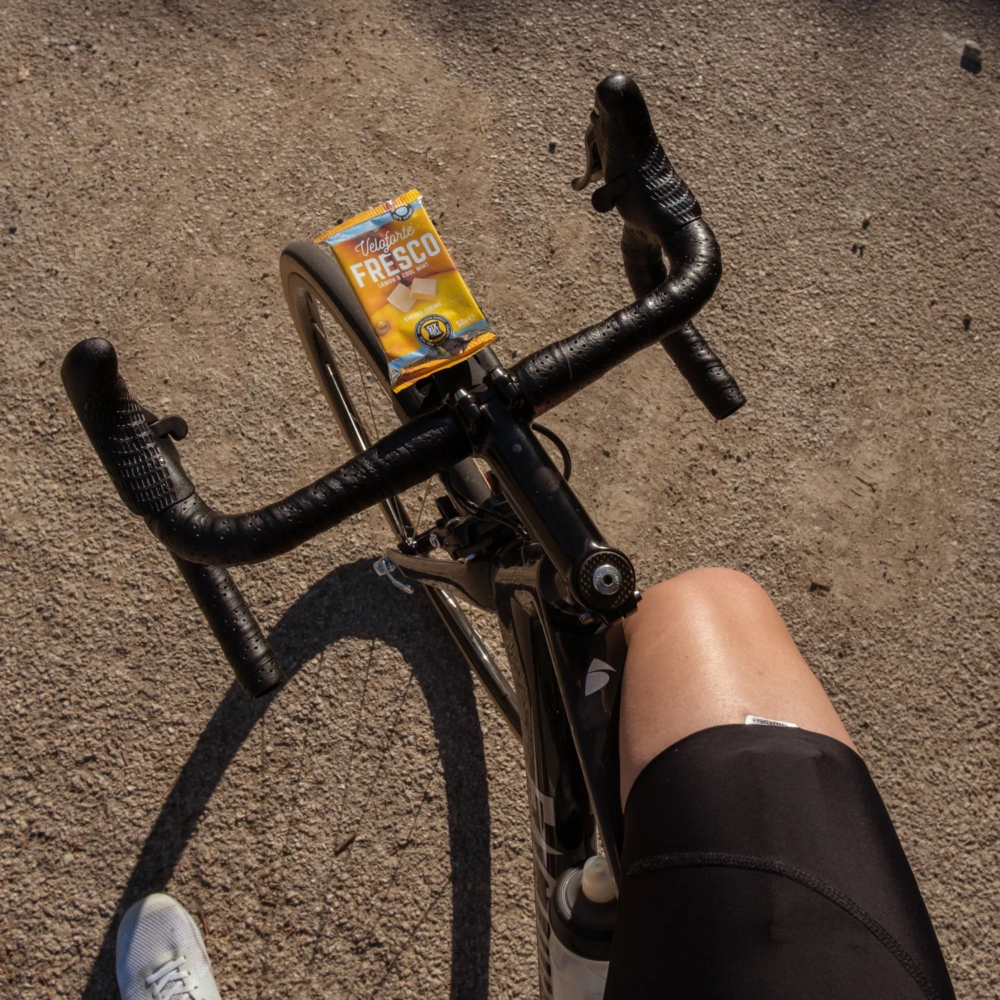

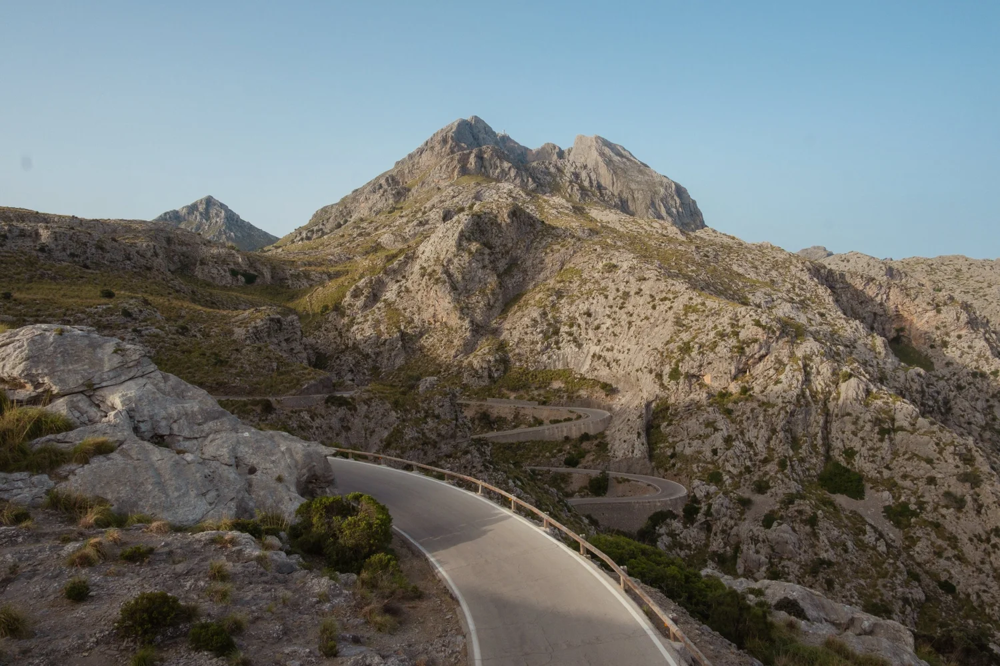

---

## Third Attempt: 29:53

3:30 a.m. Kitchen. Kettle on.

The worst night's sleep of the trip. Zepp had screamed for most of it, bright red cheeks, chewing ice-cold cucumber for his gums.

I stood there in the dark and had a decision to make. The data said don't ride. Every recovery metric I know said don't ride.

I said: "Fuck the data."

I made the strongest possible brew from the last of the Workshop Coffee. Then another. Then sat there watching the mountains slowly separate from the sky as the sun came up at 6:15 a.m.

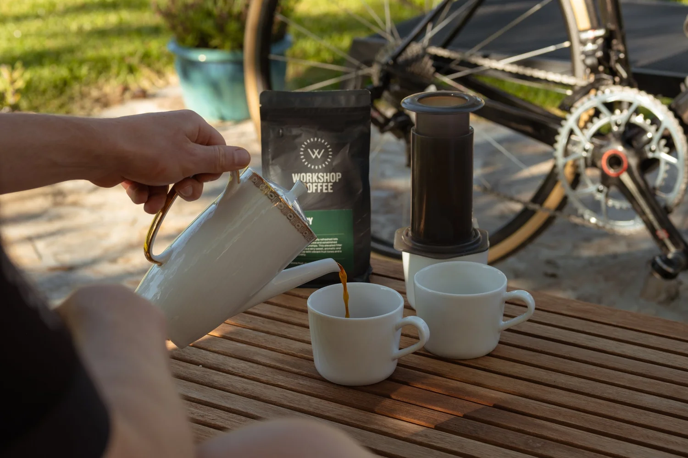

I packed an extra caffeine gel. [Veloforte Doppio](https://veloforte.com/products/doppio-natural-energy-sports-gel), 75mg caffeine. My favourite.

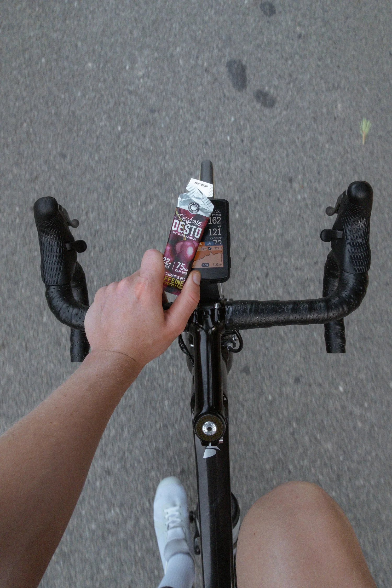

I turned on the Strava Live Segments feature on the Karoo 2. For the first time, I could race myself in real time -- see my gap to Tuesday's effort second by second.

At 6km: 60 seconds ahead.

Then it started closing.

I'd gone hard on the final 3.5km last time. Harder than I remembered. Harder than the power file suggested I could match.

I had to find something else. Something the data couldn't measure.

I thought about Zepp. Teething for a week. Bright red cheeks, ice-cold cucumber, broken sleep, not a word of complaint because he doesn't have the words yet. Just pain, endured.

His pain was my strength.

I attacked the home straight at 400w, chasing a gap that was closing one second at a time. Riding against a previous version of myself and barely holding on.

The final ten seconds felt like ten minutes.

The Hammerhead chirped: "New PB: 29:53."

With seven seconds to spare.

Relief.

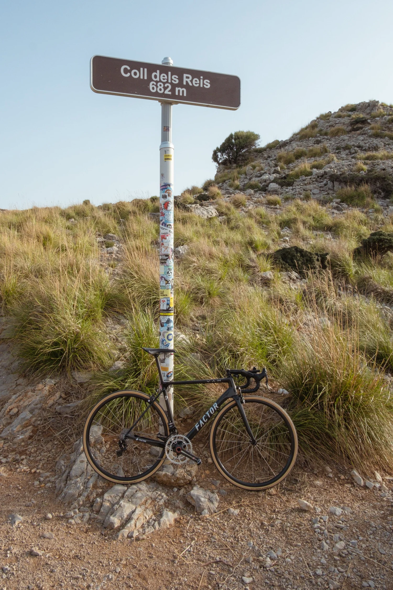

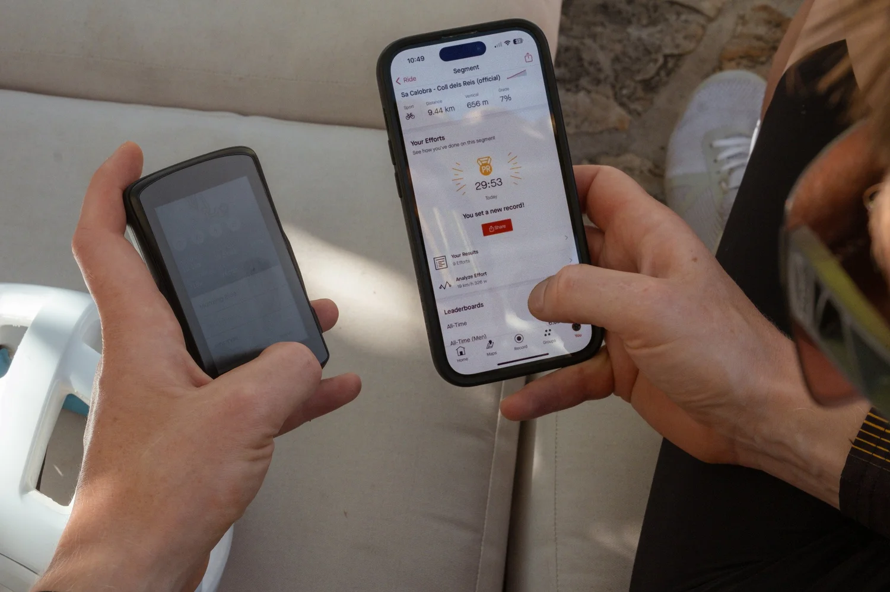

---

## What It Actually Took

Sub-30 on Sa Calobra isn't just about fitness. I had the fitness on Tuesday. Here's what it actually required:

- **The right data analysis:** understanding that cadence-chasing was costing me power, not saving it.
- **The right gear choice:** a lesson I'll carry to every climb I ride from here.
- **The right pacing tool:** the Strava Live Segments on the Karoo 2 was the difference between racing myself and hoping.
- **The willingness to ride against every recovery principle I've ever trained myself to follow**, at 3:30 a.m., on no sleep, because some things matter more than the data.

I want to be a role model for Zepp. For what it looks like to set a goal and refuse to leave it unfinished. He was too young to understand what was happening on that mountain on Friday morning. But I know.

I set the standard for myself because of him.

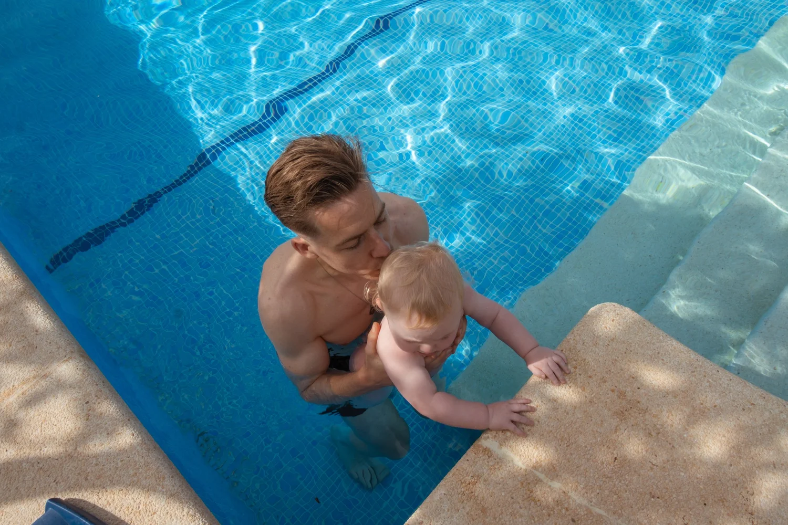

---

## What's Next

I'm already planning the return.

Sub-28 is the target. Not sub-29. The moon isn't ambitious enough.

Thanks for reading and for your support.

G

---

## Travel Essentials

*Here are a few of my travel essentials that might be useful for your next cycling adventure or PB attempt. I have also added a few discount codes to say thanks for reading and supporting me.*

*(FYI -- no commission is earned through these links.)*

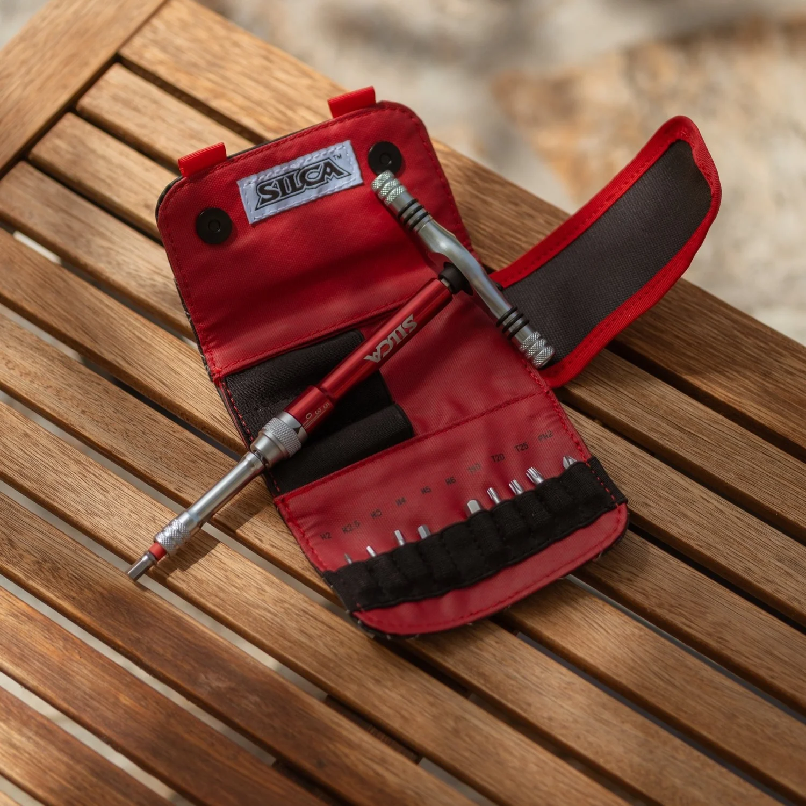

**[Silca T-Ratchet + Ti-Torque Kit](https://silcavelo.eu/products/t-ratchet-ti-torque-kit-2nd-generation)**
When you reassemble your bike, it's essential to torque up all of your bolts to the correct spec. This is like having an entire toolbox in your pocket.
Discount code: **Winter15**

**[Veloforte](https://veloforte.com)**
Nutrition is a priority for me, not an afterthought. Veloforte ships directly in the EU and the UK, so you could even get it posted to the place you are staying to avoid extra baggage.
Discount code: **GARETH20**

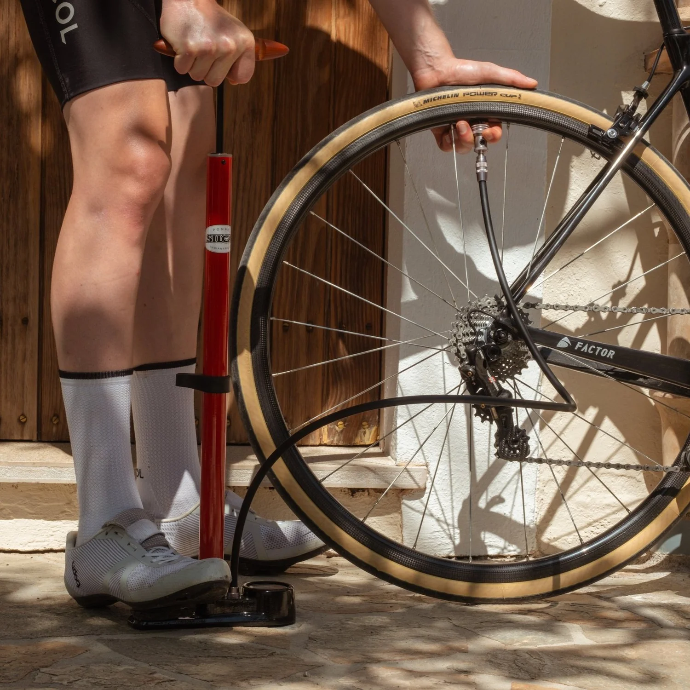

**[Silca Pista Track Pump](https://silcavelo.eu/products/pista-floor-pump-red)**
Originally designed in the 1950s, the Bianchi-Pirelli team requested a pump that could fit under the rear seat of the tiny Fiat team car. The compact size makes it perfect to strap inside a bike box.
Discount code: **Winter15**

**[Pelotan](https://pelotan.cc)**
Protect yourself with the best suntan lotion for cyclists, designed by cyclists. I never ride without it in the summer.

**[VeloSkin](https://veloskin.cc/discount/GARETHWINTER10)**
Consecutive sweaty days in the saddle and sunshine can lead to saddle sores without a quality chamois cream. Veloskin is made with natural ingredients and is PH-neutral -- suitable for all genders.
Discount code: **GARETHWINTER10**

**[Silca Pocket Impero](https://silcavelo.eu/products/pocket-impero)**
Since you can't take CO2 on a plane, taking a pocket pump will ensure you have endless air. This is the finest, most efficient pocket pump you will ever thrust.
Discount code: **Winter15**

**[Workshop Coffee](https://workshopcoffee.com)**
I take a bag of pre-ground Workshop coffee and an AeroPress when I travel. Quality coffee is a guarantee. I'm usually up before 4:30 a.m. -- nothing opens in Mallorca until 9 a.m. I can't go that long without coffee. That's insane.

**Hard Shell Bike Box**
Use a box, not a bag. Otherwise, put your bike insurance on speed dial.
I use a [Bonza bike box](https://www.sigmasports.com/item/Bonza-Bike-Box/Transport-Case/HCZ9) -- brilliant and much cheaper than an Alan. But [Alan is the best.](https://bikeboxalan.com)
