The second Sunday of April is usually reserved for Paris Roubaix. Many people (myself included) consider 'the Queen of the Classics' to be the most prestigious one-day event in the road cycling calendar. Roubaix has been 'postponed' (due to the Coronavirus Pandemic, in case you've just woken up from a coma). Instead of spending a 'Sunday in Hell', we are spending a 'Sunday in Lockdown'.

To fill the cobble-shaped hole in our hearts, I asked one of my all-time heroes, Sean Yates (AKA The Animal), to join me for my second instalment of *Turbo Talk*; to tell the story of how he famously tackled Roubaix 1994, which was crowned 'the hardest edition of the century'.

*(You can tell Sean spent all day on the front because his face isn't caked in mud, like the riders behind.)*

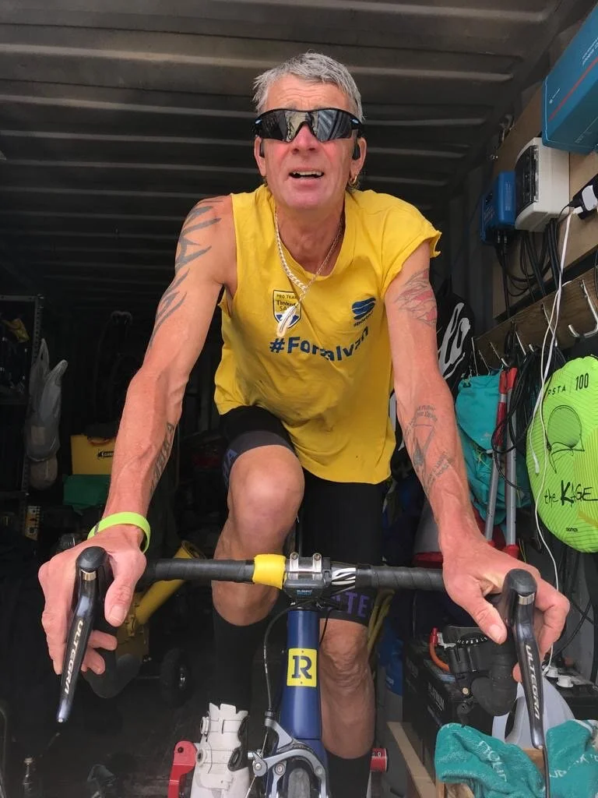

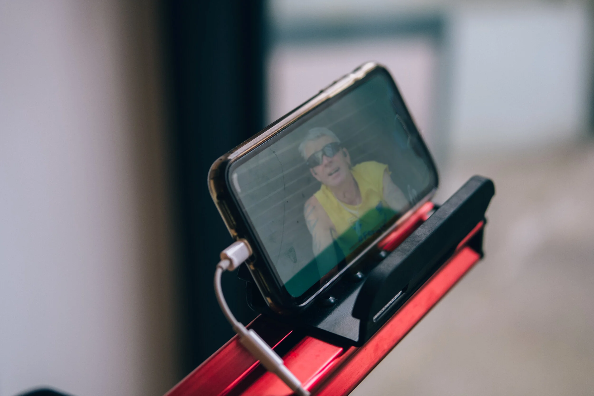

*Turbo Talk is about catching up with members of the cycling community from around the world and sharing their stories during C19 lockdown. We chat over a video call while riding turbo trainers (the next best thing to sharing the road, right?).*

Enjoy.

---

S: "Gareth."

G: "Sean. Welcome to 'Turbo Talk'. How are you?"

S: "What's going on?"

G: "The world is falling apart… Paris Roubaix has been postponed."

S: "Yes, It's not looking good…"

G: "In '94 You famously suffered through one of the hardest most arduous editions… in history. Could you relive your story of 'Sunday in Hell', to give us some escapism from our 'Sunday in lockdown'?"

S: "I spent the winter in Belgium training for the Spring Classics. We raced the Tour of Flanders, then Gent Wevelgem (which used to be in the middle of the two monuments on Wednesday), on Thursday we travelled down as a team to recon the Roubaix pave sections; like the Arenberg Forest.

"Most guys have done the parcours like a hundred times, but it's the routine, you know? So it was fresh in our minds.

"All the Northern Classics riders have been building up for this. For some, Flanders is their highlight. Personally, Roubaix was my race.

"Flanders was too early for me, in that I wasn't physically fit enough, really… to do the repeated efforts on the cobbled climbs. During my career, I found that I needed a lot of racing to really get the top-end.

"I'd train predominantly on my own during the winter, so I didn't have that group-riding-efforts-training, that a lot of guys did. So, I just took a bit longer to get going.

"Roubaix, it's not so much about your top-end speed, you know? Like, the amount of power you have to put out fifteen times up the cobbled climbs in the Tour of Flanders, for example. Roubaix is more about your strength and ability to ride the bike.

"It took me a number of years to finish Roubaix."

G: "Which year did you first finish?"

S: "I'm not sure, maybe '88? I mean, it took me five, six or seven bloody attempts."

G: "Haha, it's not a young man's race, is it?"

S: "No. It's like, one minute you're a junior riding around on the Tonbridge bypass and the next minute your riding against Francesco Moser in the 'Hell of the North', you know?

"Starting out, it's like you've been thrown in the deep end… a hundred times over. I was like a fish out of water.

"Obviously, these guys: Moser, Eddy Merckx, Roger De Vlaeminck, Freddy Maertens, they've done it a hundred times and they're the best in the world. It took a long time to get used to it, to be able to even finish the bloody thing."

G: "Did you feel like an imposter? Being one of the only Brits out there?"

S: "Not really, I was never one to 'think' too much… 'reflect' too much, sorry, about what I was doing, where I was going. I just got on and did it.

"We were foreigners in the cycling world. Luckily, we had some good riders: Robert Millar, Stephen Roche and Graham Jones, but we were still outsiders.

"It's hard to get a feeling for that in this day and age. Cycling is so international, you know?

"One minute I was riding a local TT on a Saturday afternoon, the next I was in the biggest French team, sitting in a hotel with some of the oldest and most established pros. I remember eating a bowl of muesli and they were like, 'What's that shit, horse feed?'

"You were judged on your form. If you rode well you were treated with respect. If didn't perform, you were just the 'fat Englishman'."

G: "What was it like to race against icons like Moser, Merckx, Maertens, etc?"

S: "I don't know, as I said, I didn't think too much.

"During certain events, I was good. Like a prologue or riding on the front.

"I was well overweight, so I got dropped as soon as the road went up. I was good at what I liked to do, which was ride on the front. Over a period of time, I earned the respect of the older guys, because I could do a job and I wasn't scared of suffering. They spoke up for me when my contract was up for renewal.

"Because I was relatively new to pro cycling, it took me a long time to adapt to the rigours and lifestyle. I didn't come from a family of bike riders; Britain wasn't a bike riding nation. Take the Italians for example, their parents and grandparents did it, so they grew up with it. They knew how to train, recover, stay light and strong. I was on a loooong voyage of discovery.

"We didn't have sports scientists, watts per kilo, and all this crap, you know? Then we began this transition from the Merckx era to the LeMond era. Suddenly, there was a massive leap in the science of bike riding.

"LeMond and Chris Boardman took the sport forward. Being strong wasn't good enough anymore, you also had to be clever. It was a wake-up call."

G: "Being clever doesn't really work on a cold, rainy day at Paris Roubaix, does it? LeMond was involved in several crashes in 1994. Being strong and towards the front helped you survive that race, didn't it?"

S: "In '93 I think I was eighth, eleventh in '92, in '91 I was about fifteenth, '90 I was maybe top thirty. I had been making progression, that's what gave me motivation and ambition leading up to '94.

"On top of that, I had form. I spent the winter in Belgium, in shit weather doing six-hour rides. All in preparation for Roubaix.

"Come the day, it was like, 'Okay, there's no more training. This is it.'"

G: "During breakfast, did you go looking for some camaraderie with your teammates to take your mind off the race ahead, or were you in 'Sean Yates world' trying to focus?"

S: "We were a team, we had breakfast together, got kitted-up and we rode over to the start together. The weather was pretty rough, it was snowing.

"I like cold weather, bad weather. It was up my street, really.

"The cobbles were really wet, It rained and snowed during the night. In the morning, there was so much crap on the pavé, It made the race look horrendous. After the first hundred kilometres, it started drying out to the extent where it got warm… relatively speaking...

"We had a good team. Frankie Andreu and George Hincapie we're really 'gung-ho' and up for it."

G: "It was Hincapie's first Roubaix, wasn't it?"

S: "Yeah, George was up there, he completed the race in top fifty. Frankie was ninth, I think?"

G: "When did you break away from your teammates and go off with the 'big guns' – Franco Ballerini, Fabio Baldarto, Johan Museeuw, Andrei Tchmil, etc, and get away from the peloton?"

S: "Yeah, to be honest, I can't remember exactly. The one thing that sticks out is when Tchmil went with fifty-sixty kilometres to go, and Museeuw tried to get across to him. Johan got within five metres, then he just cracked.

"You know, he just couldn't make it. He was away for a long time chasing Tchmil, then I think that Bianchi-suspension-thing locked-up, and his pedals jammed, I can't remember what make they were."

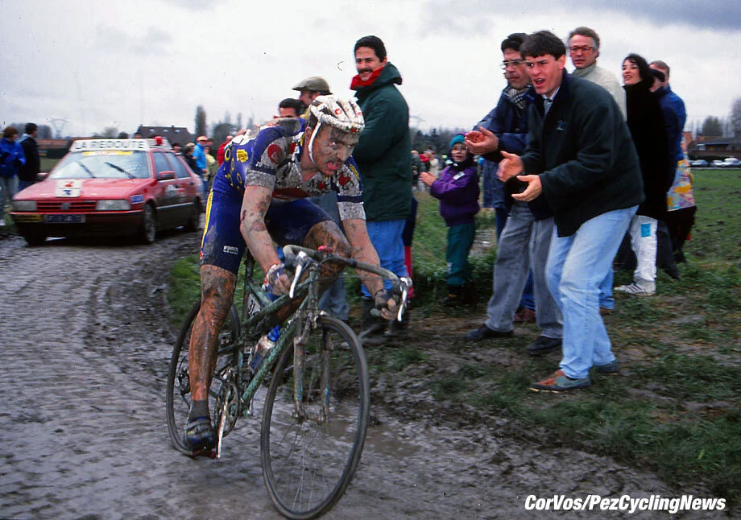

*Johan Museeuw chasing Tchmil on his full suspension Bianchi.*

S: "It's elimination from behind, Roubaix. What I learned over time, is that you have to stay at the front… this particular edition ('94) more than any. Guys were crashing and letting the wheel go, so I went and rode on the front.

"It's elimination from behind, a waiting game, although Tchmil didn't really wait that much."

G: "Hahaha."

S: "I remember coming through the Arenberg Forest. All the mud bunged-up my brake callipers. I had to squirt it off with water from my bidons."

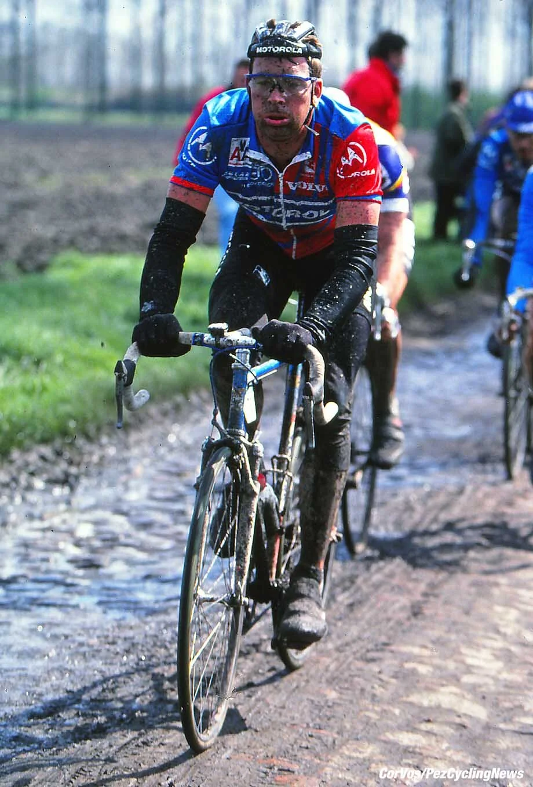

*Yatesy on the front (as usual).*

S: "There was about thirty kilometres to go and three guys up the road: Museeuw, a guy from Gewiss-Ballan… Dario Bottaro, and Tchmil.

"Ballerini punctured, Duclos punctured, and then I… Just... Went…

"Baldarto came with me and we just RODE. I was puking-up while riding, we rode as hard as we could, a two-up time trial all the way to the last section - Carrefour de l'Arbre.

"We caught Museeuw and fucking hell… he was just BLOWN.

"Then we caught Bottaro and rode Carrefour de l'Arbre. We dropped Baldarto and I was second on the road. Then Baldarto caught back on, along with Capiot, Ballerini and Ludwig.

"There was six of us with Tchmil in front. Museeuw and Bottaro got dropped, so It was just Me, Ballerini, Baldarto, Ludwig, Duclos and Capiot. That was quite a lustrious group."

G: "Errr, yeah…"

S: "Obviously, I was feeling good and we were all together. Tchmil was GONE. We all knew that he wasn't coming back."

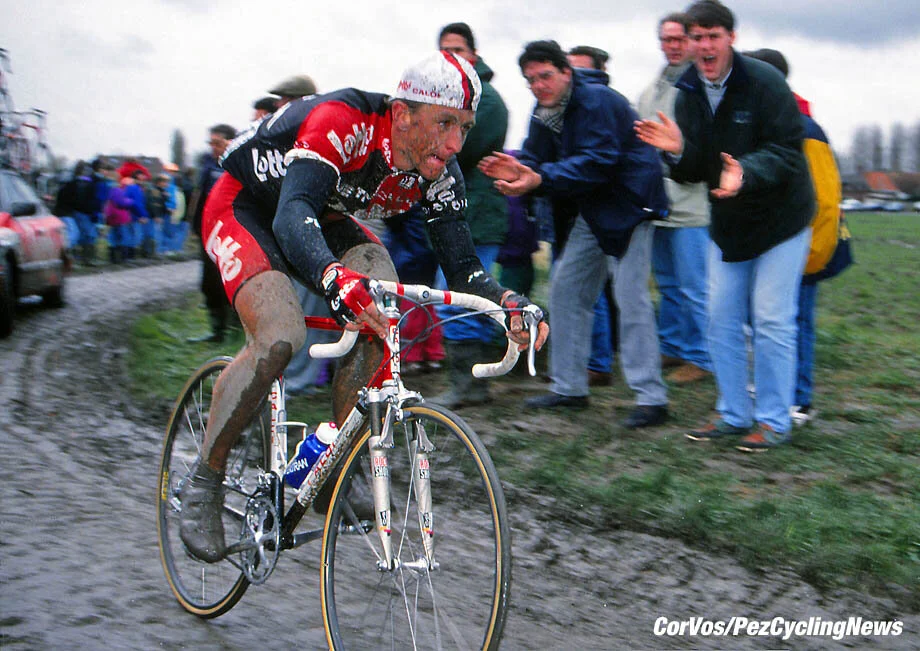

*Andrei Tchmil (Mol) Lotto. 1994 Paris Roubaix Champion (7:28:02)*

S: "I was just happy that I was in there with the 'big boys'. Ludwig was 'the Beast from the East', Duclos won Roubaix in '92 and '93, Ballerini won Roubaix in '95 and '98, Baldarto was a fantastic finisher and Capiot was a Belgian hard man.

"There's quite a drag up to the last three kilometres. I knew Ballerini was going to go there, I just knew it. I didn't have the legs. Baldarto went with him, but I couldn't go. Those guys went off for second and third.

"I tried to sprint into fourth, but Ludwig came around me. It was disappointing in a way, that I couldn't get to the velodrome with Ballerini and Baldarto to sprint for the podium, but I'd given it my all.

"It was a historic edition."

G: "It was voted the hardest edition of the century…."

S: "It was another step-up in the results. I never went beyond fifth. Obviously, I wanted to, but I just couldn't step-up in '95 or '96."

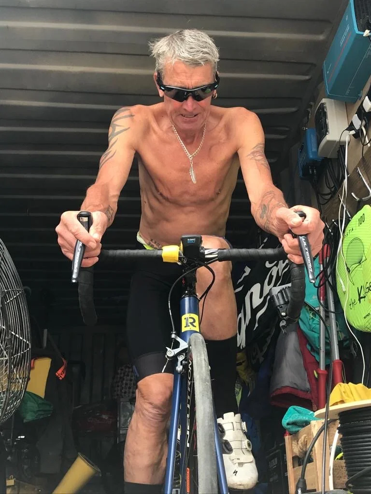

G: "I've ridden with you and I've ridden with Museeuw. There's something that you old-school-hard-nut-classics-specialists have in common… your ability to suffer. You said that you were pushing so hard during that two-up chase with Baldarto, during Roubaix '94, that you were puking-up. That's fucking suffering… right?"

S: "I don't know, I mean, It's a kind of sadistic pleasure, maybe?

"It's something a professional bike rider does every day. You derive some sort of sick pleasure from it… in that, you enjoy pushing yourself to the extreme.

"Like this morning, I was on my turbo doing intervals. I just kind of live for putting myself through pain. I don't know why it's just something you're born with.

"I won't stop riding until I'm in a wheelchair. I just love to ride. I just love to push myself.

"In that particular instance (Roubaix), It was NOW or NEVER.

"There was a chance. If Ballerini and Duclos hadn't come back, it could have been me and Baldarto sprinting for second place. So, when I went, and Baldarto was committed as well, I just said to myself - 'This is what you've been training for, all those cold, wet, long hours in Belgium wearing my wetsuit.

"It's this moment. There's no tomorrow. It's NOW… DO IT.

"Duclos could have had another puncture, Ballerini could have crashed, we could have stayed away. We could have been sprinting for the podium for second and third. If you don't try, you'll never know."

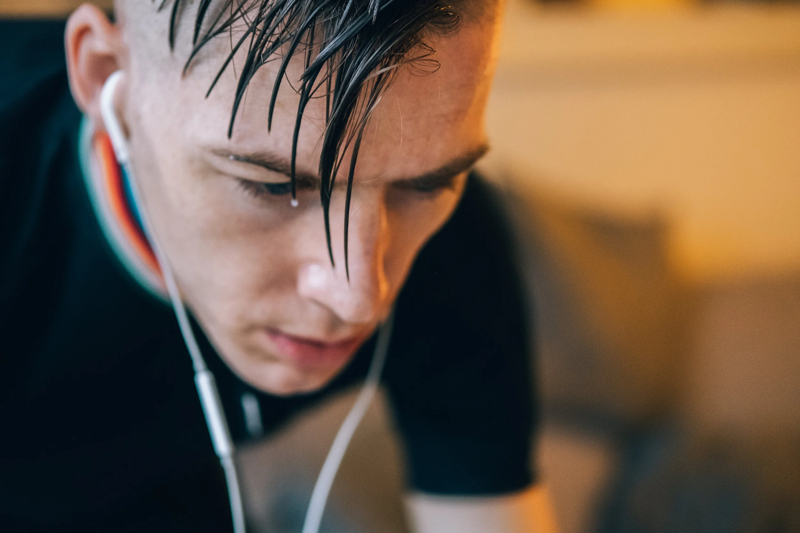

G: "This morning, in anticipation of talking about Paris Roubaix with you, I did the 'Matt Hayman Paris Roubaix Training Session' on Zwift. Why are we all obsessed with suffering'?"

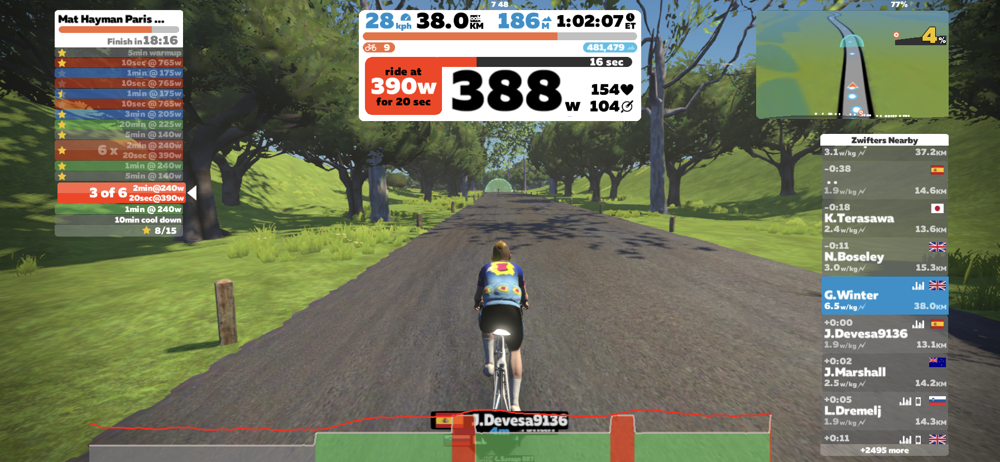

*Matt Hayman famously won Roubaix in 2016, after a season of training indoors on Zwift due to a broken arm.*

S: "It's all to do with the want. It gives me a purpose, even though it's not taking me anywhere or gaining me anything, really. It's what gets me up in the morning.

"I'm going to be sixty next month, I have AF (atrial fibrillation), this, that and the other, but I still want to be as good as I can be.

"As you do, Gareth, you look after your weight, your diet, your sleeping habits, you don't drink, etc. You do everything in a kind of scaled-down version of what Chris Froome does."

G: "I'm not a professional (even though I like to pretend), It's all about seeing what you're capable of and getting the best out of yourself. Guy's like Froomie are my inspiration, the blueprint I try and work back from."

S: "That's it. Yes.

"It's like putting an engine together. You put the parts in the right place, tune it up, put the right fuel in, blah, blah, blah. Then you put the keys in the ignition and it FIRES!"

G: "Tell me about Museeuw, he's one of my all-time heroes. How did you guys get on? What was it like racing against him?"

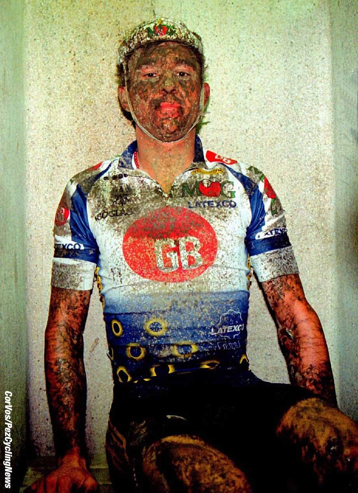

*Museeuw (post-Roubaix '94)*

S: "Well, Johan is also one of my heroes."

G: "Haha, yeah. Just look at my bike, I have a Colnago C40 with his '96 Paris Roubaix/World Championship paint job."

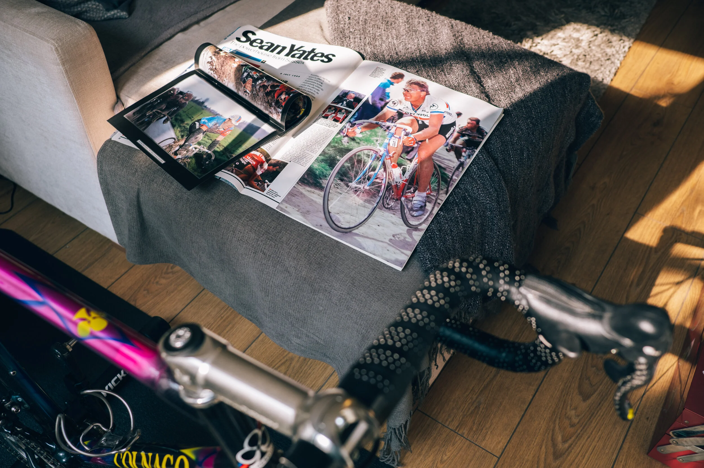

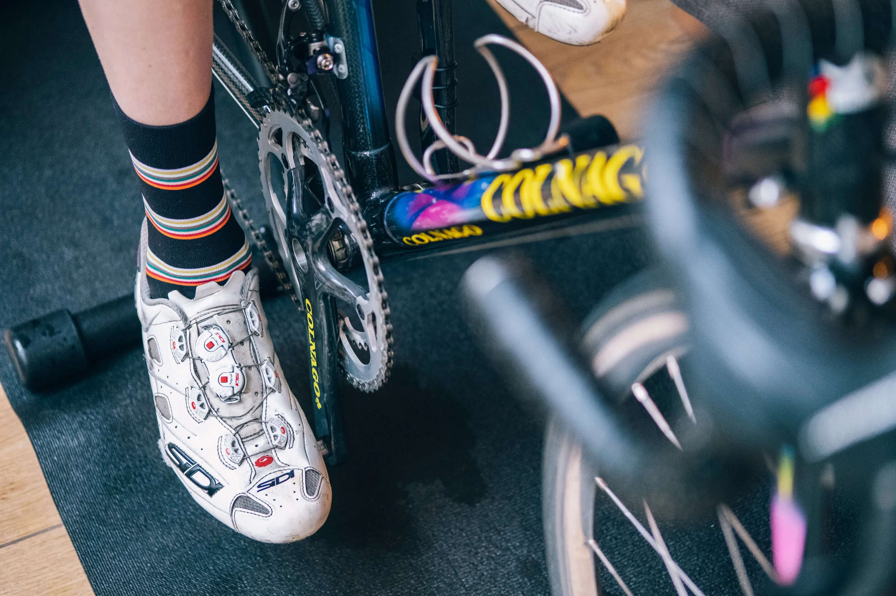

S: "Johan is no-nonsense hardcore, like Sean Kelly…"

G: "Like you."

S: "I guess so, but you don't talk about yourself."

G: "No, I'll speak for you."

S: "He was like, hardcore, you know? He would just get out there - fucking smash it, and see what happens.

"He was just a unit. He had the constitution, like Kelly, to be able to race A LOT… to not feel the pain. To recover from setbacks.

"When he fell off in the Arenberg Forest during Paris Roubaix '98 (His leg was so damaged, the doctors considered amputation), he could have given up there and then. He could have hung up his wheels, but he didn't want to. He wanted to ride a bike like he's still doing now."

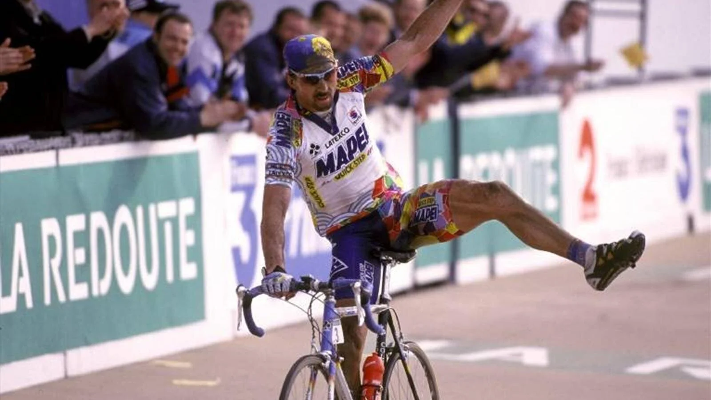

*Museeuw won Roubaix in 2000, just two years after his almost career ending leg injury.*

S: "That's what he was born to do and that's what he does. Just look at the guy, he's got the constitution of a fucking ox.

"He's not the prettiest guy on a bike, he doesn't pedal in the most gracious style, he's just a hardcore typical Belgian.

"Freddy Maertens is another idol of mine. He used to say: 'You ride with a tailwind until you're bollocksed, then you've got to turn around and come back.'"

G: "Headwinds, AKA the 'Belgian training partner'."

S: "Hahaha, yeah, that's right."

G: "We rode your sportive, 'the Sean Yates Classic' in Sussex. You had some health complications, but that was irrelevant. Even though you weren't in good form and you couldn't produce the speed you wanted, your ability to suffer remained."

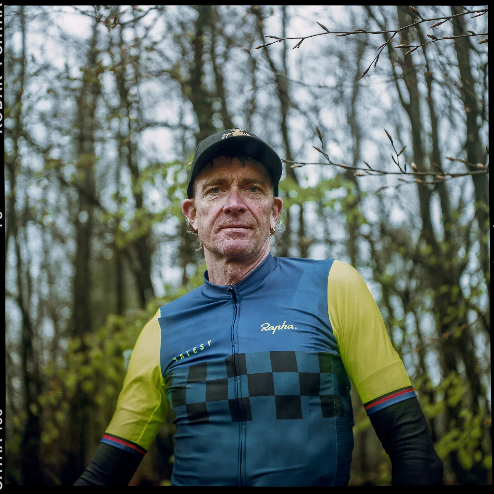

*Pre-Sean Yates Classic 2018. I photographed his portrait with my Yashica Mat TLR Camera.*

S: "Yes."

G: "You were puking out of effort during Roubaix '94. When we rode the Yatesy Classic you threw-up a few times as well. You were fucking pushing it."

S: "Phahaha, haha. As you said, the suffering ALWAYS remains the same, it's just the speed that changes."

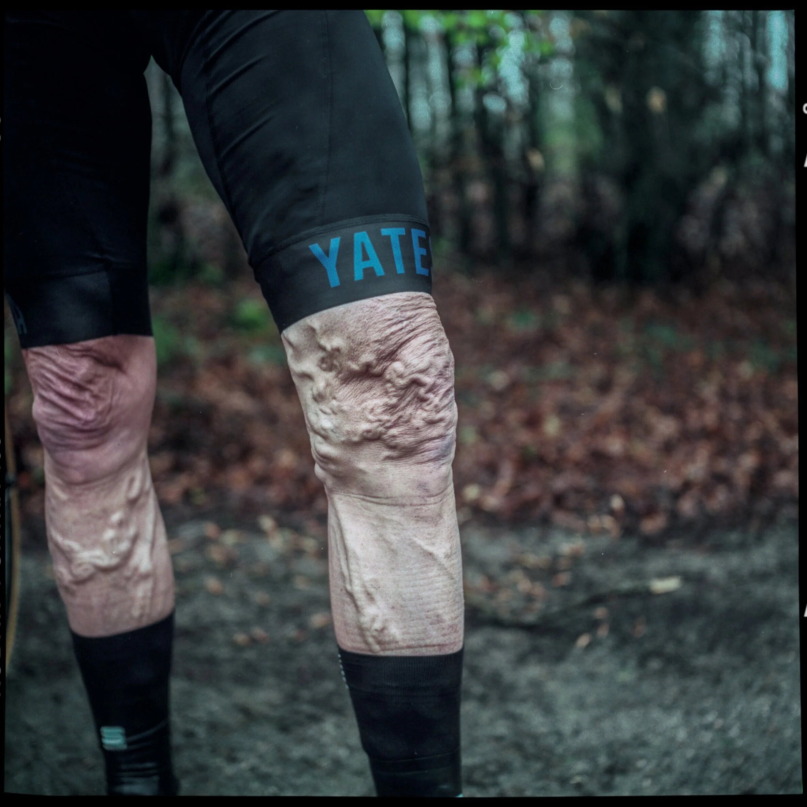

*Sean's famous legs. Built by a lifetime of riding on the front.*

S: "When I ride (I mean If I'm doing structured training, I really do try to rein myself in a bit), I've only got one speed… try hard."

G: "Yeah, Sean 'fifty-three-eleven, twenty-four-seven' Yates."

S: "Phahahaha.

"That sportive - I just came back from an operation. I wanted to the long route and I wanted to do it as fast as I could, you know?

"You suffer as much as you can to get that time.

"I don't want to just 'ride around', I've never done that."

G: "I don't know anyone else who would even enter, let alone go out and smash it."

S: "That was my goal, to get back on my bike. I always refer to goals. my goal at the moment is to get fit for the Sussex Champs one-hundred-mile time trial in August.

"I always set these goals, whether they are six months away, or a year away. Not that I need motivating, but you know, you don't take your foot off the gas."

G: "You have a purpose, that resonates with me."

S: "Whether that's my sportive or a time trial, or when I'm coaching one of my guys I challenge them to a twenty-five-mile time trial – 'If you beat me, you get a month's free coaching', that motivates them, that motivates me.

"It's these kinds of little 'help-me-alongs' that I set myself, you know?

"I'm always asked to do these cycling related things. The last thing I want is to turn up and not be as good as I could be and suffer at the hands of some punter unnecessarily. Okay, if I'm as good as I can be and I suffer, there's nothing more I can do."

G: "Your nickname is 'the Animal', you've got to live up to it, right?"

S: "Ha, yeah, I do. These day's I'm more of a pussycat."

*(He's just being modest. Seriously… after my first ride with Sean, it became immediately clear why he's known as 'the Animal'. He should have been a boxer; he'd never stay down.)*

G: "Your nickname is perfect. Yes, you're a beast on the bike, but I think it goes a bit deeper than that…

"…You are goal-oriented by nature. Once you reach your target, you set another one. For you, life is about the chase. Your hunger is never satisfied. Animals are hunters."

S: "Hahaha, I guess so.

"Obviously, we've got lockdown here in Spain (due to COVID-19) so we can't get out, but it's hilly around here, you've got to be in half-decent shape to be able to enjoy the riding."

G: "Yeah, when I got lighter, hills became much more… pleasurable."

S: "You lost a lot of weight, didn't you?"

G: "Fuck, I lost loads. I got really heavy at one point. I was powerful on the track; I could produce over two-thousand watts, but It just wasn't really… 'me'.

"As soon as I got back on the road - the weight fell off and I felt like myself again."

S: "No one can call you a 'fat Englishman' these days, eh?"

G: "Haha, no. Other cyclists compliment me on my leanness, non-cyclists think I'm ill.

"Like you (I think), we do it for ourselves. We're goal-oriented.

"Look at you during your Peugeot Days (your son Liam is the spitting image of you in this photograph). You've always had the engine and the head for racing, but once you dropped some extra mass, you began to fulfil your true potential."

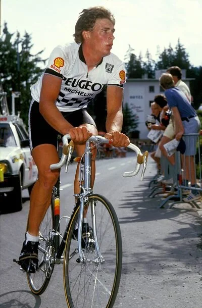

*Yatesy in 1984 (📸 John Peirce)*

S: "Yeah. Joining a French team and getting thrown in the deep end was a real wakeup call, you know?"

G: "Yeah, my 'wakeup call' was 2012. Brad winning the Tour and the Olympic TT was a life-changing moment for me. That's when I said to myself: 'stop fucking around on a bike. Apply yourself and see what you're capable of.'

"Talking of Brad, you were one of his heroes. You became like a father figure to him and helped him achieve the highlights of his career. How does his success make you feel, as his mentor?"

S: "It's not something I thought about when it was happening. It was my job as a Directeur Sportif to get results out of my riders. I knew what it took to win the Tour and Bradley was my material to work with.

"Bradley was from the South East, I'm from the South East, I'd know him for a number of years, but it was only after he won that Tour that I found out he had pictures of me on his wall. It's not something he admitted to. Hahaha.

"We just went out to win races, you know?"

G: "I think he once said: 'I've got a master's degree in Sean Yates.'

"Do you think that Brad not only wanted to be the best for himself but being one of his heroes, wanted to live up to your standard?

"I mean, growing up in the UK, in my household, there were two names… Chris Boardman and Sean Yates.

"To prove it, my dad has kept these (he's a sad twat, like me), one is Graham Watson's photo journal, his 'sixteen best images' and the other one is the 'Tour de France '94 Souvenir Guide', there's a whole double-page spread of you in here, 'Sean Yates – The Powerhouse from Sussex'.

"Because there were so few names in British Cycling back then, you guys were the only riders that people like my dad and a young Bradley Wiggins could relate to, that had come from a similar way of life.

"So, does that help you realise how much you must have influenced his career?"

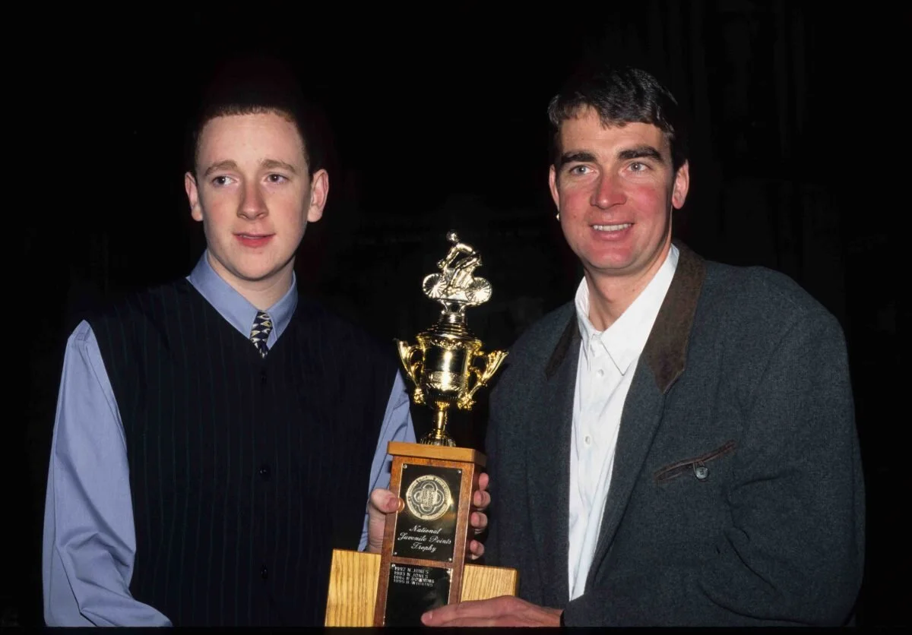

S: "Yes, it's funny to look back on it like that. During the time I was just focused on helping him win races."

G: "Did you get more pride and a sense of achievement from your own performances and results, or as a DS/coach and helping other people achieve their own results?"

S: "Well, good question, that. Most of my… no… virtually all of the pictures and publicity about me are all about my riding career.

"I'm equally proud of my achievements in my DS career. Most people think a DS just sits in the car and shouts at the riders, but there's a bit more to it than that.

"I was the first British DS to win a grand tour (Paolo Savoldelli – '05 Giro d'Italia). I was lead DS when Alberto Contador won the Giro in 2008, and lead DS when Bradley won the Tour in 2012, etc. But also, lots of other races and riders, you know? Swifty, Kennaugh, Stannard – I'm equally proud of those.

"When I look back, that's what I'm most proud of."

G: "I'm a firm believer that before you can learn how to lead, you have to know how to follow. You have to put the hard work in. Your history on a bike and your attitude towards training, commitment to cycling and commitment to a goal must have rubbed off on everyone?"

S: "It's hard to pinpoint what makes a good DS. I wasn't the savviest bike rider, it wasn't my job to be savvy. My job was to 'get on the fucking front and just ride'.

"A DS is the complete opposite, you've got to think about every possible scenario. When you convey your decisions to the riders, you have to be crystal clear. You have to believe you have made the best decision within those circumstances, so they believe in you.

"You need to get inside the oppositions head and think, 'what is their rider thinking? What is their DS thinking? How are they going to react to this? How are they going to react to that?' That's why Nico Portal was so good at being a DS. Sadly, he passed away recently. He came in under me. He just had that 'savvy', you know?

"Nico could just get into the oppositions head, put himself in their shoes and do what they wouldn't like..."

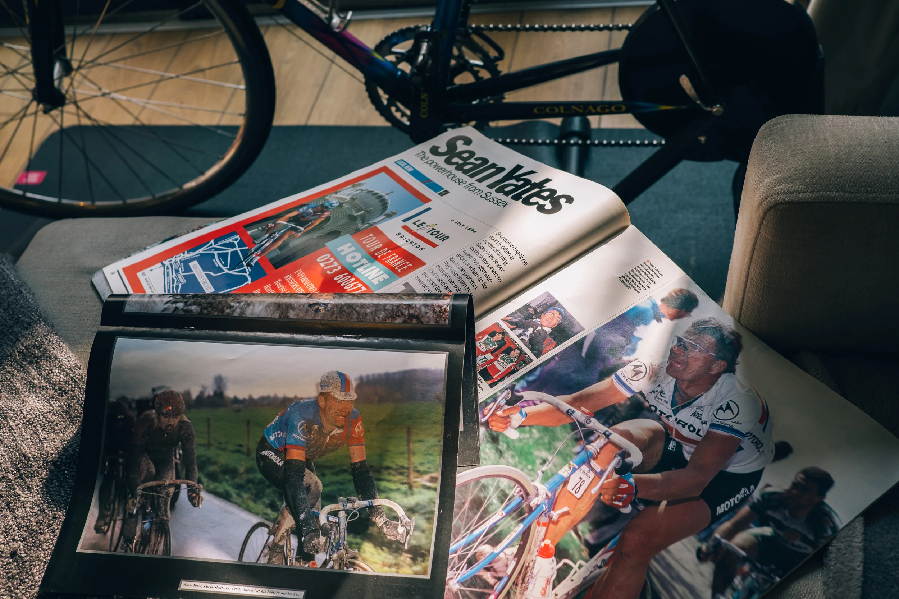

*I first met Nico Portal in 2015, he came to visit us at Sky. He was pretty excited to meet fellow Frenchman, Thierry Henry (apparently he was a good soccer player? 😉). Nico was a true gent and I am grateful for the short amount of time we spent together throughout the Team Sky years.*

S: "The results speak for themselves. Nico won the Tour with Chris Froome, G and Bernal. Leading the troops into battle goes a long way to winning the war, you know?"

G: "Yeah. Absolutely."

S: "If you don't, they'll be disruption in the ranks. They won't be pulling in the same direction.

"On reflection, I'd love to still be doing it. But you have to make way for the next generation."

G: "Yep."

S: "I still act like a professional cyclist and a DS. Who knows, maybe one day I'll get the call and go back to a grand tour in the team car. I said, 'never again' once before, but I still went back.

"I'm a cyclist, you can't switch it off. Since the age of seventeen I picked up a bike and that was it."

G: "That reminds me of my grandfather. When he fell into a downwards spiral of ill health and couldn't ride his bike, he didn't stop being a cyclist. His coffee table was stacked with cycling magazines and books, Eurosport was ALWAYS on the TV, his garage was still full of bikes, he was a timekeeper at local TT's, he served tea and cakes to his clubmates after the club run. Like you say, you can't switch it off."

S: "Yes, that's me.

"Life is for enjoying, really. Do what you enjoy, you know?"

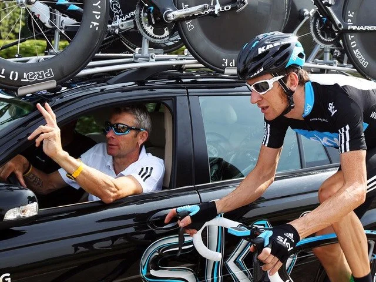

---

## Heroes

To me, heroes are the most combativité cyclists, the ones who overcome the toughest situations, persevere, endure, suffer, and see it through to the bitter end. Heroes aren't always the ones standing on the podium with their hands in the air.

Sean may not have stood on the podium on the 10th April 1994, but he (along with the other six chasers) earned the respect of every cyclist in the world. That is worth more than a title in your palmarès.

Sean, after your 'Sunday in Hell' on the turbo, enjoy the rest of your 'Sunday in Lockdown'.

Gareth.
