**Gareth Winter: 'Suspicious' Jiffy Bag Arrives at Italian Training Camp**

- Amateur cyclist claims: "It's just a small seatpin clamp."
- 'Winter's history of substance abuse is well documented.'

*Monday 17th August 2020*

Gareth Winter, 31, has condemned the report into the 'Factor Bikes Jiffy bag affair'. The 2014 KOM record holder (of a small, insignificant Strava segment), interviewed on RoadCyclingNews.it.

In March, Winter was granted permission to consume 'above normal' quantities of oral-hygiene-substance 'Alcohol Hand Sanitiser'; which can help prevent the spread of germs and the COVID-19 virus. Winter claims that the substance helps manage his OCD and so-called 'germaphobia'. Winter has been accused of abusing this exemption.

*"Gareth's hand sanitiser abuse is obsessive and excessive. It's not technically against the rules, but there is certainly an issue of morality."* — Anonymous

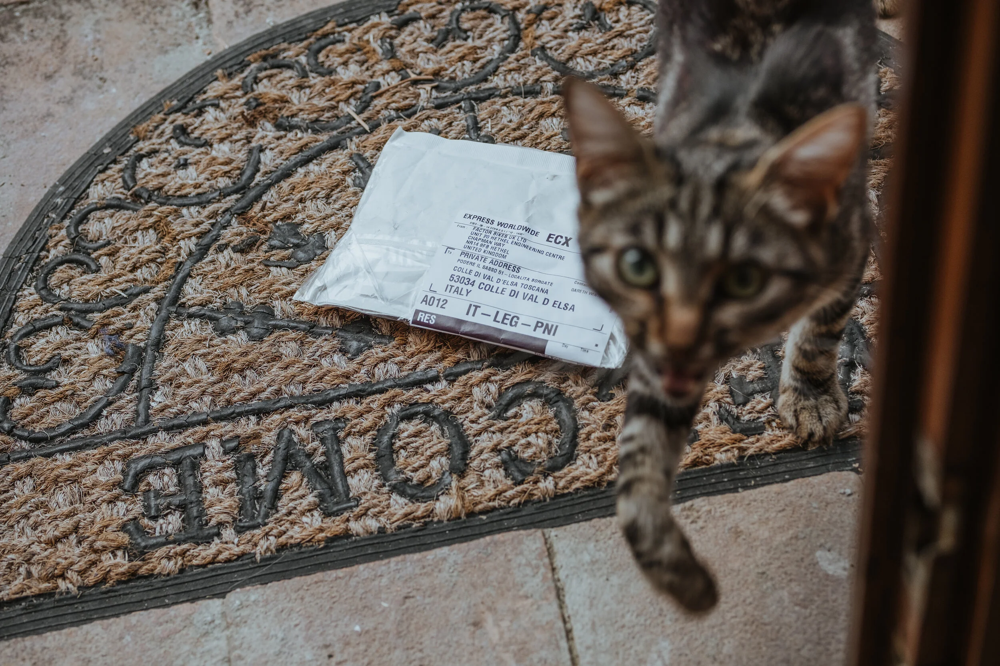

The saga began on August 13th 2020 when Mr Winter arrived at his Tuscan retreat, claiming that his seatpin wedge was missing (required for installation of seatpin and saddle into his frame).

*"Without this small, seemingly insignificant component, my bike is unrideable."* — Gareth Winter

Factor Bikes UK provided evidence proving that without this component a seatpost and saddle cannot be installed into Gareth's Factor O2 VAM.

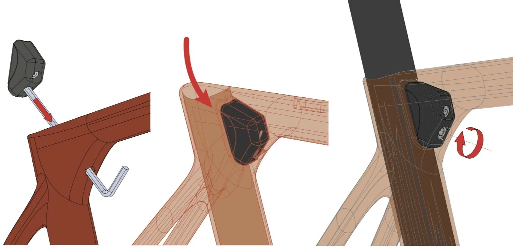

Speculation began after a Jiffy bag was delivered to Gareth during the Critérium du Dauphiné 2020 — a race that he half-watched on the Eurosport Player app (which kept crashing) while sitting on the toilet.

At the request of Winter, Rob Wicks (Operations Manager, Factor Bikes UK), arranged for a replacement seatpin wedge to be delivered to Winter's Tuscan cottage via DHL priority shipping. It is reported that Wicks then told John Bailey (Managing Director, Factor Bikes UK): *"Gareth's been sorted."* — Rob Wicks

The anonymous source claimed: *"There was a liquid substance inside the Jiffy bag. Clearly Factor Bikes are supplying Gareth with additional hand sanitiser."* — Anonymous

An immediate investigation was launched. The 'suspicious jiffy bag' poses the question: 'How could any cyclist be so careless?'

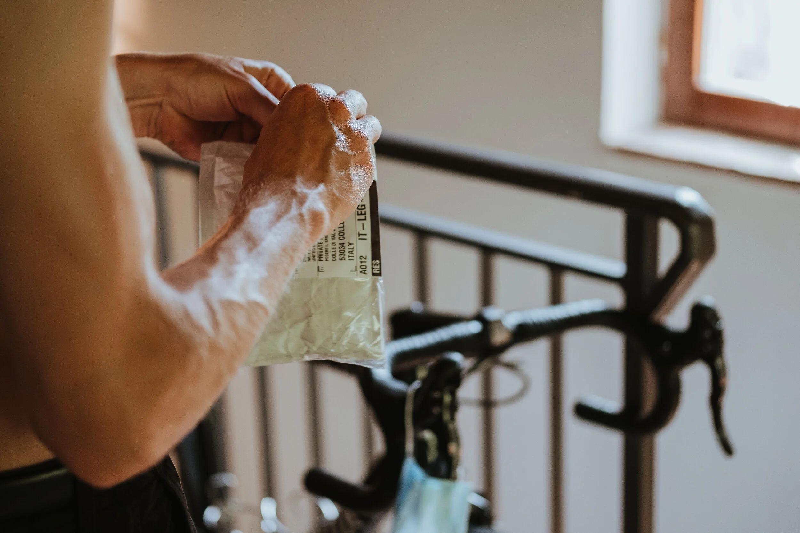

'Accidentally' leaving a vital component at home seems like an alias for wrongdoing? The images posted on Winter's social media account led to further accusations of "A cover-up attempt". Both Winter and Wicks deny that anything suspicious was inside the package.

Bailey told the hearing: *"Wicks informed me that the package contained the required wedge for attaching Gareth's seatpost to his frame. Gareth needs this component so he can enjoy riding his Factor O2 VAM in Tuscany, rather than a hire bike."* — John Bailey, Managing Director, Factor Bikes UK

However, an inconsistency was noted. Winter refers to the component as a seatpin wedge, and Wicks/Bailey referred to it as a seatpost wedge.

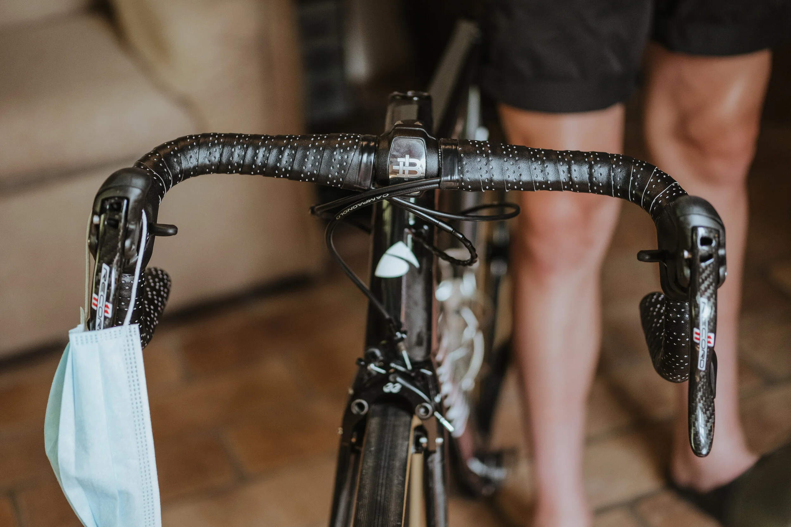

Factor Bikes UK stated: *"We strongly refute the allegation of supplying hand sanitiser to Winter. We are surprised and disappointed that the committee has chosen to present an anonymous and potentially malicious claim in this way, without presenting any evidence or allowing us to respond."* — Factor Bikes UK

Speaking to Road Cycling News, Winter added: *"It is well known, my history of hand sanitiser abuse. However, the contents of this package are well documented and Factor Bikes UK are able to present full evidence to the court."* — Gareth Winter

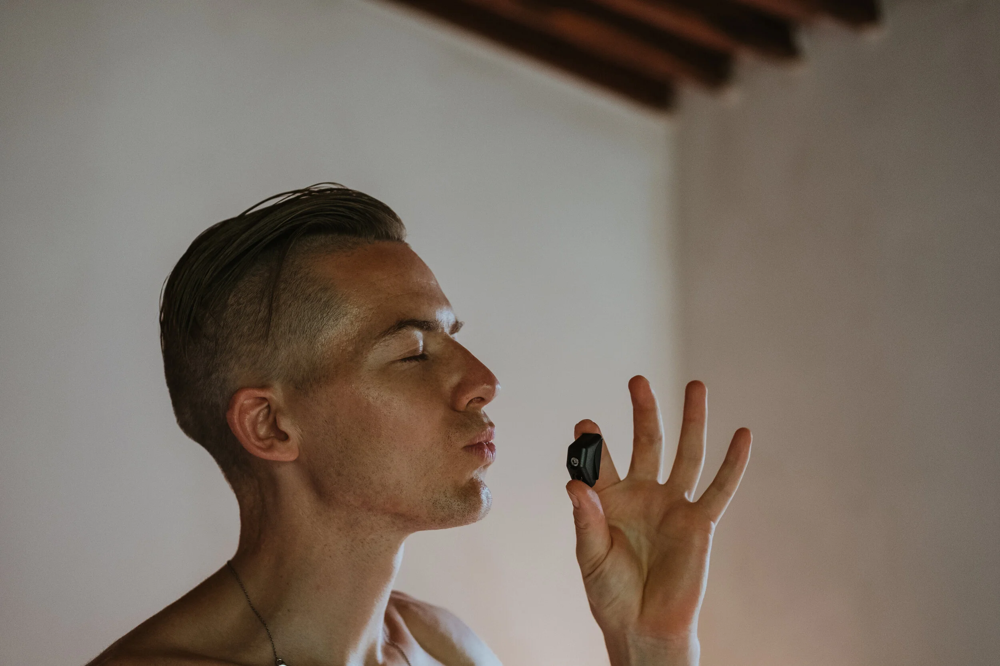

Speaking to Road Cycling News, Gabriele Pecce (Winter's host), who signed for the parcel, stated: *"It was just an envelope, a Jiffy bag, a small Jiffy bag. As far as I know I could have been Speedplay pedals in there."* — Gabriele Pecce

Responding to Winter's claim about the report, authorities added: *"We received evidence from people who did not wish to be named, it was made clear where we relied on anonymous sources, and we trusted them as being credible. People can read the report and come to their own conclusions."*

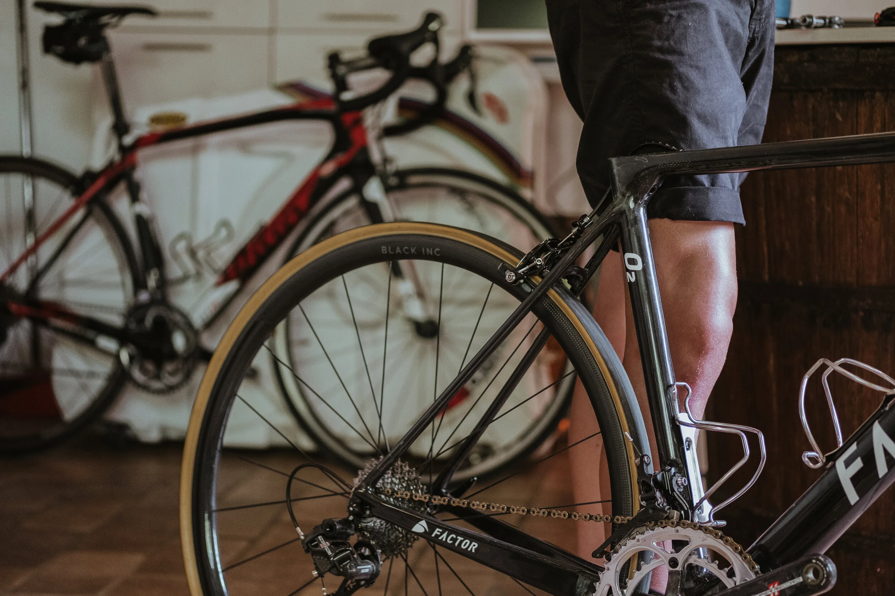

The case has now been fully dismissed after evidence suggests the anonymous source was mistaken. The small sachet of liquid, also found in the Jiffy bag, was not alcohol-based hand sanitiser. It was, in fact, 'Black Inc carbon fibre grip paste', to assist with the proper installation of the seatpost/pin into the frame.

Winter and Factor Bikes UK also stated:
- The proper supply of componentry is fully documented for all of our customers and ambassadors.
- Winter is doing everything in his power to avoid contracting or spreading COVID-19.
- Concern at the use of Gareth's hand sanitiser abuse has been dismissed as 'best-practise behaviour'.
- Gareth has learned from his mistake. He will never forget a vital component while transporting his Factor O2 VAM.

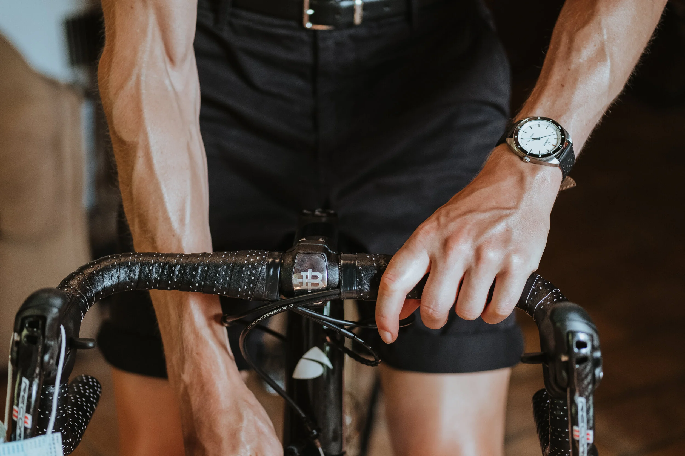

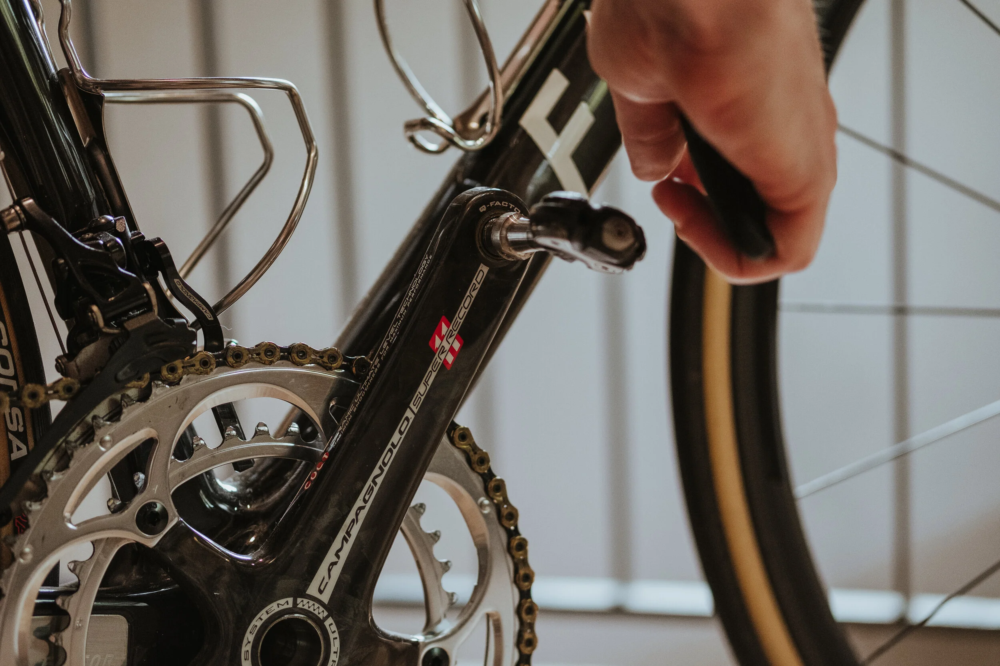

---

Clearly, I'm taking the piss out of the 'Wiggins Jiffy bag scandal'. The intention of this blog post is to highlight how the media can tear people down with the smallest thread of misinformation.

We're all just trying to move forwards at our own speed. Let's support each other.

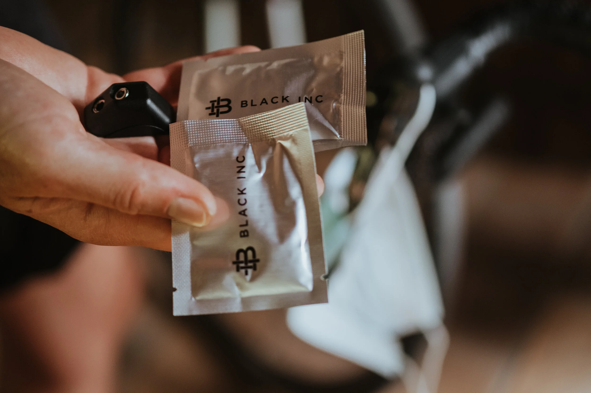

Thank you, Rob, for getting this wedge over to me, so I could ditch the hire bike and ride my VAM on the Strade Bianche parcours.

Stay tuned for my next Tuscan adventure: 'Strade Bianche'.

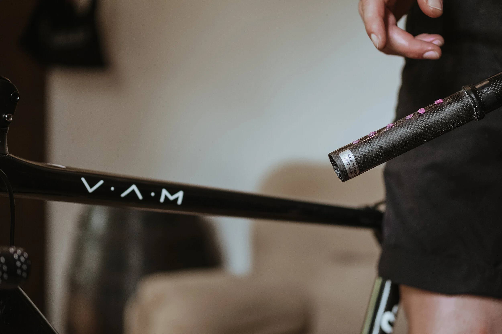

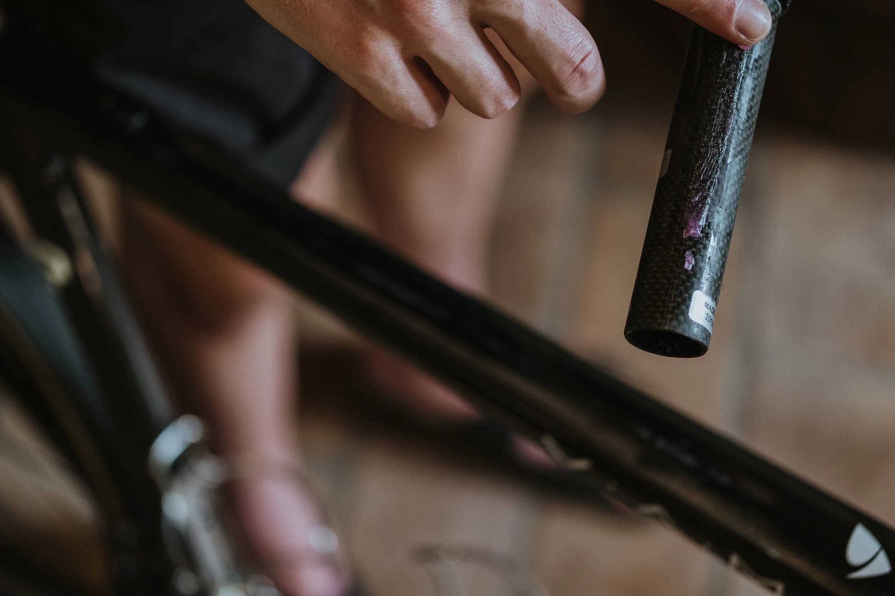

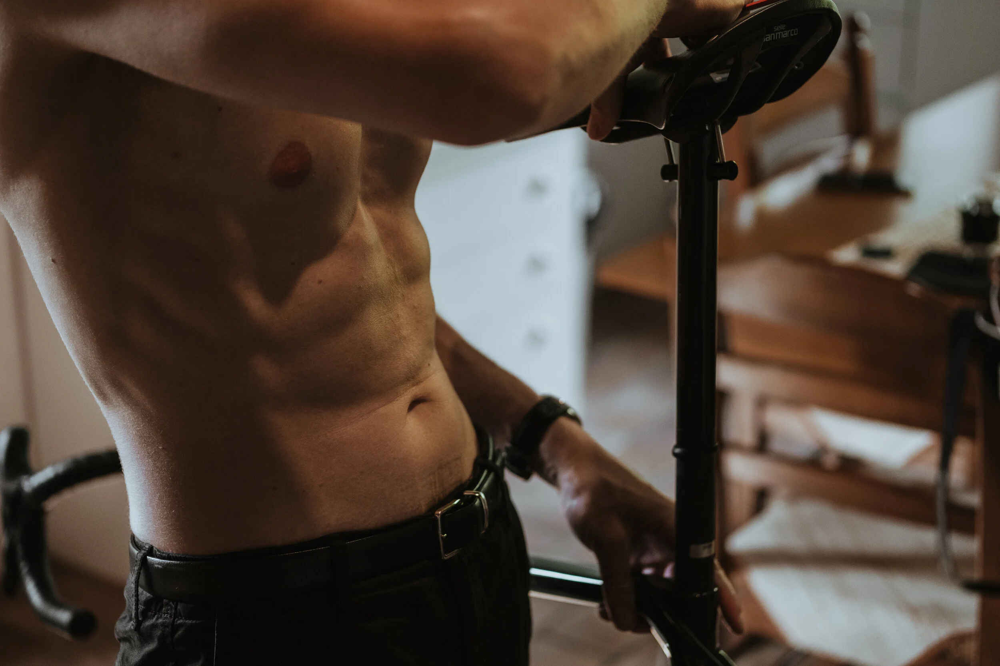

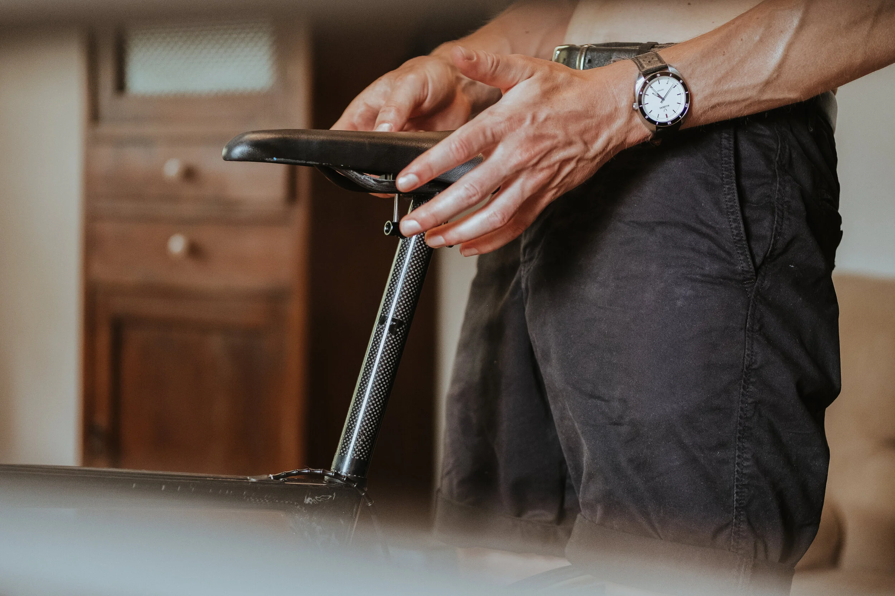

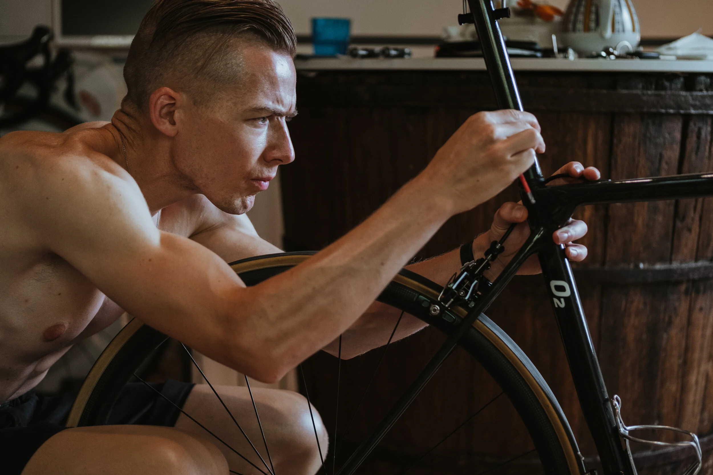

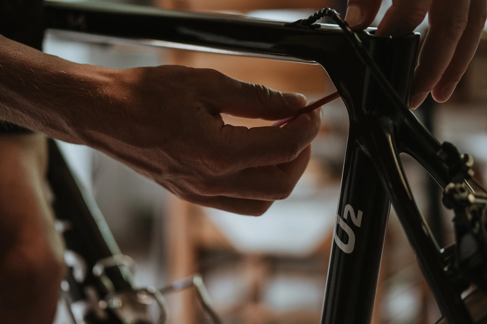

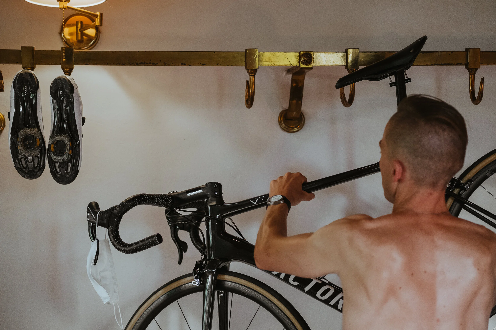

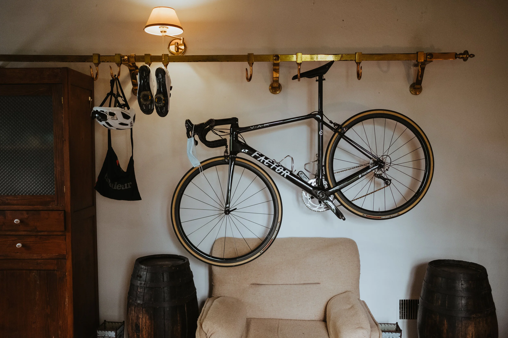

Gareth.
