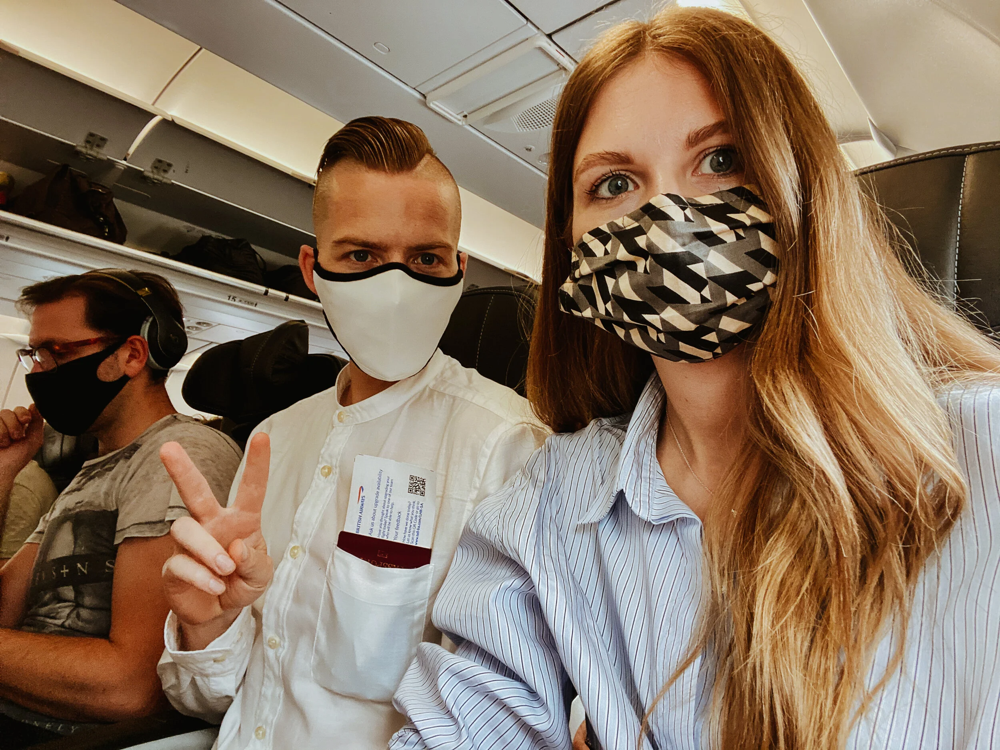
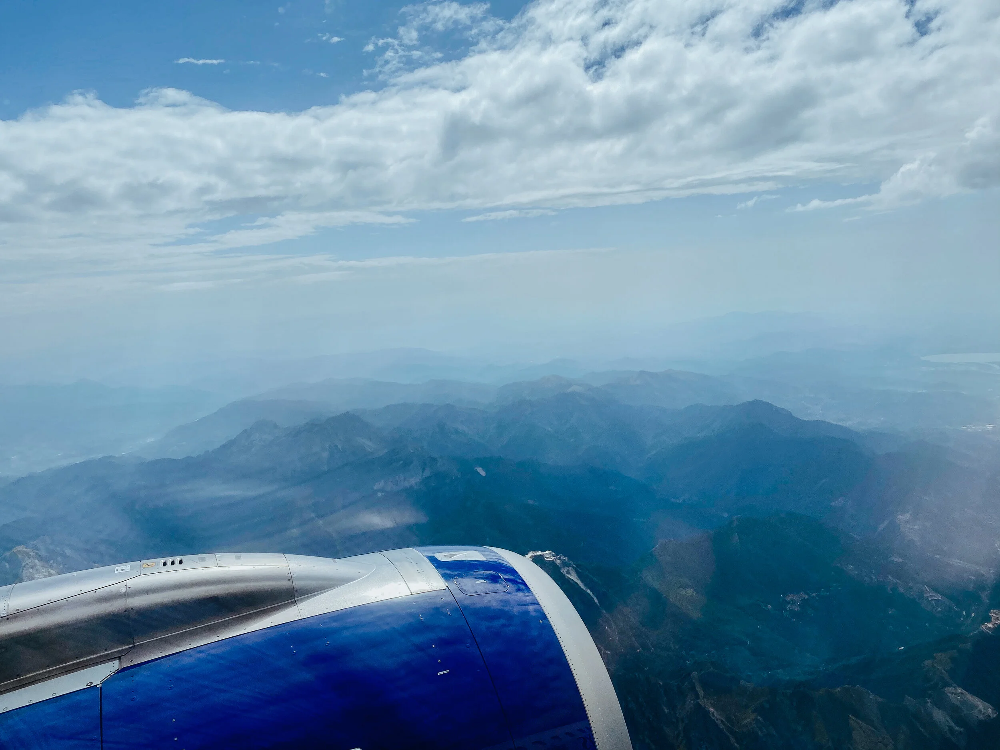
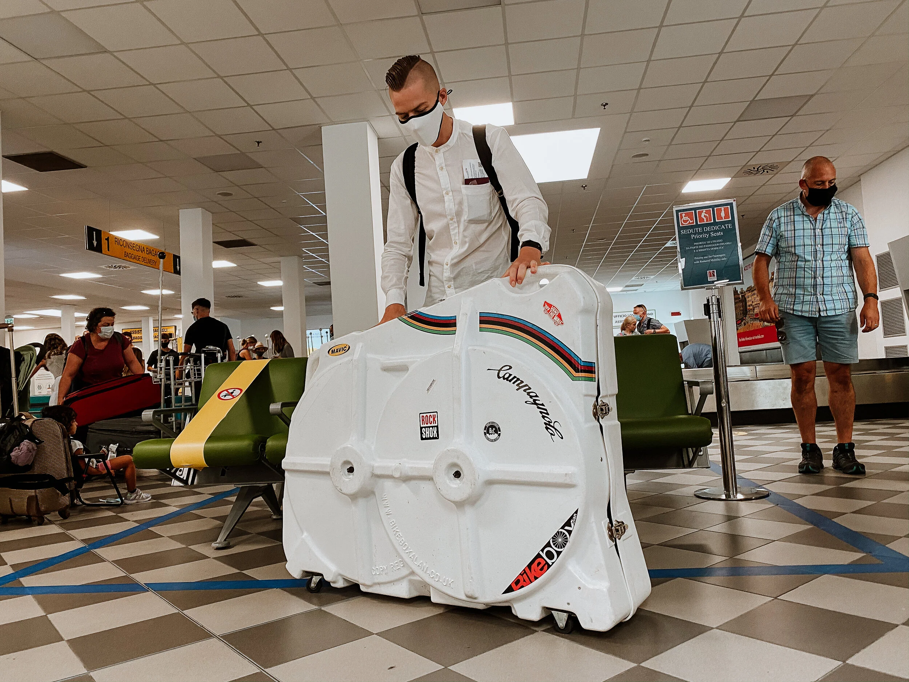
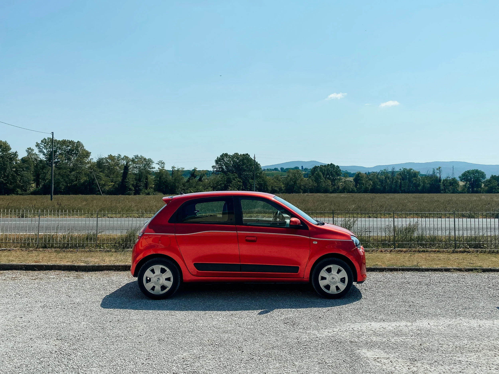
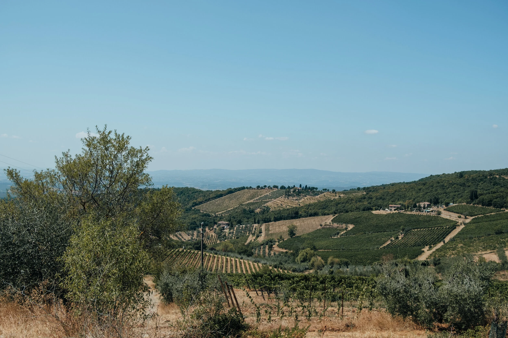
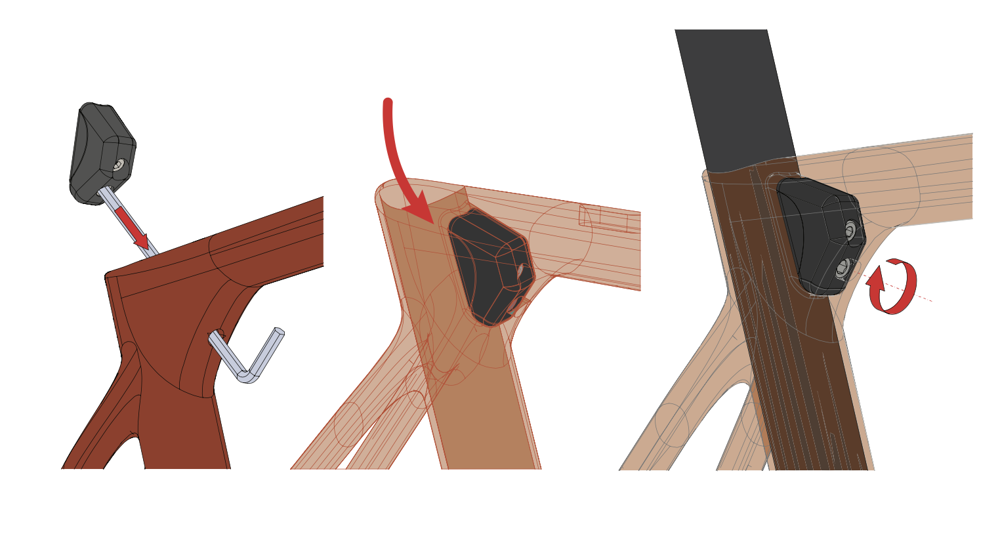
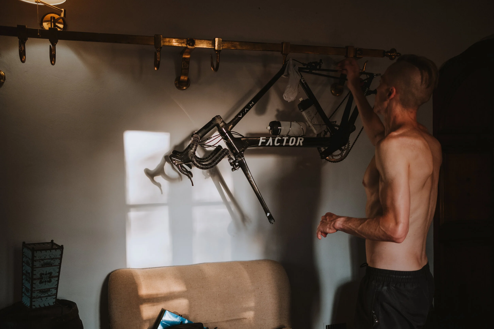

*Thursday 13th August 2020*

The Uber died on the M25.

Not a warning. Not a juddering cough. The engine just quit. We coasted to the hard shoulder in silence, 45 minutes from Heathrow, surrounded by lorries. My Factor O2 VAM was in a bike box in the boot. My flight was in three hours.

I sat in the back and watched the driver scroll his phone. He looked for rescue. I looked at the clock.

This was my first trip since COVID closed everything. Mallorca got cancelled when the government pulled the travel corridor in July. One day's notice. Tuscany was the backup plan, rescued from the wreckage. I had been training for four months on the turbo, building for roads I had never ridden but watched a hundred times on video. The white gravel roads of the Strade Bianche. The Chianti hills. The cypress trees.

Four months of suffering on a static bike. For this. Stranded on a hard shoulder, watching my trip evaporate.

I got a replacement Uber. Made it to Heathrow with time to spare. Which is when I made my second mistake.

Paul Smith has a shop in Terminal 5. I know this. I have walked past it on every trip through T5 for years. I have never stopped. But the window display caught my eye at exactly the wrong moment. Something colourful. Something that looked like it would make a brilliant gift.

Twenty minutes later I was jogging to the gate. Last passenger. The gate agent had the look. The one that says: "You absolute idiot."

She was right.

Boarding pass scanned. Down the jetway. The flight was half empty, which is what flying during COVID looks like. Everyone masked. Seats blocked out. The air tasted of hand sanitiser. Nobody spoke. You could hear the engines from the moment you sat down.

I had one job: get to Tuscany, get on my bike, ride the Strade Bianche. Four months of lockdown training for this single week. I was not going to waste it.

We landed at Pisa.

The car hire desk should have been a formality. I had booked in advance, had my credit card, had my full UK driving licence.

The woman behind the counter pointed at my licence and then at a laminated list of requirements. My full licence was not sufficient. I needed the paper counterpart. The supplementary document that British drivers have not needed since 2015 when the DVLA abolished it. The one that, until this moment, I had genuinely never thought about since passing my test.

I did not have it.

What followed was a long, warm, increasingly frustrating conversation with a car hire company that operated on its own timeline. Italian bureaucracy and British impatience make poor travel companions. My foggy lockdown brain was not helping. Becky stood next to me with the patience of a saint, saying nothing, which was exactly the right approach.

Eventually, we were in a car.

Then Tuscany ambushed me.

You forget about everything the moment you leave the autostrada. The road climbs through vineyards. Cypress trees mark the ridgelines. The light turns golden and thick, the kind that photographers spend careers chasing. We drove through hilltop villages with stone walls and flower boxes, through valleys full of sunflowers, past farmhouses that looked untouched for two centuries.

I had been frustrated, jet-lagged, overheated, slightly embarrassed about Paul Smith. Then the landscape swallowed all of it.

Becky and I didn't speak for a long stretch. We didn't need to.

We pulled into the driveway of our cottage just outside Colle Val d'Elsa as the evening light was going flat and golden. Gabriele, our host, was waiting at the gate. Warm handshake. A tour of the property. Cold water on the terrace. A glass of local wine for Becky.

I went straight to the bike box.

This is always the first thing. Unpack the bike, assess the damage from transit, rebuild it, prop it against the nearest wall, and only then start being a tourist. I had packed meticulously. I had a list. I had checked the list. The Factor was wrapped in pipe lagging and foam, seatpost removed, bars turned, pedals off, rear derailleur protected.

I unpacked everything carefully. Rebuilt it methodically. Reached for the seatpin wedge to fix the saddle and seatpost to the frame.

It wasn't there.

FUCK.

I went through the box again. Then a third time. I emptied the entire contents onto the floor and went through every item individually, handling each piece separately to make absolutely certain.

No wedge. No clamp. No saddle on the bike.

Without it, the O2 VAM was unrideable. A very expensive, very beautiful piece of Italian carbon propped against a Tuscan wall. Decorative.

The reason it wasn't packed: I had assumed it was already fitted to the frame. It was not. It was on my workbench at home, 1,400 kilometres away.

Cyclist lesson, learned the hard way: never assume.

I messaged Rob at Factor Bikes UK. It was late. He came back to me within minutes, confirmed what I already knew (the bike was unrideable without the component), and arranged a DHL priority shipment to the cottage. It would arrive in a few days.

A few days.

Gabriele took one look at my face and made a phone call. His local bike shop, Gippo, could provide a hire bike until the part arrived. A Wilier. Perfectly good bike. Not my bike.

I sat on the terrace with a glass of water, looking out at the cypress trees in the last of the evening light.

An Uber breakdown. A near-missed flight. A car hire bureaucratic nightmare. And now this.

Tomorrow I was riding Tuscany on a hire bike.

The cypress trees didn't care. The landscape was still beautiful.

Onwards.

---

*Continue with [Part Two](/blog/tuscany-road-journal-part-two): the Wilier, the white roads, and the search for the missing seatpin wedge.*
