A bike fit is a journey — not a destination. As your lifestyle and training change and evolve, you may need to tweak your position to accommodate. I headed over to the Vires Velo Physiology Studio to check on my training progress, find ways to improve and dial in my bike fit for the season ahead.

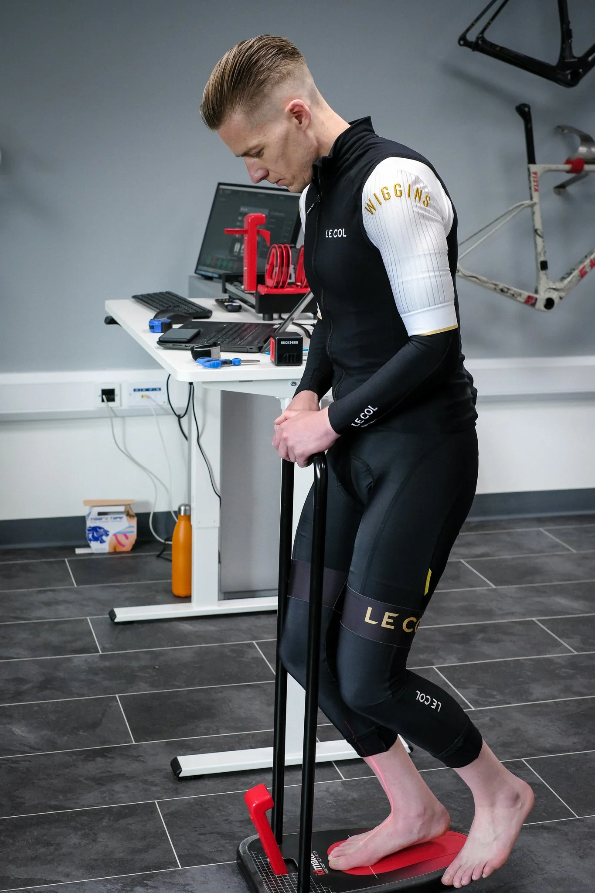

Over the last two years, I have spent more time on a turbo trainer than on the road. My life has got far busier, so spending an hour and a half on the turbo before work doing structured sessions maximises my training time. I love a good suffer-fest, so I'm not complaining. My position has adapted to the extensive turbo time. I am far more upright, as there is no wind to fight — and this helps with the higher cadence that a turbo trainer encourages.

Now that I have the capacity to ride outside a bit more, I will be training my back to go from 'dry spaghetti' to 'cooked'. But for now, we needed to adapt my bike fit to accommodate where I am, not where I want to be. Working from home, my right hand spends all day elevated upon my dining room table, holding a stylus pen. This has sent my shoulders off balance. As a result, I often find myself riding crooked and have to straighten myself back up consciously.

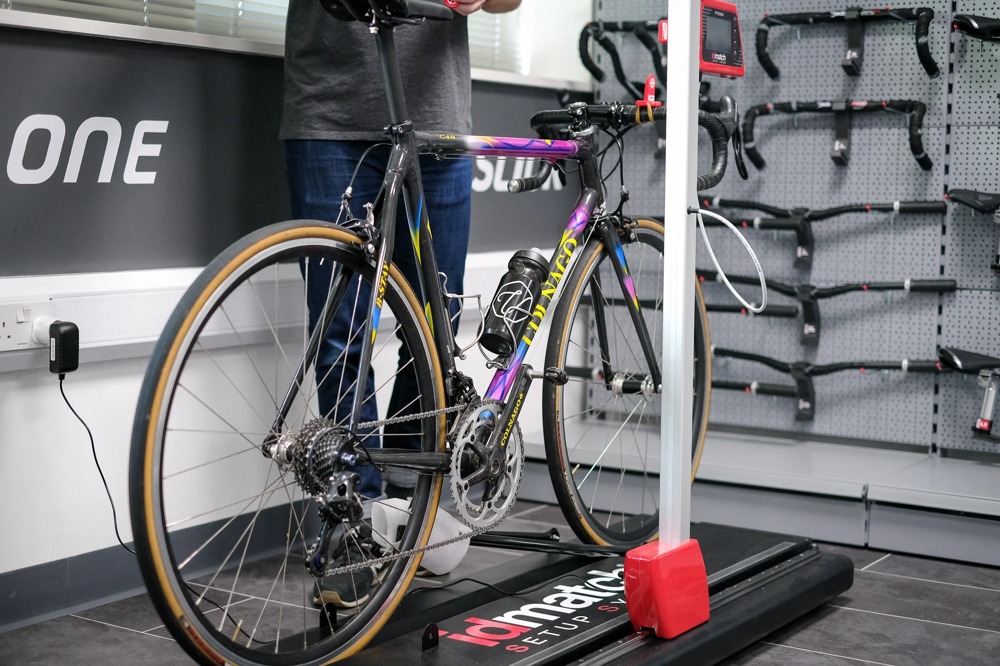

Hayden Daniells, Sports Scientist at the Vires Velo Physiology Studio, asked all of the right questions to draw out the above information during our initial consultation.

## The Bike Fit

I have had many fits over the years, as you can imagine. Most of them have been within a few millimetres of each other, reassuring me that I am in the right ballpark. I have had a few anomalies, but most have been very helpful, "a journey — not a destination."

Vires Velo are world-class and don't do anything by halves. They have got their hands on some very cool kit, including the idmatch bike fit system and recruited Sports Scientist, Hayden, to operate it. idmatch is a cutting edge measuring system that takes 3D scans of your body and, with a series of carefully placed markers and algorithms, determines your optimal bike position based on your goals and riding style.

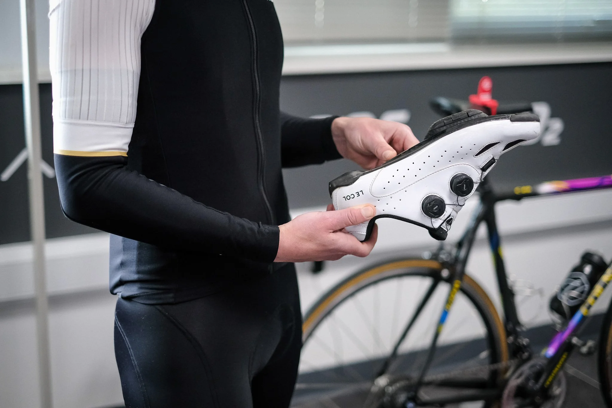

Firstly, Hayden took measurements such as my height, foot lengths and arch profile, weight, flexibility (or lack of), etc. For comparison, Hayden set the idmatch smart bike to my existing fit and asked me to pedal at a steady cadence so he could look at my position and posture while quizzing me on any discomforts.

"Well, I constantly have to remind myself to drop my right shoulder blade, as I ride crooked, and my right knee tracks inwards." — me

Hayden had already spotted this, and we began to answer the most important question, "why?"

I believe the shoulder thing is due to being desk-bound. The knee? Well, I already knew the problem — my spindle length. I use Speedplay pedals. The standard length is too narrow for me. I need longer spindles to avoid crank rub and straighten up my knees.

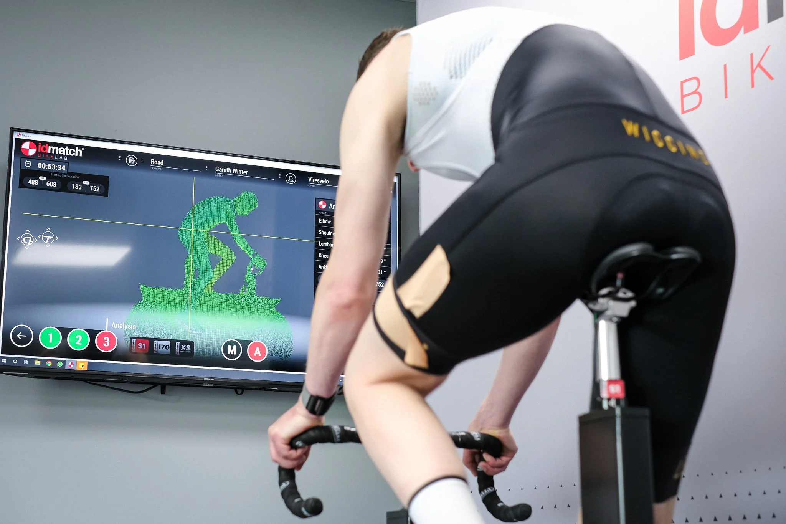

On my Factor O2 VAM, which I sadly crashed and am currently replacing, I'd fitted longer spindles to cure this problem (destroyed one pedal in the crash). I just haven't bothered to fit longer spindles to my Colnago C40 — the bike I have been riding all spring, and have been twisting my foot inwards to avoid the crank rub. There is a typical case of "do what I say and not what I do" between me and myself.

Hayden also suggested using some insoles with a medium arch to match my foot profile, as this will give me an even sturdier profile to put the power down.

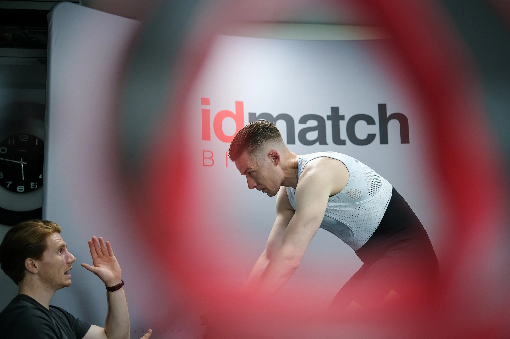

Then Hayden set the idmatch system to find my optimum position automatically, and guess what, it pretty much put me bang on where it was — a tribute to how good the algorithms are. So we dropped my saddle 1mm and brought the bars a bit closer — as my position isn't as stretched out as it used to be (I'll get there soon enough).

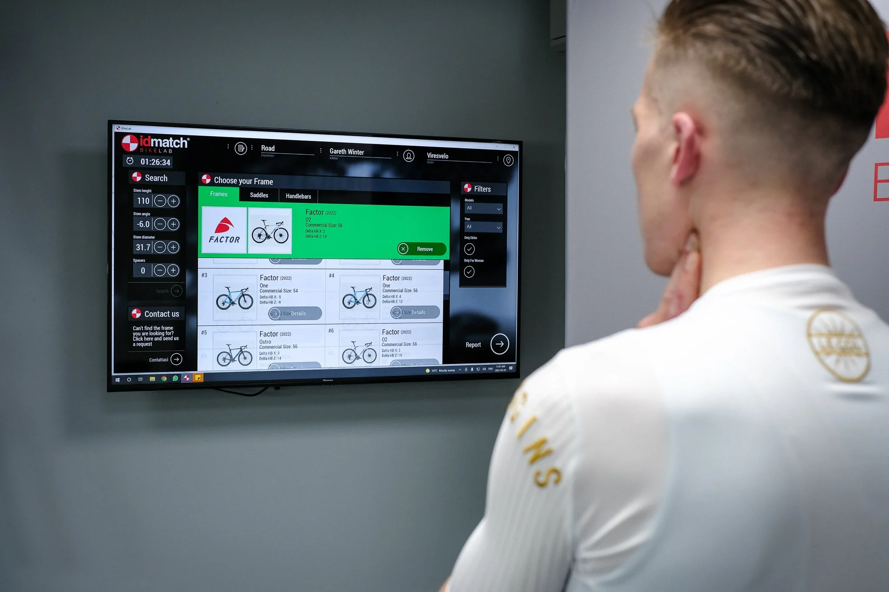

This process was brilliant. The idmatch smart bike adjusts as you ride, making small changes and quickly comparing positions — which is much easier than jumping on and off a road bike on a turbo trainer to fettle with an Allen key. I am no stranger to these bike fit jigs, I have been fitted on a Retül and a Guru, and they are all fantastic tools. However, the 3D body scanning is what makes the idmatch a cut above.

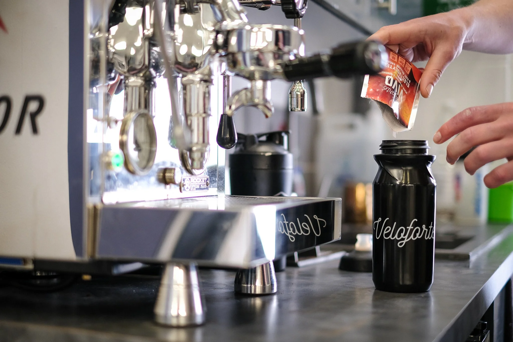

With my experience and Merckx-like bike fit OCD, I would never produce a drastically different fit. Speaking of Eddy Merckx, when I rode with him and jokingly asked what he thought of my position while fettling with his saddle, he said, "Maybe you are a few millimetres too high." — Eddy, you have the eyes of an eagle.

However, if you haven't had a bike fit before, I highly recommend you do, as even an old soldier like me can learn (or remind myself) of a thing or two.

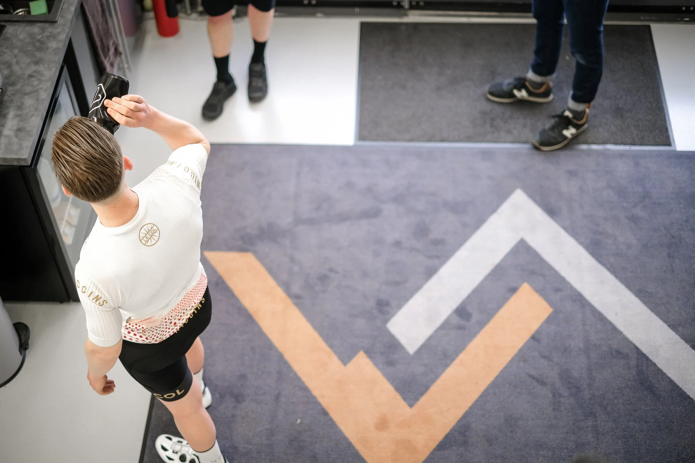

I believe that "your health is your wealth", which in this context means riding in comfort and reducing the risk of injury. Putting my saddle down 1mm and getting pedal axels that are 5mm longer isn't going to unlock more power or improve my aerodynamics, but it will straighten up my right knee. If we didn't solve this issue, think about the accumulation of strain over the next decade, where I do 10-15hrs per week, every week? That's what a bike fit is for. Thanks, Hayden.

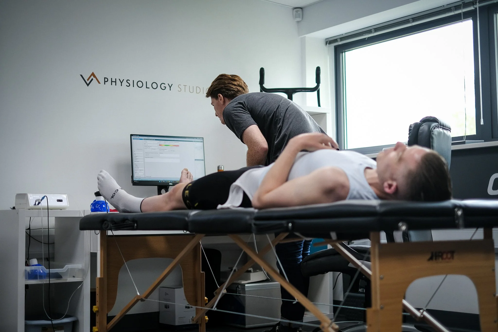

## Resting Measures

Next up, resting metabolic rate (RMR), where Hayden measured the total number of calories my body needs to maintain a rested state. For example, additional energy expenditure such as cycling, strength training, etc. — would require additional fuelling.

We are all unique, and I have found that 'rule of thumb' or 'government recommendations' are as useful as glass cranks. For example, have you ever looked at 'estimated calorie burn' on a fitness tracker vs measured calorie burn from a heart rate monitor or power meter? That will give you an indication of how drastically wrong guesswork is.

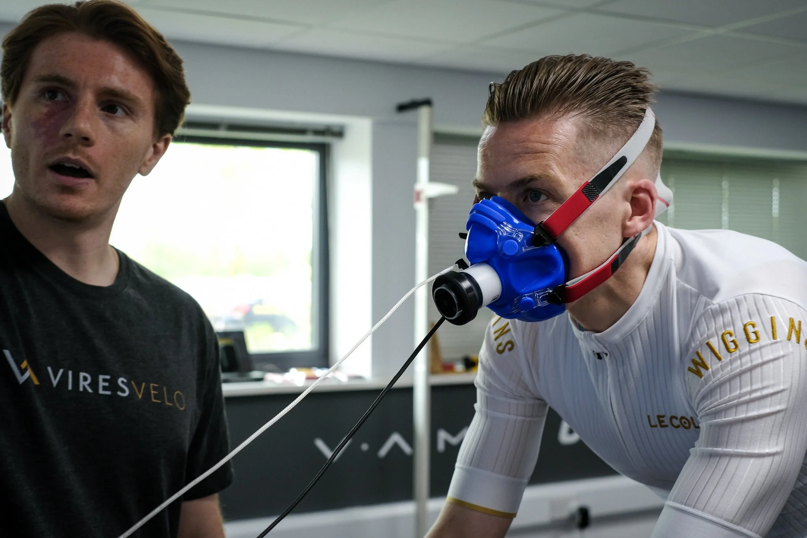

Therefore, you cannot rely on an online calculator or app to inform your calorie or macro targets. Even if you input your age, gender, height, etc. — these apps have no context of your background or lifestyle. An RMR test gives you evidence-based results and an accurate indication of what your body truly needs.

A popular food diary app recommends that based on my age, gender, height, weight, etc. I should consume 2000cals per day. However, the RMR test showed that I need 2225cal. The test also splits your macro requirements — carbs, proteins and fats per day. Now, carbs give you energy, protein repairs muscle damage, and fats keep you healthy.

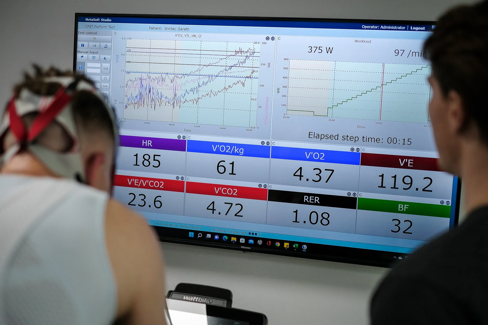

So for someone like me who pays close attention to my nutrition, this insight helps fuel my daily quest to become a fitter, stronger, happier, healthier human. A few years ago, I was drastically underweight on my quest to outdo Froomies' BMI and power-to-weight ratio. But unfortunately, all I achieved was burning away all the power I had built over the last few decades. Now I have flipped my mindset from "dieting and exercising" to "fuelling and training" — I am back on the power wagon, but it is taking me a long time to undo all of that damage.

## The Hard Part

Hayden put me through a VO2 MAX test. I build at least one VO2 MAX turbo session into my week — as it's the best 'bang for your buck' for improving fitness — along with some decent base miles (Z2) and sweet spot.

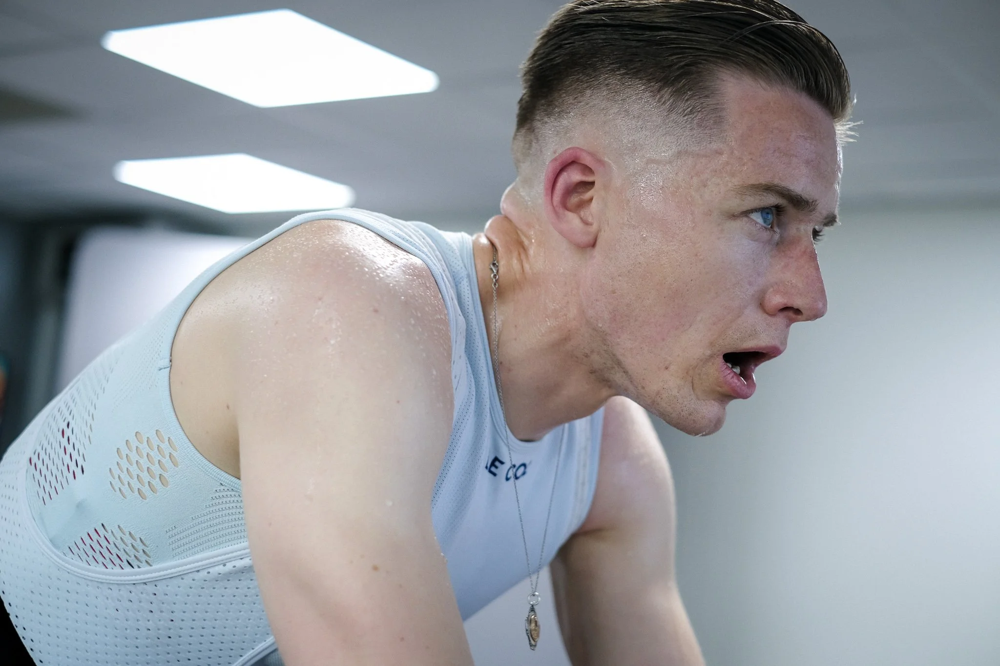

Anyway, I have been guessing my VO2 MAX based on my 20min FTP test and loosely calling my Z5 training zone VO2 MAX, which is in the right ballpark but not the complete picture. I am a practised cyclist and have reached the level where I can no longer find 'maximal gains' and have to look for 'marginal gains' to see continuous improvement.

Consistency is the most important factor for progression, but the key to consistency isn't just turning up — but consistently stepping out of your comfort zone. Focussing on increasing your time spent at VO2 MAX is a great way to train your ability to pile on the hurt and build your engine. Having an accurate measure can improve the quality of your training.

The ramp test was a sweat fest, but I have conditioned myself to 'break down the challenge'. When you know your training zones, you can look at a ramp test and know that most of it will be performed well within your comfort zone. It's only when you get into Z5 that it starts to burn, and your core temperature rises. Also, you have a mask on your face, which restricts your breathing ability. Before you know it, you have gone from relative ease to dripping with sweat and gasping for air.

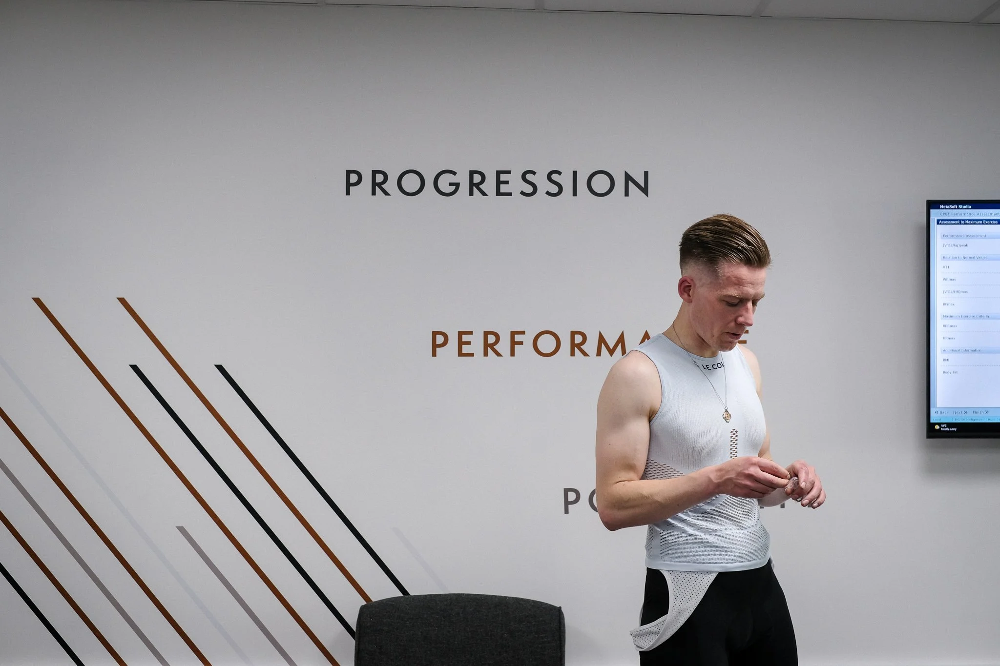

Hayden talked me through each step of the process and made sure I squeezed out my best effort. I was pretty happy with my results — and now know where I can find improvements.

## Conclusion

I left Vires Velo a more knowledgeable rider. That is what this experience is all about. Education is the first step to making positive changes.

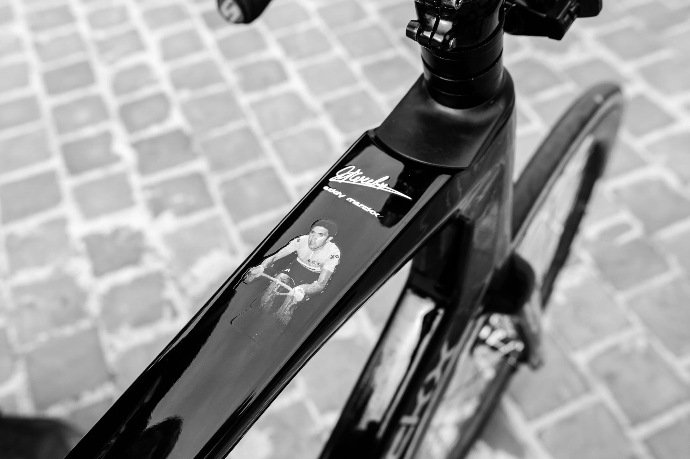

I have put longer spindles on my pedals, which instantly felt more comfortable. But unfortunately, I have tapped out god knows how many hours riding in my old position, so it will take a bit of time to retrain my muscle memory and consciously correct these movements until they become unconscious.

The mid arch insoles have reduced the amount of movement inside my shoe, so I have a more stable platform. It really does feel like a world of difference. As someone who tracks my calories, macros, and nutrition, I have adjusted my daily target to align with my RMR test. With consistency, I hope to see some improvements in my overall well-being and my performance.

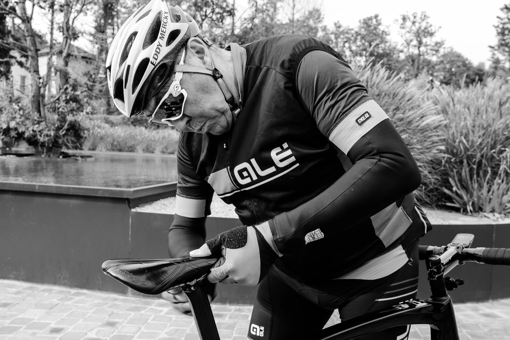

I have adjusted my VO2 MAX training sessions on Zwift to hit the exact number. One of my MANY sayings is "increase, adapt, repeat." — so I am looking forward to popping back over to Vires Velo soon for a retest.

The best thing about Vires Velo is that everything is under one roof. Spend the day here, and you can get a bike fit, physiology testing, have your bike looked after by a mechanic, etc. For example, I have previously gone to Putney for a bike fit, Central London for insoles, Wandsworth for a mechanic, and Kingston for VO2 MAX testing. What a chore. It's much more time and cost-effective to get it all done under one roof — and to an exceptional standard, with great people.

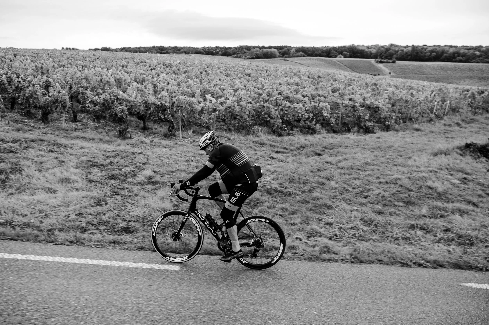

Thanks for the knowledge, gains, beautiful coffee, and good company, Vires Velo. And big thanks to Tom Fleetwood for documenting the process and calling me while I was driving home to tell me I had forgotten my cycling shoes. Classic.

G
