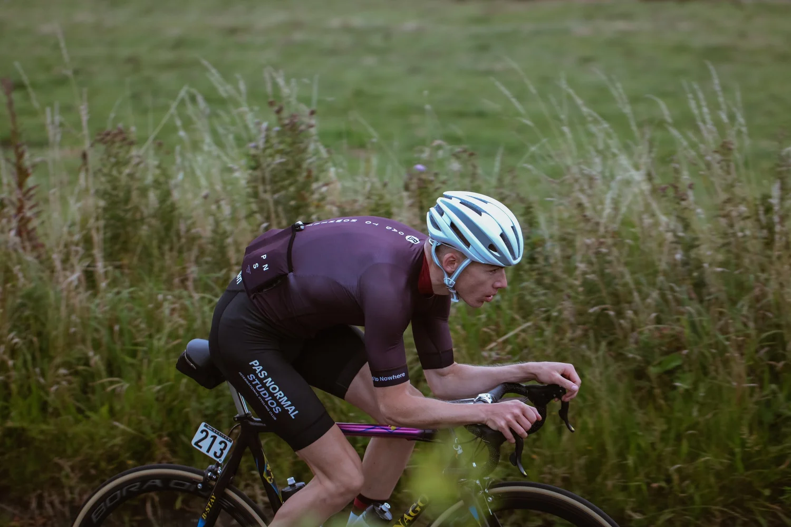
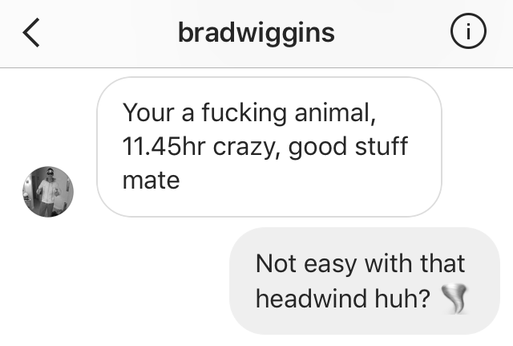
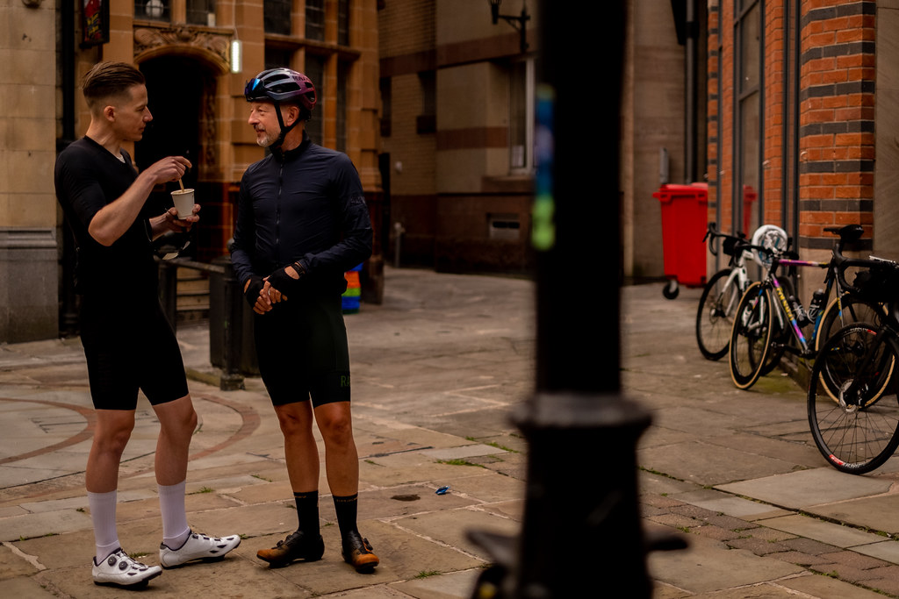
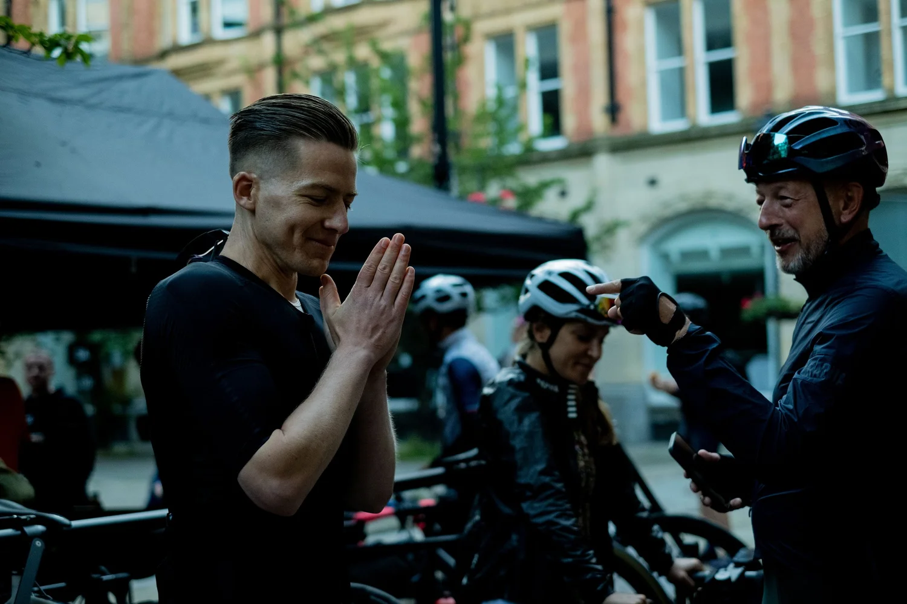
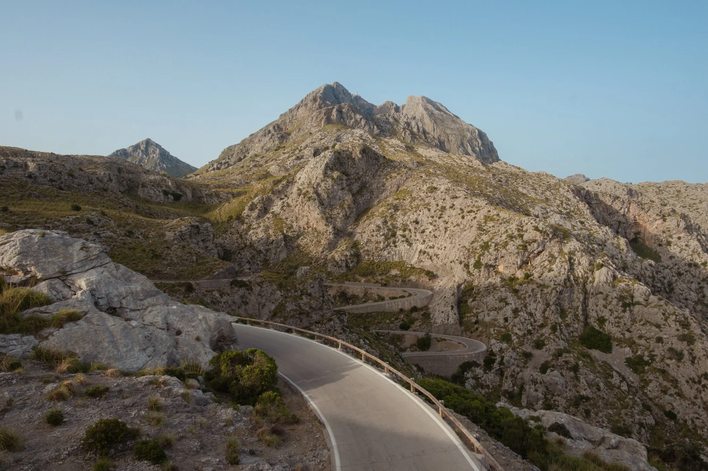
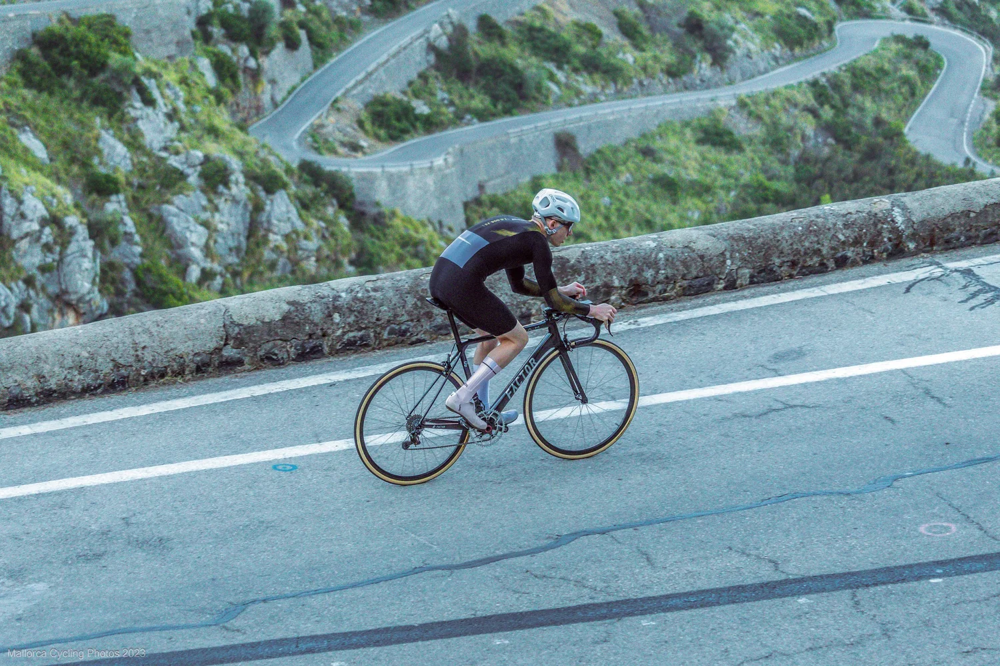

## Why I Wax My Chain, And Why You Probably Should Too

There are two types of cyclists.

Those who clean black paste off their cassette with an old toothbrush.

And those who do not.

This is the story of how I became the second type.

It starts, as most good things do, in Manchester.

## Manchester to London: 360km of Reality

Manchester to London *(founded by Rapha’s Simon Mottram)* is not a lab test.

It’s rain.

Grit.

B-roads.

Fatigue.

It is 12 hours of drivetrain exposure to everything the British road network can throw at you.

Before waxing, I would finish 8+ hour rides with a chain like a cement mixer. 

A cassette that looked like a plasterer’s radio. Leave it overnight, and you wake up to rust by morning.

A drivetrain that required a full degreasing session. The “get your hazmat suit on and cover the ground with tarpaulin” kind. 

The kind that wilts nearby plant life and makes you question your life choices.

And the quiet suspicion I had just spent £50 worth of component life.

Then I switched to chain wax.

Specifically, <a href="https://silca.cc/en-gb/collections/chain-waxing-system" target="_blank" rel="noopener noreferrer">
SILCA Secret Chain Blend, Hot Melt Wax.
</a>

What changed?

Not the weather.

Not the distance.

The noise.

Silence...

Standard drip lube vs Hot Melt Wax is like comparing a chain smoker with a rattly cough and lungs like raisins, versus Wim Hof’s wind pipes that could seat a tubeless tyre with one exhale.

## The First Thing You Notice Is Not Speed

It’s silence.

A properly waxed chain does not sound lubricated.

It sounds absent.

It's not magic. It's friction reduction. 

Not witchcraft. Watt-craft.

Zero Friction Cycling, widely regarded as the most exhaustive independent drivetrain testing authority in the world, has stated:

> “Hot melt wax remains the benchmark for efficiency and wear performance in real-world testing.”

Their full 6000km block testing, which includes clean, dry contamination, wet contamination, and extreme contamination blocks, consistently shows immersive wax systems outperforming wet lubricants for both friction and wear.

Adam Kerin of Zero Friction Cycling also notes:

> “A poor lubricant choice or contaminated chain can cost upwards of 5 watts at 250 watts. That number increases as power increases.”

Friction Facts testing, reported through VeloNews, showed wax-based systems running nearly 6 watts faster than standard oil lubricants after one hour in dirt and water.

Six watts is not marketing.

Six watts is a bike length at 50 kilometres per hour.

And over 360 kilometres, that compounds.

## But This Is Not Just Paraffin

This is where people oversimplify it.

They say “wax” and imagine candles.

<a href="https://silca.cc/en-gb/collections/chain-waxing-system/products/secret-chain-wax-blend" target="_blank" rel="noopener noreferrer">
SILCA’s Secret Chain Blend
</a> is not just refined paraffin.

It contains nano-scale tungsten disulfide.

That matters.

Tungsten disulfide plates into the microscopic asperities of the chain surface. It does not just sit between metal surfaces; it modifies them.

SILCA describes it clearly:

> “Secret Chain Blend utilises nano-scale tungsten disulfide to fill surface imperfections and create an ultra-low friction, wear-resistant interface.”

Zero Friction Cycling’s efficiency testing of SILCA Hot Melt places it among the fastest lubricants tested at approximately 3.8 watts loss at 250 watts.

This is not generic wax.

It is a wax matrix carrying one of the most lubricious solid additives used in high-performance engineering applications.

You are not just reducing contamination.

You are reducing boundary friction at the metal interface.

That is a different conversation entirely.

## Manchester to London: Three Chains, One Winner

### Chain Number One: 2016

Manchester to London 2016. Back then, immersive waxing was fringe.

When I told my friend Liam Maybank *(founder of Aerevolution and a proper UK timetrial engine)* that I was riding M2L, he offered to wax my chain for mates’ rates: £20. He promised durability and a few watts.

I wasn't convinced, but I trust and respect Liam, so I gave it a go. 

The process looked like Breaking Bad. Picture Walter White. Solvents. Home oven. Serious kitchen chemistry.

**Race day:** The forecast flipped. 2016 became a washout. I panic-bought Rapha’s Shadow jersey and bib shorts the day before. If my drivetrain was going waterproof, so was I.

The moment I clipped in, it felt different.

Not faster. Quieter.

I rode off the front with two riders in the first quarter, Jake and Tom. After a few hours in the rain, their drivetrains sounded like gravel grinders. Mine stayed silent.

That silence became fuel.

While their chains collected every grain of the North of England, mine kept shedding contamination and running silently.

I rode them off my wheel and spent the next six hours solo.

Low position. Rhythm. Mindset. Efficient pedalling.

When I reached London, my legs were ruined.

My drivetrain was not.

## Chain Number Two: 2017

I returned in 2017 and took the fastest time and the course record, despite a headwind for most of the 360 kilometres.

That year, I used Muc Off’s Nanochain, developed for Sir Brad Wiggins’ Hour Record; a project that I worked on, leading the creative and advertising for the event broadcast on Sky Sports, and globally on YouTube. Tickets sold out in under 5 minutes...

It worked.

Sir Brad rode M2L too. His respect was a greater achievement than my result:

But the Nanochain was essentially single-use. A lot of money for one ride.

You could not repeat the treatment yourself.

With a hot melt system at home, you can.

And it's faster. 

And as Zero Friction Cycling summarised in their long block testing:

> “Immersive wax lubricants consistently demonstrate significantly lower wear rates than wet lubricants across contamination blocks.”

That matters in a 360km race.

## Chain Number Three: 2022

By 2022, I was fully committed.

Full SILCA Hot Melt system.

Fastest time again.

Same British weather lottery.

The chain was weatherproof, durable, and silent.

The next day, it went back into the wax pot and came out as good as new.

Unlike my legs.

## “But Isn’t Waxing a Faff?”

It can be.

If you do it wrong.

The old-school method required:

* Multiple solvent baths
  Degreasing rituals
* A sacrificial slow cooker
* And a level of mechanical commitment bordering on monkhood

SILCA changed that ecosystem.

Here’s how it actually works now.

## The SILCA Chain Waxing Ecosystem (The Grown-Up Version)

This isn’t just a pot of wax.

It’s a system.

### 1. StripChip: No-Solvent Start

Factory grease is the enemy of wax adhesion.

StripChip chemically converts factory grease inside the wax bath at 125°C — no pre-solvent stripping required 

One chip per factory chain.

That’s it.

No mason jars.

No petrol baths in the garden.

### 2. Secret Chain Blend: The Base Layer

Four refined waxes.

Nano-scale tungsten disulfide (WS₂).

Tunable via SpeedChip or EnduranceChip. 

Hot immersion ensures full penetration into rollers — the actual friction interface.

Official friction testing places Hot Melt around **~3.8W loss @ 250W load** — among the fastest lubricants tested (ZFC) 

That’s race-grade.

### 3. SpeedChip vs EnduranceChip

This is where it gets interesting.

SpeedChip:

Optimised for outright friction reduction.

EnduranceChip:

Optimised for extended contamination resistance and interval length (ZFC extended interval data) 

Translation:

* Time Trial? SpeedChip.
* Manchester to London in British weather? EnduranceChip.

Marginal gains aren’t one-size-fits-all.

### 4. Super Secret Drip: Field Maintenance

You don’t re-hot-wax every week.

You top up.

Super Secret Drip is essentially hot-melt performance in a drip format, using the same WS₂ nano-platelet additive 

Let dry 45 minutes.

Ride.

It bridges hot melt intervals without re-stripping.

That’s the ecosystem.

# Sa Calobra: Why 18 Seconds Matters

Manchester to London proved durability.

Sa Calobra, Mallorca's most iconic climb, proved obsession.

9.4 kilometres at 7%.

Climbing it in under 30 minutes became a number that would not leave.

I had tried before.

30:47.

30:21.

30:12.

Each time, close enough to taste. Each time, far enough to hurt.

When you miss by 12 seconds, 18 seconds is not theory.

It is personal.

At roughly 300 watts sustained climbing, a 3-watt saving is around 1%.

One percent over 30 minutes is roughly 18 seconds.

Eighteen seconds is the difference between unfinished business and closure.

For my sub-30 attempt, everything was controlled.

Weight.

Tyre pressure.

Pacing.

Sleep.

Fuel.

Position.

Friction.

Fresh immersion in Secret Chain Blend.

Optimised for outright efficiency.

Top up with Super Secret the night before.

No drivetrain contamination.

No boundary friction penalty.

No excuses.

On previous attempts, around minute 18, doubt arrived. Cadence dropped. Torque increased. Resistance crept in.

When you are grinding at threshold, drivetrain losses are not abstract numbers. They are resistance you feel.

That day, everything felt direct. Clean. Mechanically quiet.

When I crossed the line and saw 29:53 on the clock, it was not relief.

It was validation.

Wax did not give me lungs.

It did not give me legs.

But it removed resistance at the metal interface.

Marginal gains stack.

And tungsten disulfide is not marginal.

## The Economics

Wax looks expensive at first.

But fewer chain replacements.

Longer cassette life.

Longer chainring life.

Zero Friction Cycling’s modelling shows drivetrain savings over 10,000 kilometres can reach four-figure sums on high-end groupsets when low-wear lubrication systems are used.

Expensive up front.

Cheaper over distance.

## What Does It Actually Cost?

Let’s address the obvious objection.

Yes, hot waxing has an upfront cost.

## Initial Setup

Approximate pricing:

* Secret Chain Blend 500g: **£40 / $40**
* Super Secret Drip: **£25 / $25**
* StripChip (6 chains): **£24 / $24**
* Chain Waxing System: **£100 / $100**

Total upfront:

**\~£189 / \~$189**

*(European pricing will be broadly comparable in EUR.)*

That sounds like a lot.

Now let’s break it down properly.

## Cost Per Wax

A 500g bag of wax costs about £40 / $40.

You reuse the same wax bath.

The actual wax that leaves the pot per immersion is only a few grams.

That works out at roughly:

**30p to 50p / $0.30 to $0.50 per hot wax dip.**

Super Secret top-ups cost around:

**60p to £1 / $0.60 to $1 per application.**

StripChip is a one-off £4 / $4 per new chain.

If you keep the waxing system for five years and wax every two weeks, the cost of the machine drops to roughly:

**\~70p / \~$0.70 per wax.**

So your total real-world cost per service interval?

Often around:

**£1 to £2 / $1 to $2.**

That’s less than a coffee.

And significantly less than prematurely replacing a £300 cassette. 

# **Who Is This Actually For?**

## **The Speed-First Racer**

You care about watts.

~3–5W @ 250W matters 

Silence under load matters.

## **The Endurance Rider**

You care about cost per kilometre.

Extended interval data supports durability gains 

## **The Clean Freak**

You care about white gloves and quiet bikes.

Dry wax doesn’t turn into grinding paste.

# **What Nobody Tells You**

Pattern 45 – “What nobody tells you…”

Waxing isn’t about speed.

It’s about control.

Oil is reactive.

You clean because it got dirty.

Wax is proactive.

You prevent contamination from sticking.

That psychological shift alone is powerful.

Your drivetrain stops feeling disposable.

# **The Simple Way To Start**

1. Buy the Hot Melt system
2. Use StripChip for your first chain 
3. Add EnduranceChip for UK (non-perfect) conditions
4. Top up with Super Secret between rewaxes 

One pot.

Two minutes active time.

Ride.

## Want To Lighten The Load?

If you’re ready to try the system, you can use my code:

**ROADBOOK15**

For 15% off at SILCA.

That takes the upfront cost down immediately.

Silence is speed.

And now it’s cheaper too.

## Final Thought

Hot wax is not candle science.

It is surface engineering.

Manchester to London proved durability.

Sa Calobra proved the margin.

Zero Friction Cycling proved the wear data.

Friction Facts proved the efficiency.

Tungsten disulfide explains the why.

If you are still running oil, you are not wrong.

You are just leaving seconds and lifespan on the table.

And sometimes, seconds change everything.

Maybe we’ll discuss leg waxing vs leg shaving in my next blog? 

Gareth.
